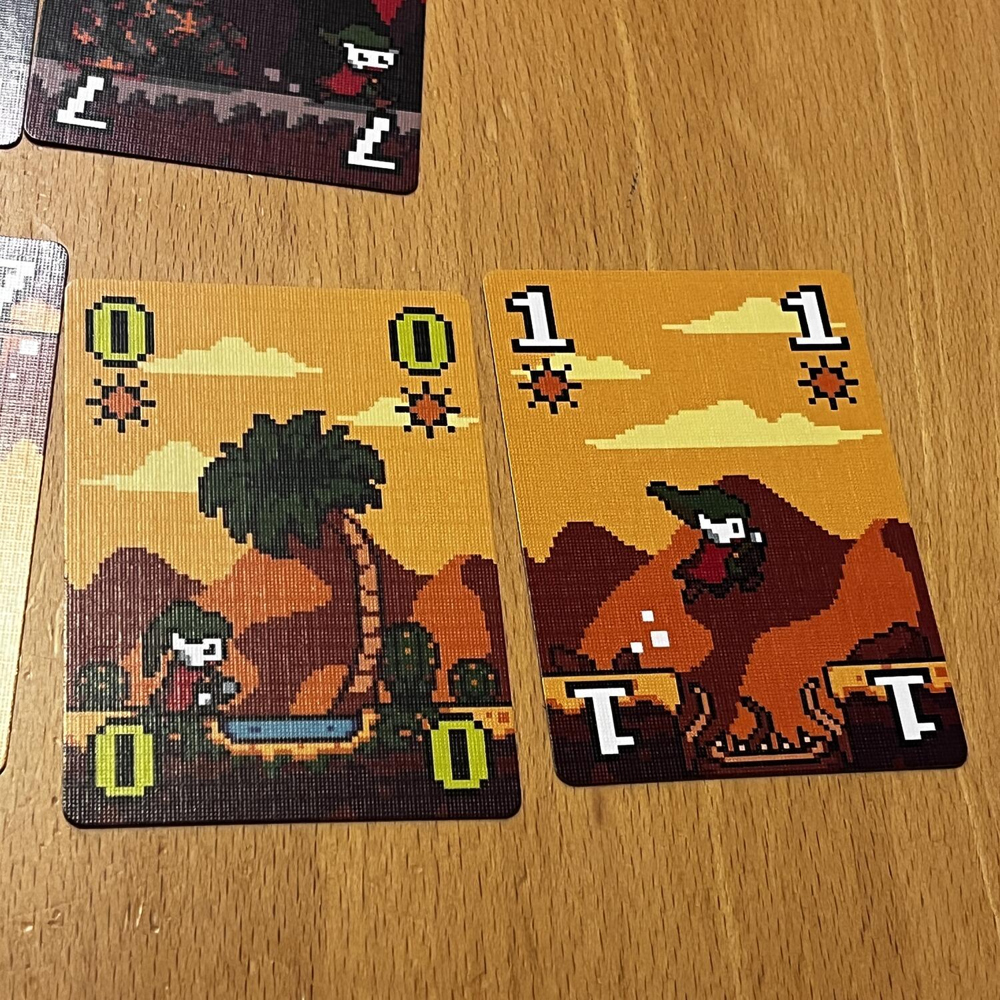
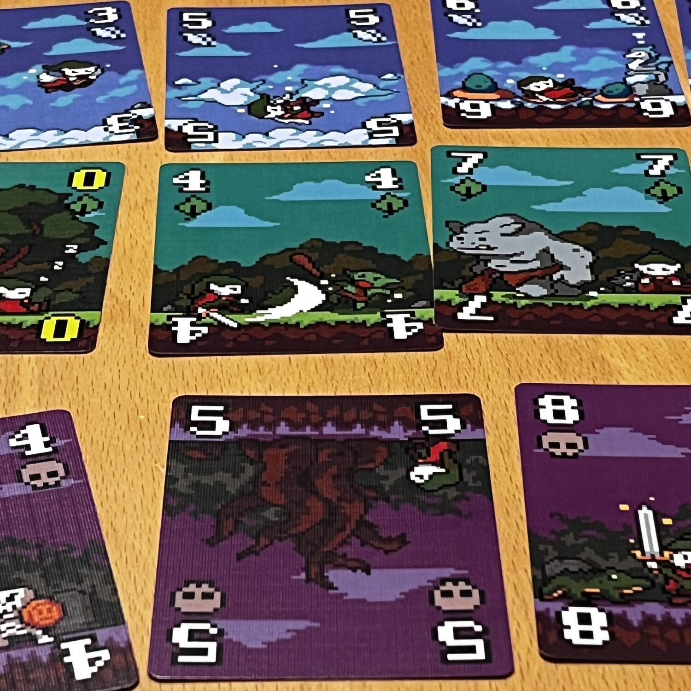
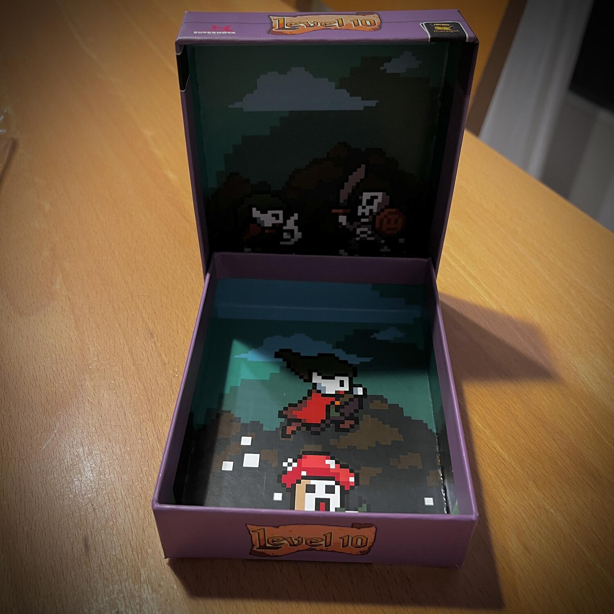

<Setting>

  Un'avventura a 8bit con 5 regni. In questo cooperativo, i giocatori dovranno
  portare il protagonista fino alla fine dell’avventura, composta da 50 carte.
  Fermarsi, avanzare, interrompere la partita... Cosa succederà? Sarà compito
  vostro deciderlo!

</Setting>

<Rules>

  Level 10 è un gioco da 1 a 5 giocatori che assomiglia un po’ al gioco{" "}
  <em>Scarta i Re</em> che si gioca con le carte italiane. Ogni giocatore ha
  delle carte in mano con numeri che vanno da 1 a 10 e che possono essere di 1
  tra 5 colori: dovranno posizionarle in sequenza crescente per ogni colore.
   
  Tutto questo a due condizioni principali: non si può cambiare colonna, a meno
  che tutte le righe non abbiano la carta in quella posizione, e per ogni
  colonna ci deve essere una carta speciale zero. Di queste ultime ne esistono 2
  per colore, per un totale di 10, come le colonne che andranno completate per
  vincere la partita, e non saranno nelle mani dei giocatori, bensì in una
  riserva comune.

</Rules>

<Feedback>

  La vera domanda è: Level 10 è un gioco che vale la pena di essere giocato?
  Data la sua natura di supremo filler, non sarà il titolo che, una volta
  risolto, tornerà spesso sul tavolo, anche perché la complessità strategica non
  è abissale. Non dico sia facile vincere, però non è neanche un’impresa per cui
  occorra spremersi le meningi. Come gioco{" "}
  <Link to="/mechanism/solitario">Solitario</Link>, invece, presenta molti punti
  di forza, tra cui la durata, ancora più contenuta, e il maggior peso del
  fattore fortuna che bilancia le probabilità della risoluzione: infatti, alcune
  partite potrebbero essere perse in poche mani, ma, in un viaggio molto zen
  alla ricerca dell'illuminazione in questo mondo a 8bit, ciò ha davvero
  importanza?

</Feedback>

