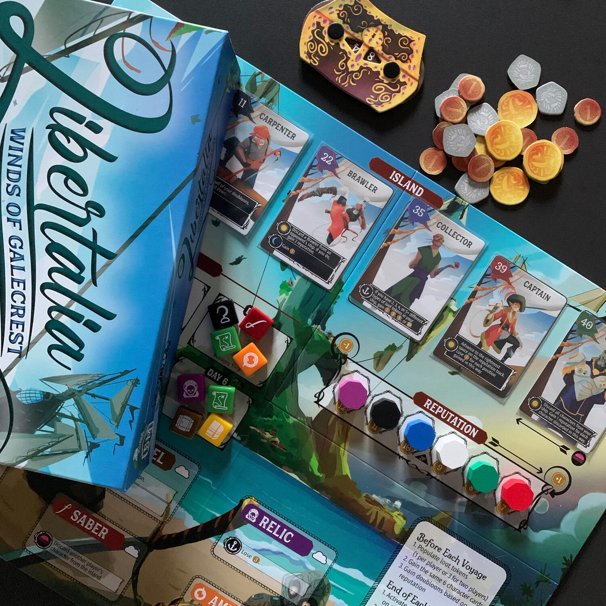
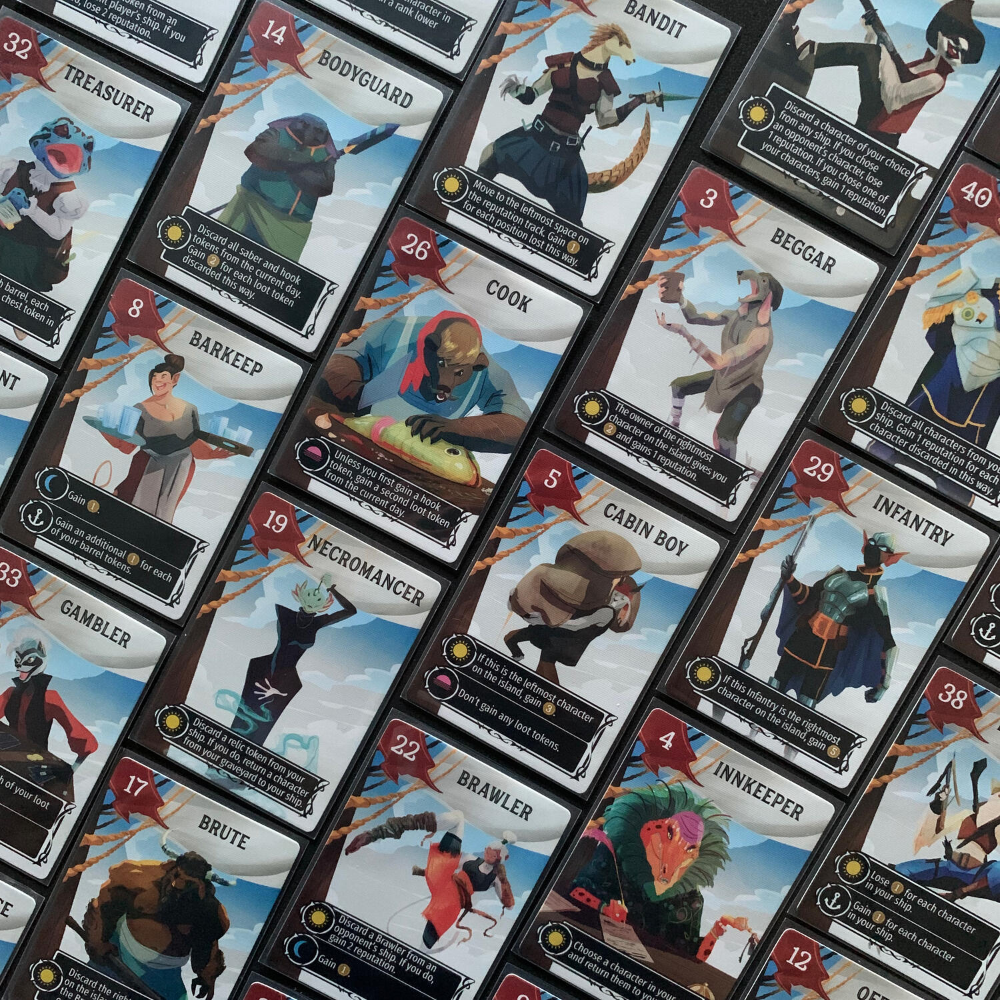
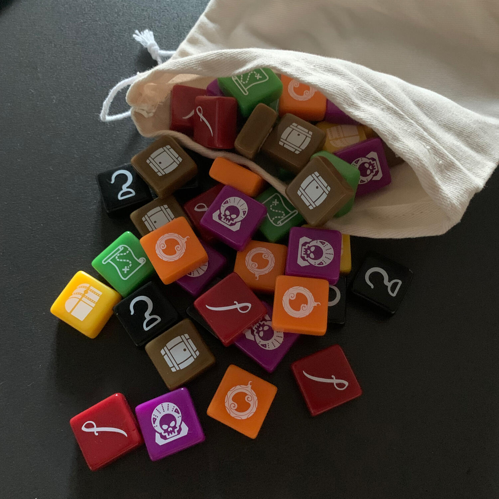

<Setting>

  Nel mondo di Galecrest, <strong>i pirati</strong> dei cieli salpano tra i
  venti in cerca di avventura, <strong>tesori</strong> e <strong>gloria</strong>
  . 
  Siete ammiragli a capo di una nave dal numeroso e variegato equipaggio. Ma
  assieme a voi ci sono anche i vostri avversari, che solcano i cieli nella
  stessa flotta pirata. Ogni giorno la flotta approderà a un’isola differente,
  dove invierete un membro del vostro equipaggio a raccogliere la parte di
  bottino che vi spetta… sperando che possa tornare vivo a bordo della nave, per
  dare man forte al vostro gruppo di personaggi.

</Setting>

<Rules>

  In una partita a Libertalia si affronteranno <strong>3 spedizioni</strong>,
  ognuna delle quali è divisa in giorni: la prima dura ne 4, la seconda 5 e
  l'ultima 6.
   
  All'inizio di ogni viaggio,{" "}
  <strong>un giocatore tra tutti mescola il proprio mazzo</strong> di 40 carte e
  ne estrae casualmente 6. Ogni altro giocatore comporrà poi lo stesso identico
  mazzo a partire dalle sue carte, ognuna delle quali è identificata da un
  livello di gerarchia (un numero tra 1 e 40) e da alcune azioni. Tutti i
  giocatori avranno in questo modo la stessa mano.
   
  Ogni mattina, ogni capitano (o giocatore) manda sull'isola uno dei fidati
  marinai della propria ciurma (mano), giocandolo sotto forma di{" "}
  <strong>carta coperta</strong>, nella speranza di vederlo tornare con un
  bottino. Quando tutti avranno giocato la propria carta, queste verranno
  rivelate e disposte in ordine di gerarchia crescente.
   
  Nelle 3 fasi della giornata (giorno, crepuscolo e notte) i pirati verranno
  chiamati all'azione attivandosi e svolgendo le proprie azioni nelle fasi
  corrette.
   
  Durante il <strong>giorno</strong>, verranno attivate le azioni "giorno" da
  sinistra a destra (dal minore al maggiore); durante il{" "}
  <strong>crepuscolo</strong>, invece, si torna indietro, eseguendo l'azione
  "crepuscolo" e scegliendo uno dei bottini disponibili per quel giorno (ce n'è
  uno per giocatore a meno di sorprese). L'azione “<strong>notte</strong>”,
  invece, verrà eseguita pber tutte le notti da quel momento alla fine della
  spedizione. Tutto questo, ovviamente, a patto che il pirata sia vivo nel
  momento in cui dovrebbe compiere l'azione.
   
  Una volta terminato il giorno, i pirati sopravvissuti verranno posizionati
  sulla nave, mentre quelli meno fortunati andranno dritti al cimitero senza
  passare dal via.  
  Si continua così <strong>fino alla fine dei giorni</strong> che compongono la spedizione,
  alla fine della quale si attiva l'ultima tipologia di abilità, ovvero quella distinta
  dall'icona dell'ancora.  
  Si svuota la nave, si libera il cimitero, si ripopolano i tesori per ogni
  giornata della prossima spedizione,{" "}
  <strong>si pescano nuovamente 6 carte</strong> (quindi dopo la prima
  spedizione ogni giocatore avrà in mano 8 carte, 6 nuove e 2 non ancora
  utilizzate) e si deposita il tesoro conquistato all'interno del forziere. Il
  tesoro di ogni turno è dato dalle monete ottenute, da alcune abilità ancora e
  dalle monete ottenute dalla vendita del bottino, che cambiano di partita in
  partita.
   
  Alla fine della terza spedizione, <strong>chi avrà più monete</strong> nel
  forziere sarà il pirata più piratesco di tutta Galecrest!

</Rules>

<Feedback>

  Libertalia è quel genere di giochi che ami o che odi. Lo si ama perché le
  regole sono poco più di quelle descritte qui sopra e il gioco scorre che è un
  piacere, senza nessun tipo di intoppo e eccezioni da chiarire. Perché si
  potrebbe odiare? <strong>Perché è bastardo… e ti porta ad esserlo.</strong>{" "}
  Tutta la tua strategia potrebbe essere spazzata via in pochi secondi dalla
  carta giusta di uno dei tuoi avversari che è riuscito a leggere il tuo gioco.
   
  Potreste essere tentati a dare la colpa al fattore casualità, ma mi permetto
  di dissentire: le carte che tutti i giocatori hanno in mano sono le stesse e,
  di conseguenza, lo sono anche tutte le azioni disponibili. Sta nella bravura
  del giocatore capire <strong>quando è meglio giocare</strong> una carta e{" "}
  <strong>quando è meglio tenerla</strong> per la prossima spedizione, quando
  probabilmente sarà l'unico ad averla ancora a disposizione.
   
  Durante una partita si pescheranno in totale <strong>18 carte</strong> e il
  gioco sta proprio nel arrangiarsi con quelle, cercando di farle andare in
  combo il più possibile, senza cadere nell'ovvio, altrimenti gli avversari
  sapranno bene quando e come attaccarti, facendoti saltare i piani e, magari,
  l'intera partita.
   
  Non ti basta questa variabilità? La plancia ha due facce: mare calmo e
  tempestoso. La prima è più “rilassata”, ma se sceglierete di giocare la
  seconda, mettetevi un coltello tra i denti prima di sedervi. Inoltre, ci sono
  anche delle tessere per sovrascrivere il valore di ogni bottino!
   
  L'immediatezza delle regole e la voglia di continuare a intavolare questo
  titolo lo{" "}
  <strong>    rendono perfetto sia per un nuovo pubblico, sia per giocatori di vecchia
    data</strong>
  , che daranno vita a una vera e propria guerra fredda. Il trucco non sta nell'ammazzare…
  ma nel far credere che ammazzerete!  
  Pressoché tutti i materiali del gioco vi lasceranno molto soddisfatti a tal
  punto che ci troverete a giocherellare con i vostri bottini per tutta la
  partita, tanto sono dolci al tatto.  
  Libertalia è un gioco da 1 a 6 giocatori, ma non restituisce la stessa esperienza
  ad ogni player count. Per quanto riguarda il gioco in solo, come in tutti i giochi
  della famiglia Stonemaier, è presente un <strong>automa</strong> molto semplice
  capace di creare sfide interessanti; mentre, per due giocatori, è inclusa una variante
  che introduce un terzo giocatore fittizio. Se volete prenderlo per giocarlo in
  1 o 2 giocatori… lasciate perdere, il costo non vale la candela. Ma se cercate
  un gioco che scala benissimo da 4 a 6 giocatori (andando ad aumentare inevitabilmente
  la lunghezza del gioco), potreste aver trovato il titolo che cercavate!
   E se non vi piacciono i pirati o preferite un’esperienza più
  asimmetrica,{" "}
  <Link to="/reviews/vampiri-la-masquerade-vendetta">
    Vampire: The Masquerade - Vendetta
  </Link>{" "}
  ha un gameplay che presenta moltissimi punti in comune con questo, dalla
  <Link to="/mechanisms/gestione-mano">gestione della mano</Link> di gioco progressiva
  al triplice ordine di priorità delle azioni, passando ovviamente per l’<strong>    interazione cattiva</strong>.
   
  Libertalia è un gioco che ho sempre voluto provare senza averne mai avuto l'occasione.
  Non riuscivo a decidermi di comprarlo per via dell'ambientazione da me molto distante.{" "}
   
  Se potessi tornare indietro, non aspetterei così tanto.

</Feedback>

