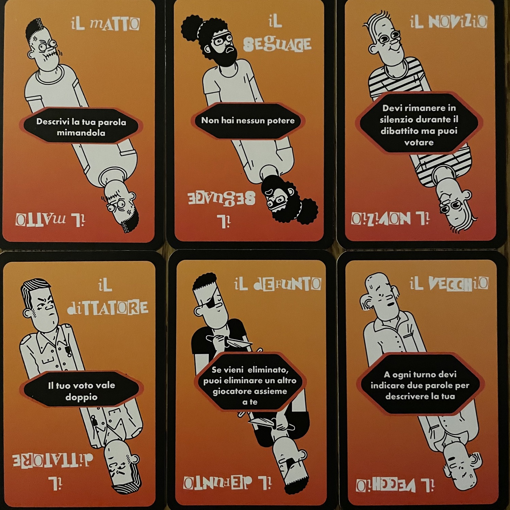
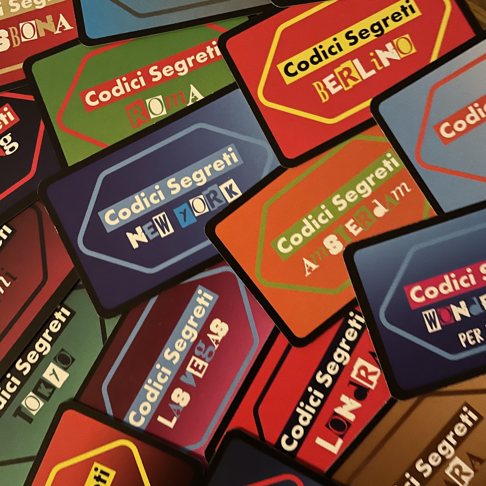

<Setting>

  I membri di una <strong>società segreta internazionale</strong> organizzano delle riunioni in{" "}
  <strong>diverse città del mondo</strong>. Attenzione, non tutti i giocatori sono dei <strong>Discepoli</strong>: degli{" "}
  <strong>Infiltrati</strong> si sono aggiunti al tavolo e si sospetta addirittura che un <strong>Giornalista</strong>{" "}
  sia segretamente presente. Per verificare l'identità dei giocatori, è stata creata una <strong>Password</strong>.
  Soltanto i Discepoli hanno la password corretta… Come smascherare gli Infiltrati e il Giornalista, senza essere
  eliminati?

</Setting>

<Rules>

  Il gioco consta di <strong>17 mazzetti Missione</strong>, <strong>ciascuno</strong> composto da{" "}
  <strong>10 Carte</strong>, a cui si aggiungono <strong>9 Poteri</strong> da usare facoltativamente in partite da 6+
  giocatori. In ogni mazzetto ci sono 5 Carte Discepolo, 3 Carte Infiltrato, 1 Carta Giornalista e 1 Carta Codici
  Segreti.
   
  Prima di cominciare la partita, qualcuno dovrà <strong>predisporre 4-5 Missioni</strong>, componendo i relativi mazzi
  con un certo numero di carte Discepolo e Infiltrato in base al numero dei Giocatori; il Giornalista entra in gioco
  solo da 5 giocatori in su. Quindi, la carta Codici Segreti viene collocata al centro del tavolo a faccia in giù (il
  colore delle password di questa carta corrisponde a quello delle carte Discepolo), mentre le altre Carte, da tenere
  segrete, vengono suddivise tra i giocatori.
   
  Una volta assegnati i <strong>ruoli segreti</strong>, un volontario sceglie un numero tra 1 e 10: questo numero
  corrisponderà alla Password che ogni giocatore (eccetto il Giornalista) ritroverà sulla propria carta. Si procede con
  un <strong>Giro di Indizi</strong>: a partire dal giocatore che ha scelto il numero, ognuno deve dare un indizio (una
  parola sola o un composto) che abbia a che fare con la Password ma sia diverso dalla Password stessa. Solo i Discepoli
  conoscono la Password: il Giornalista deve improvvisare del tutto l’indizio, basandosi su quelli dati dagli altri,
  mentre gli Infiltrati hanno una Password leggermente diversa da quella dei Discepoli. Si noti che{" "}
  <strong>nessun giocatore</strong> diverso dal Giornalista, però,{" "}
  <strong>saprà inizialmente se gioca come Discepolo o come Infiltrato</strong>. 
  Una volta che tutti i giocatori hanno dato un indizio, si apre un <strong>Dibattito</strong>, alla fine del quale avverrà
  una <strong>Votazione</strong>, durante la quale tutti punteranno contemporaneamente il dito verso la persona che vogliono
  eliminare dal gioco. <strong>Il giocatore designato dalla maggioranza verrà eliminato</strong> (eventuali pareggi si dirimono
  con il metodo sasso carta forbici). <strong>Se il giocatore eliminato è il Giornalista</strong>, questi ha un’ultima possibilità:
  indovinare la Password dei Discepoli. Se indovina, vince la missione e guadagna 3 punti; altrimenti, la partita continua.{" "}
  <strong>Se il giocatore eliminato non è il Giornalista</strong>, guarda discretamente la carta “Codici Segreti”: quindi
  rivela la propria identità agli altri. Si procede con un <strong>nuovo round</strong>, <strong>    cominciando dal giocatore a sinistra di colui che è stato eliminato</strong>. <strong>La Password rimane la stessa del turno precedente.</strong>
   
  <strong>Si procede così finché</strong> tutti gli Infiltrati e il Giornalista sono stati eliminati (con conseguente vittoria
  dei Discepoli, che guadagnano tutti 1 punto a testa, anche se eliminati) o finché non rimangono solo due giocatori (gli
  Infiltrati, anche quelli eventualmente già eliminati, vincono e guadagnano 2 punti a testa se almeno uno di loro è rimasto
  in gioco; il Giornalista – qualora non abbia dovuto indovinare la password – vince se non si è fatto eliminare e guadagna
  3 punti). Finita una missione, se ne può iniziare un’altra, ridistribuendo le carte di un nuovo Mazzo. <strong>    La partita finisce quando un giocatore arriva a 5 punti</strong>. Dovrà allora essere chiamato il Capo Supremo…
   

</Rules>

<Feedback>

  Se avete già giocato a <strong>“Il Camaleonte”</strong> – di cui peraltro Asmodee Italia ha appena annunciato la
  ristampa – è probabile che abbiate già vissuto un’esperienza analoga a quella di Little Secret. Vanno osservate,
  tuttavia, alcune <strong>differenze di rilievo</strong>: 
  <ol>
    <li>      in Little Secret <strong>non è consentita la ripetizione di un indizio già detto</strong> da altri;</li>
    <li>      mentre <strong>ne “Il Camaleonte” tutti i giocatori conoscono i loro ruoli dall'inizio</strong>, in Little Secret
      non è così, eccezion fatta per il Giornalista (di fatto, alter ego del Camaleonte);</li>
    <li>      quello del “volontario” che dice un numero e avvia il Giro di Indizi è un{" "}
      <strong>escamotage intelligente per fare in modo che il Giornalista non si trovi mai in prima posizione</strong> a
      dover improvvisare un indizio su una parola che non conosce, a differenza del povero Camaleonte (per quanto possa
      sempre trovarsi in una scomoda seconda posizione al primo Giro di Indizi);</li>
    <li>      la possibilità di giocare con dei <strong>Poteri</strong> (il matto, il novizio, il vecchio, il saggio, il
      defunto, il dittatore e i seguaci) aggiunge un <strong>tocco speziato e divertente</strong> alle partite,
      aumentando la longevità del gioco!</li>
  </ol>
  Anche se il Giornalista è l’unico ruolo non obbligatorio in 4, senza di lui la partita può risultare meno intrigante:
  pertanto, <strong>consiglierei di giocare sempre a Little Secret dai 5 giocatori in su.</strong>
   
  Parliamo di un <strong>difetto macroscopico</strong> di questo titolo. Per quanto nel regolamento sia specificato che
  occorre preparare 4-5 missioni prima di iniziare una partita, non viene precisato il fatto che un giocatore tra i
  presenti deve guardare i colori di ogni Mazzo, avendo evidentemente l’opportunità di <strong>memorizzare</strong>{" "}
  quale sia il colore delle Carte Discepolo e quale quello delle Carte Infiltrato in ogni Mazzo. Questo è, purtroppo, un{" "}
  <strong>difetto intrinseco</strong> al gioco, di fatto <strong>ineliminabile,</strong>{" "}
  <strong>ma possibilmente</strong> <strong>aggirabile</strong> facendo predisporre le Missioni a qualcuno nei dintorni
  che non sia impegnato a giocare o al/alla più smemorato/a al tavolo.
   
  Ciò non toglie, in ogni caso, che Little Secret sarà certamente un <strong>ottimo compagno</strong> con cui animare
  ludicamente quelle serate in cui ci si troverà numerosi (e non tutti necessariamente esperti di giochi da tavolo).
   
  Infine, <strong>due note di merito</strong>: sono presenti <strong>missioni per bambini</strong>, che consentono di
  avvicinare al gioco anche i più piccoli; apprezziamo, inoltre, che – come nel caso di{" "}
  <Link to="/reviews/finis-terrae/">Finis Terrae</Link> – il gioco sia stato stampato in Europa e su carta{" "}
  <strong>ecosostenibile</strong>.

</Feedback>

