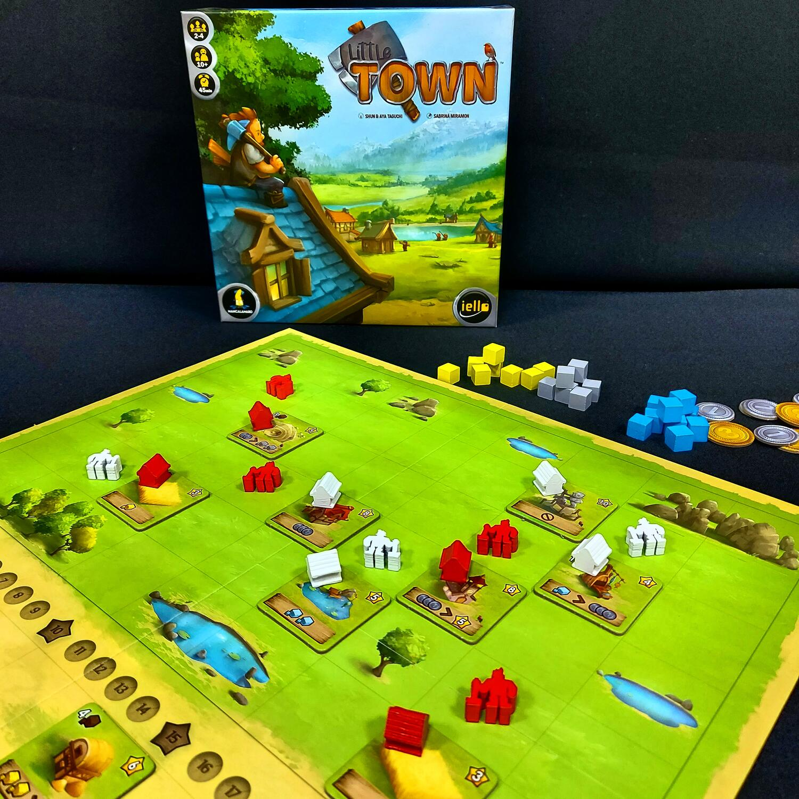
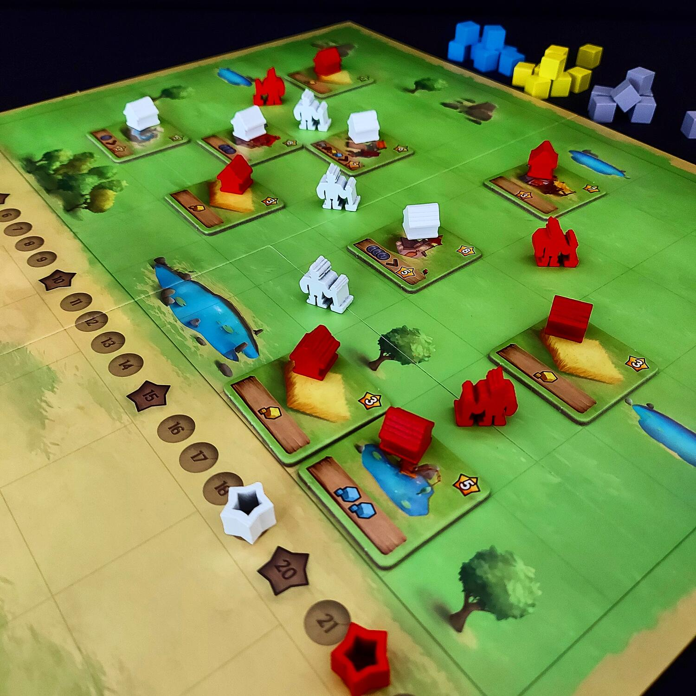

<Setting>

  Molto molto lontano, oltre le montagne più sperdute, c'è una terra ancora da
  esplorare. Questa regione è il luogo ideale per iniziare a costruire una bella
  città. Per farlo durante ogni turno dovrete decidere dove piazzare il vostro
  lavoratore per raccogliere le risorse necessarie o per costruire nei posti
  migliori, cercando di anticipare le azioni degli avversari.
   
  Non tragga in inganno il titolo di questo gioco: non si tratta infatti di un
  “altro” gioco di civilizzazione, né si tratta di un gioco di “solo”
  piazzamento lavoratori e gestione risorse.
   
  In realtà Little Town è l'insieme di tutte queste cose, ma la cosa più
  incredibile è che lo fa con un regolamento facilmente assimilabile, in cui le
  poche azioni disponibili costituiscono la forza del gioco: infatti
  obbligheranno fin dall'inizio il giocatore a ponderare con attenzione ogni
  singola “mossa”.

</Setting>

<Rules>

  Una partita a Little Town dura quattro round durante i quali ogni giocatore
  piazza i propri lavoratori per compiere un'azione. Alla fine round sarà
  necessario aver conservato delle risorse per poter sfamare i propri
  lavoratori: ogni lavoratore non sfamato, infatti, farà perdere preziosi punti
  vittoria.
   
  Quando il round termina si raccolgono tutti i lavoratori piazzati e si passa
  al successivo.
   
  Ma vediamo in dettaglio le azioni che si possono compiere:
   
  <strong>Raccogliere risorse</strong>: si piazza un lavoratore su una casella
  vuota e si accumulano le risorse dalle otto caselle circostanti, tenendo conto
  che la foresta fornisce legno, le montagne forniscono pietra, il lago fornisce
  pesce e il campo di grano fornisce grano;
   
  <strong>Utilizzare edifici</strong>: se sulle caselle intorno al lavoratore
  sono presenti edifici, questi possono essere utilizzati gratuitamente se
  propri o pagando una moneta se di proprietà di un avversario; essi forniscono
  risorse, monete, punti vittoria, oppure permettono di scambiare risorse.
   
  <strong>Costruire edifici</strong>: si piazza un lavoratore sullo spazio in
  comune sotto il conta-turni, si preleva una delle tessere disponibili (ad
  inizio partita saranno 12, oltre ai campi di grano) pagando le risorse
  indicate sulla tessera stessa e la si posiziona in una casella vuota: quindi
  si ricevono immediatamente i punti vittoria. Sull'edificio costruito andrà
  piazzata una casetta del proprio colore per reclamarne la proprietà.
   
  Esistono anche <strong>due azioni aggiuntive gratuite</strong> che si possono
  fare in qualunque momento del proprio turno: scambiare tre monete per avere
  una risorsa qualsiasi oppure risolvere degli obiettivi.

</Rules>

<Feedback>

  Little Town è una piacevolissima scoperta, un gioco di piazzamento tessere e
  gestione risorse, dalle regole molto semplici e dalla durata contenuta. Un
  titolo perfetto per avvicinare “neofiti” a questa tipologia di gioco, ma allo
  stesso tempo molto piacevole per giocatori esperti.
   
  Il gioco rende bene con qualsiasi numero di giocatori al tavolo. Saranno
  necessarie una buona dose di strategia nello scegliere gli edifici giusti e
  dove piazzarli, e una buona dose di tattica perché si dovrà cercare di
  ottimizzare il piazzamento dei propri lavoratori sulla mappa, magari
  anticipando le possibili azioni degli avversari.
   
  La rigiocabilità è praticamente infinita, tenuto conto che in ogni partita
  saranno utilizzate solo 12 delle 24 tessere disponibili e che il tabellone può
  essere utilizzato da entrambi i lati.
   
  I materiali sono ottimi, la grafica è davvero molto curata ed accattivante e i
  segnalini in legno sono una vera chicca.
   
  Insomma, un gioco che non può davvero mancare nella vostra collezione e dal
  divertimento assicurato!

</Feedback>

