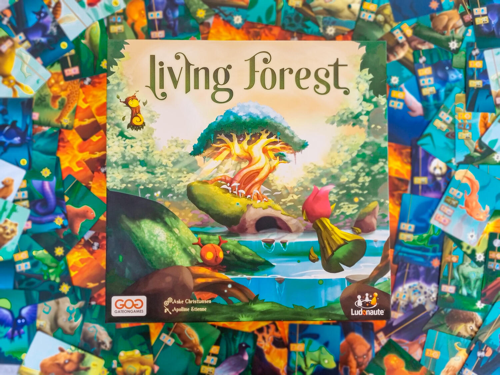

<Setting>

  L'Albero Sacro della Foresta è in pericolo, aggredito dai temibili (?) assalti
  incendiari di Onibi e dei suoi fidi Varani di Fuoco. I Quattro Spiriti della
  Natura, rappresentanti delle stagioni dell'anno e incarnati dai giocatori,
  sono chiamati a salvare la propria casa, competendo al contempo per il titolo
  leggendario di Gran Protettore.
   
  Aiutati dai meravigliosi e scintillanti Animali Guardiani, gli Spiriti
  danzeranno rapidamente attorno al loro Cerchio, piantando Alberi Protettivi,
  collezionando Fiori Sacri per risvegliare il grandioso Guardiano della Foresta
  Sanki, o tenendo sotto scacco le fiamme che lambiscono l'Albero Sacro.

</Setting>

<Rules>

  Una partita a Living Forest vede i giocatori svolgere una serie indefinita di
  turni fino al raggiungimento di una delle tre condizioni di vittoria previste:
  (1) piantare 12 diversi Alberi Protettivi, (2) raccogliere 12 Fiori Sacri e
  risvegliare Sanki, il grande Guardiano della Foresta, o (3) spegnere 12
  Incendi per bandire per sempre Onibi.
   
  Ogni turno inizia con la fase “Animali Guardiani”, durante la quale i
  giocatori rivelano, una alla volta e con la possibilità di fermarsi quando
  meglio credono, le carte dal loro mazzo per comporre la loro Linea di Difesa.
  Questa fase, nella quale i giocatori possono sfidare la sorte, è determinante
  per conoscere il numero di azioni che saranno disponibili nella seconda parte
  del turno ad ogni giocatore. Infatti, rivelare il terzo Animale Guardiano con
  l'icona Solitario chiuderà la Linea di Difesa e costringerà il giocatore a una
  sola azione, invece delle due regolarmente previste.
   
  A seconda del numero di azioni disponibili (una o due), i giocatori si
  alternano nel loro svolgimento. Le azioni devono essere tra loro diverse e
  sfruttano la somma dei simboli uguali presenti negli Animali Guardiani che
  compongono la propria Linea di Difesa. Nello specifico, (1) i simboli del Sole
  serviranno come valuta per Attirare (acquistare) nuovi Animali Guardiani dalla
  riserva, (2) i simboli Germoglio a piantare nuovi Alberi Protettivi adiacenti
  a quelli già presenti, (3) i simboli Goccia a spegnere gli Incendi dell'Albero
  Sacro, e (4) i simboli Vortice ad avanzare sul Cerchio degli Spiriti
  innescando azioni bonus, e rubando Tessere Vittoria dagli Spiriti sorpassati
  (i simboli Fiore Sacro rivelati nella fase Animali Guardiani non forniscono
  azioni, ma servono per il computo totale ai fini dell'evocazione di Sanki).
   
  Il turno si conclude con le aggressioni di Onibi, dapprima, aggiungendo
  scomode carte Varani di Fuoco ai mazzi dei giocatori, qualora il numero di
  Incendi nell'Albero Sacro sia superiore ai loro simboli Goccia; quindi,
  incrementando gli Incendi nell'Albero Sacro in base al numero e al tipo di
  Animali Guardiani attirati dalla riserva generale durante il turno.

</Rules>

<Feedback>

  Living Forest candidato al prestigioso Kennerspiel des Jahres (gioco dell'anno
  per esperti) per il 2022? Non la prenda a male la giuria tedesca preposta alla
  selezione dei titoli, ma se è vero che il mondo è bello perché è vario, ci
  arroghiamo il diritto di dissentire.
   
  Lo ammettiamo candidamente, il nostro guilty pleasure è (e sempre resterà) un
  design di spessore. Animali fluo con gli occhi vacui? Ecco i vostri soldi, con
  tanti ringraziamenti alla penna brillante di Apolline Etienne. Ma scalzata la
  coltre abbacinante che copre il titolo di Christiansen, cosa resta?
   
  Apparentemente, un cocktail di tile placement, deck building e push your luck
  di bell'aspetto, uno di quelli con l'ombrellino e la fetta di lime, ma che al
  palato non lasciano un ricordo memorabile. Niente point salad in Living
  Forest, ma tre possibili sentieri ben battuti verso il traguardo della
  vittoria finale. Legittimo interrogarsi se uno di questi sentieri non sia
  perfettamente in piano e da percorrere scalzi, mentre gli altri non prevedano
  rischiose arrampicate.
   
  In verità, Onibi è tanto pericoloso quanto essere morsi da uno squalo su un
  tram, e spegnere 12 incendi può richiedere uno sforzo drammaticamente
  inferiore alle altre strategie. Il risultato? Le partite in due giocatori
  rischiano di essere minate da tattiche forzate, controbattendo “fuoco al
  fuoco”, senza potersi curare di azioni alternative. L'indirizzo a senso unico
  del gioco è mitigato solo a condizione che il numero di giocatori aumenti, e
  che questi abbiano già maturato sufficiente esperienza di gioco.
   
  In quattro al tavolo non sarete primi di turno abbastanza spesso da passare
  indisturbati nella vostra caccia alle fiamme? Vero. Qualcuno cercherà di
  mettervi i bastoni tra le ruote evitando di attirare troppi Animali Guardiani
  per ridurre il numero di incendi che Onibi innescherà a fine turno?
  Altrettanto vero, ma sacrificare la qualità del proprio mazzo per rallentare
  gli avversari è a dir poco frustrante.
   
  Questi cocktail però una particolarità la hanno, ed è quella di avere il
  potere di alterare la memoria. E allora ecco che, nonostante il sapore
  pungente, si torna a berli di tanto in tanto. I difetti ci sono, li sentiamo
  bene, ma a volte decidiamo di ignorarli, perché quei colori sfarzosi e
  quell'ombrellino sono sirene ammaliatrici.
   
  Living Forest è un pittoresco collage di minigiochi, tutti altrettanto
  divertenti: tentare la sorte nel blackjack degli Animali Guardiani, piazzare
  strategicamente tessere nel proprio puzzle di Alberi Protettivi, sorpassare
  gli altri giocatori nella corsa attorno al Cerchio degli Spiriti e, perché no,
  giocare al pompiere di Flash Point sopprimendo le fiamme scatenate da Onibi.
  Ma come in tutte le asimmetrie, il rischio è cadere sempre sullo stesso lato.
  Noi, dal canto nostro, lo abbiamo percepito forte e chiaro. Ma questa è solo
  un'opinione, e come tutte le opinioni, è pronta per essere messa in
  discussione.

</Feedback>

