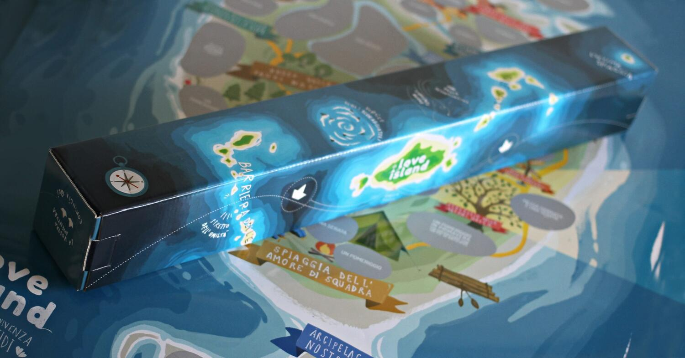
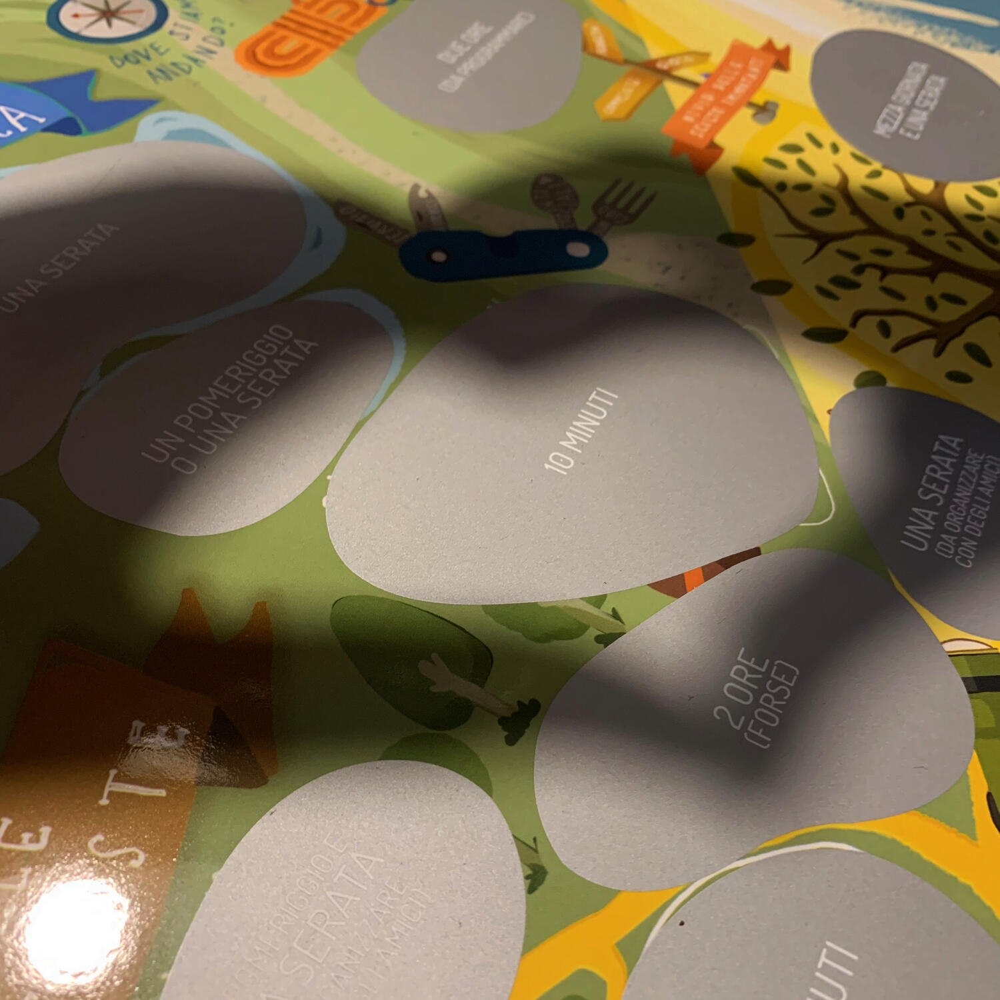

<Setting>

  Prendi un'isola deserta, una buona dose di tempo a disposizione e un cucchiaio
  di dolcezza. Aggiungi tenerezza, una spolverata di bei ricordi e situazioni
  imbarazzanti a piacere. Bene, sei pronto per giocare a Love Island.
   
  Una fuga romantica che inizia tra le mura di casa ma capace di portarti in
  situazioni che non avresti avuto la forza (o la voglia) di organizzare.
   
  L'importante è mettersi sempre in gioco... anche se potrebbe far paura
  (tranquilli, gli zombie non sono contemplati).
   
  Non state girando Cast Away, non siete Tom Hanks e non siete soli con un
  pallone di nome Wilson. Siete sempre voi, con la vostra metà, a girare il film
  della vostra vita assieme.
   
  Sì, a volte sono romantico, ma non ditelo in giro ;)

</Setting>

<Rules>

  Per giocare a Love Island non è necessaria nessuna preparazione, se non tanta
  voglia di mettervi in gioco. Prendete la mappa a forma di miocardio, scegliete
  un'attività nascosta in base al tempo che avete a disposizione e iniziate a
  grattare. Sì, tipo un gratta e vinci: non ci sono in palio milioni, ma
  bellissime esperienze da vivere con la persona che vi accompagna. La vittoria
  è assicurata.

</Rules>

<Feedback>

  Love Island è uno scratch poster che propone 38 semplici e divertenti attività
  da vivere in coppia in base al tempo che si ha a disposizione, in quel
  momento: da pochi minuti a un intero weekend.
   
  Gli argomenti sono tra i più vari e, ovviamente, non ve ne dirò neanche uno,
  se non sotto tortura.
   
  Quello che posso dirvi è che sono attività atte a farvi uscire dalla routine,
  a offrirvi spunti di conversazione e, soprattutto, a divertirvi e a farvi
  passare dei bei momenti assieme.
   
  È perfetto per le nuove coppie che vogliono conoscersi in maniera differente
  dal modo canonico, per le coppie "datate" che vogliono dare una scossa al
  solito trantràn, per le persone che amano le sorprese e non hanno paura di
  uscire dalla propria comfort-zone.
   
  Non lo consiglierei alle coppie che hanno bambini piccoli a meno che non
  vogliate "parcheggiarli" dai nonni per un weekend ogni tanto, rischiando però
  di far interferire le relative preoccupazioni con la vostra esperienza.
   
  È un gioco davvero per tutti: fossi in voi ne approfitterei per fare un bel
  regalo boomerang a San Valentino.
   

</Feedback>
