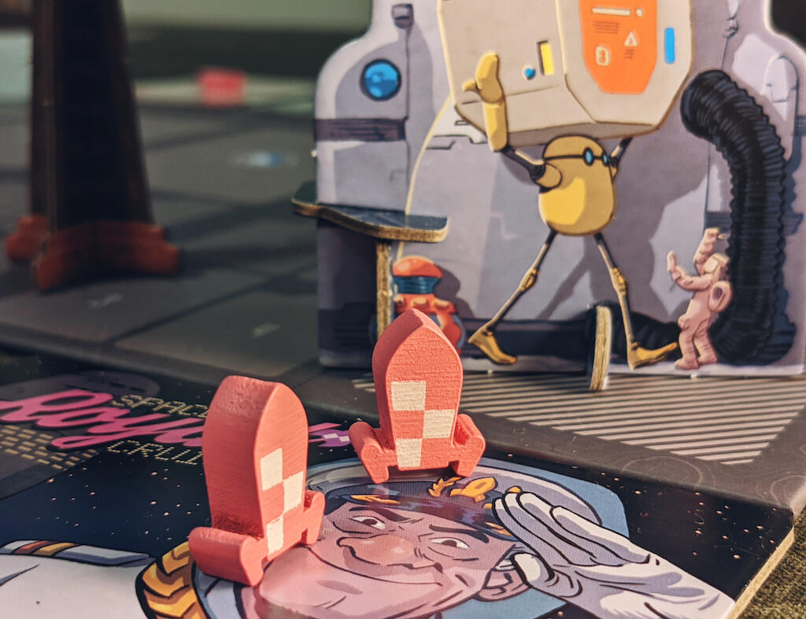
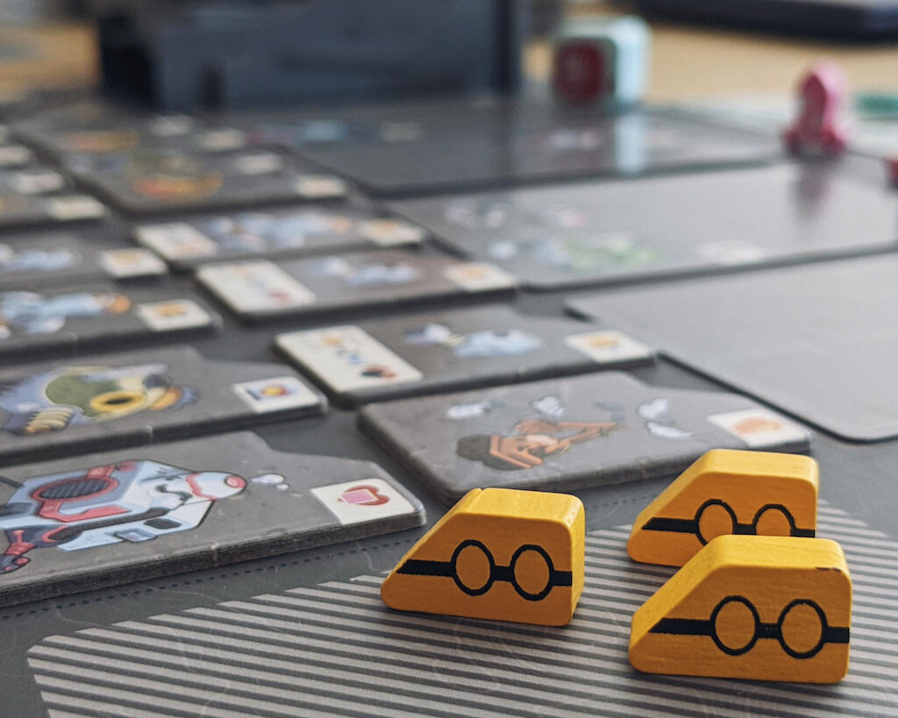

<Setting>

  È il 1977 e la Luna è finalmente pronta per essere colonizzata! Grazie ai
  nostri sponsor abbiamo finalmente abbastanza fondi per cercare di costruire
  uno splendido insediamento sul nostro amato satellite. Di cosa avremo bisogno
  per rendere questo progetto realtà? Sicuramente di sistemi vitali
  all'avanguardia per produrre ossigeno, idrogeno, acqua e, naturalmente,
  alimenti. Ma non sarà facile, poiché tutte le costruzioni dovranno essere
  erette in posizioni strategiche e accuratamente selezionate, in modo da
  garantirne l’efficienza. Sarà il tuo l'insediamento che verrà eletto la prima
  Capitale della Luna?

</Setting>

<Rules>

  LUNA capital è un gioco di{" "}
  <Link to="/mechanisms/piazzamento-tessere">piazzamento tessere</Link> nel
  quale ad ogni turno si dovrà scegliere una combinazione di tiles e carte da
  aggiungere al proprio tableau personale. Attenzione però, perché ad ogni turno
  le tiles da scegliere aumenteranno e dovranno essere piazzate tutte senza
  eccezioni! Il punto focale del gioco (quello che darà i punti) consiste nel
  piazzamento di tiles dello stesso tipo nella stessa area, in modo da creare il
  più grande gruppo possibile per ciascun tipo di tile. Il tutto è reso più
  interessante da una serie di obiettivi pubblici e scoring conditions, che
  renderanno il gioco colorato, divertente e pop.

</Rules>

<Feedback>

  Questo gioco si fa amare dalla prima partita. Non solo per il suo look anni
  '70/'80, ma anche per il gameplay, che, seppur non complicato, rimane
  interessante e pieno di decisioni entusiasmanti e mai banali. Risulta
  interessante il fatto che le tile da piazzare sono molte e a volte non è
  possibile trovare il posizionamento che risulti più redditizio (a meno che non
  siete ingegneri edili che hanno esperienze di lavoro sulla Luna :P). La
  replayability è alta, e l'interazione risulta divertente e mai punitiva.
  Insomma, lo si può considerare uno dei vincitori morali del 2021 :)

</Feedback>

