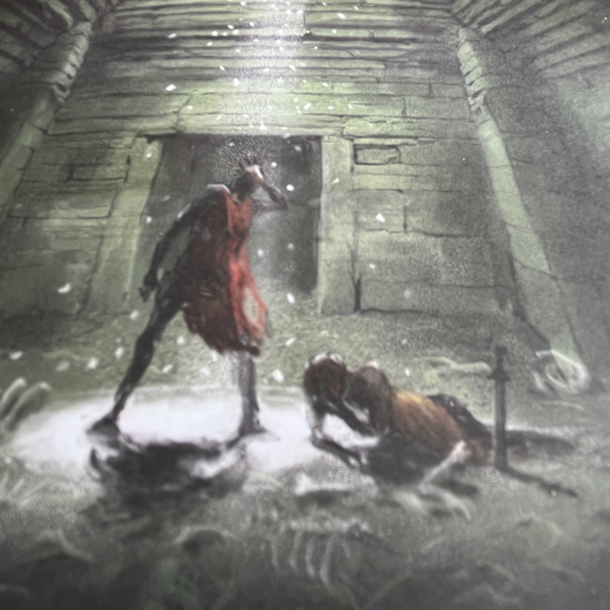
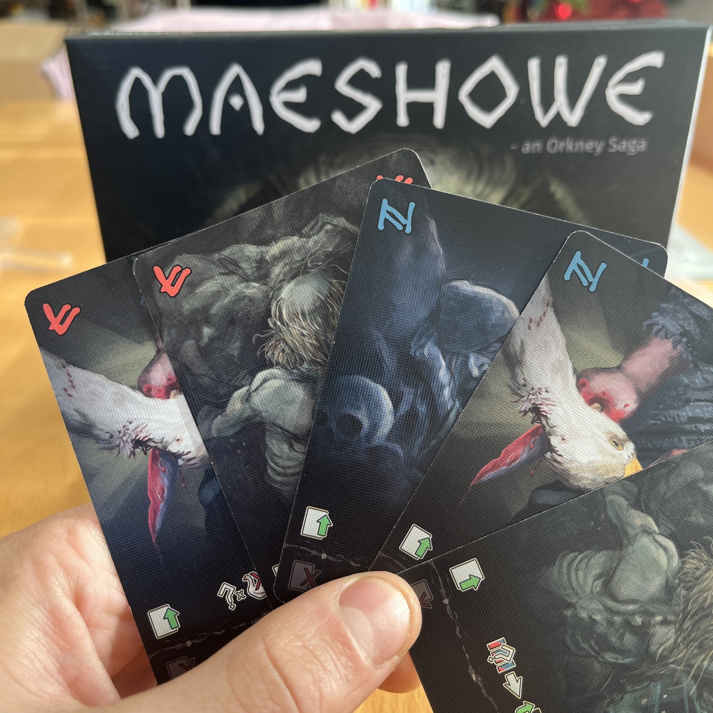

<Setting>

  Rognvald Kali Kolsson entrò nelle tombe di Maeshowe, Orkney, nel 1153 durante una tempesta. Nella storia ci mise 3
  giorni ad uscire, sfiorando la pazzia…  
  Che dire? Riuscirete a farlo uscire anche voi? Oppure ci saranno degli storici molto confusi?

</Setting>

<Rules>

  Un mazzo di carte. Quattro vite e una papera… Sì, una papera.  
  Ogni turno dovrete scegliere quale carta, tra le cinque in mano, giocare e quale scartare e di conseguenza quale effetto
  attivare rispettivamente, per poi ritornare ad avere 5 carte in mano. Le carte giocate formeranno una riga, essenziale
  per uscire vivi dalle tombe. Infatti, una volta che 4 carte “scava passaggio" verranno giocate, si potrà rimuovere uno
  dei massi che impedisce la fuga. Toltone un numero sufficiente si potrà fuggire! <strong>Attenzione però</strong>! Zero
  vite equivale ad un <em>game over</em> e, se per caso in mano avete 5 carte con lo stesso simbolo (rosso o blu), siete
  impazziti, e perderete preziose risorse… Riuscirete davvero a scappare?

</Rules>

<Feedback>

  Che dire… ancora una volta la <Link to="/publishers/dragon-dawn-productions/">casa editrice</Link> ci porta un gioco
  veloce, semplice e decisamente bello in <Link to="/mechanisms/solitario">Solitario</Link>. Il gioco si impara in 2
  minuti, seppur con qualche dubbio di regolamento. Si gioca in maniera super fluida ed è estremamente modulabile, come
  difficoltà. Si va dall’estremamente facile al matematicamente impossibile, con in mezzo la possibilità di usare moduli
  che permettono di aggiungere complessità alla formula del gioco base, senza diminuire il divertimento!  
  Non è tutto oro quel che luccica ovviamente... La parola chiave del gioco è decisamente: Fortuna. Ma è davvero un problema
  perdere velocemente in un gioco del genere?

</Feedback>

