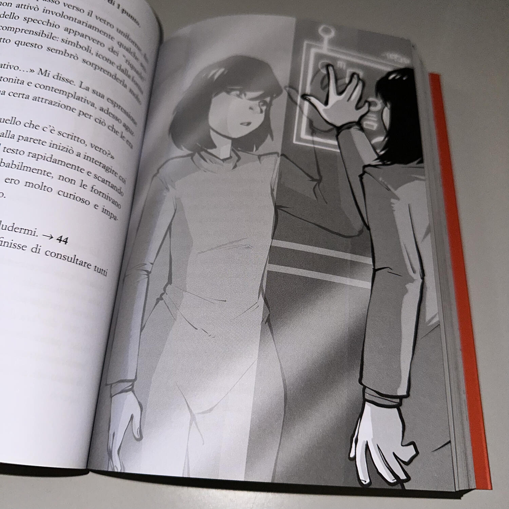
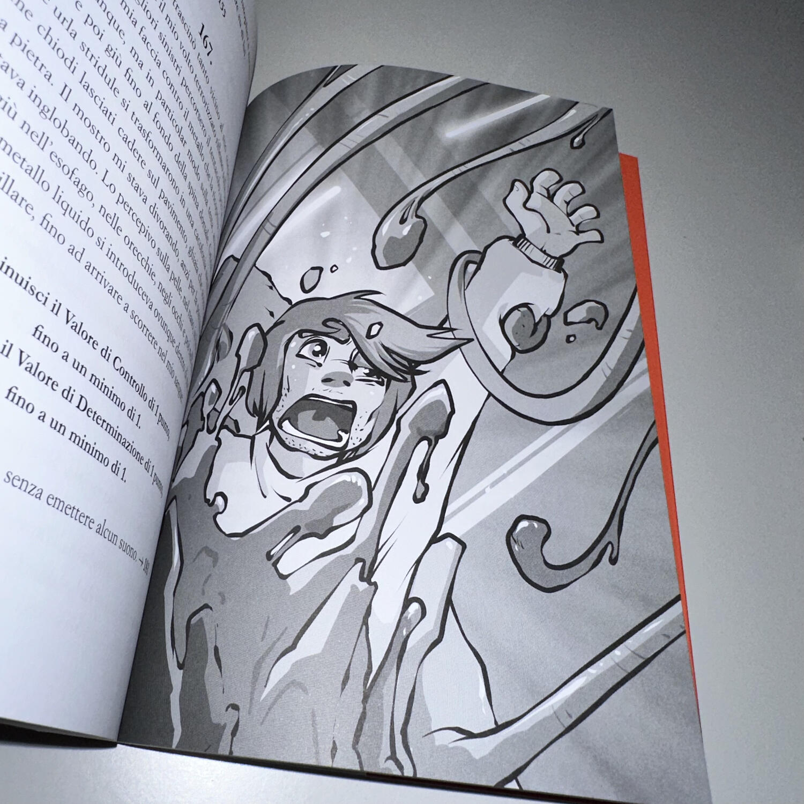
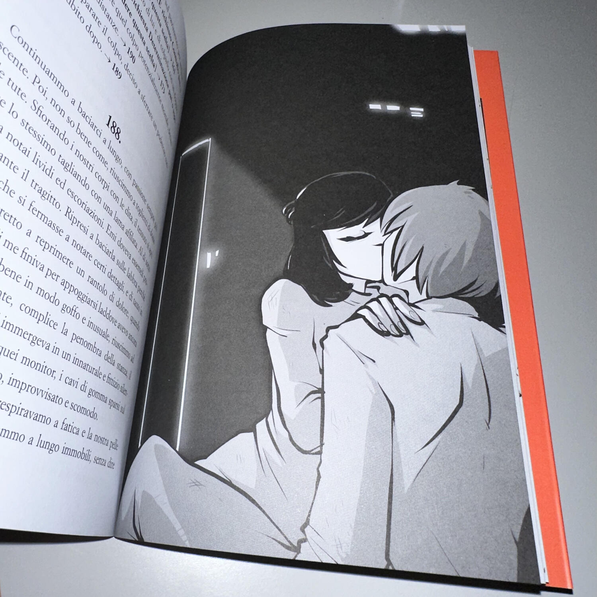

<Setting>

  Vi risvegliate in una stanza cubica, davanti a voi una parete completamente
  occupata da uno specchio, vi guardate ma vi sembra di fissare uno sconosciuto.
  Non sapete chi siete e come siete finiti lì, dallo specchio notate che dietro
  di voi c'è una sorta di armadietto aperto, tanto grande da potervi contenere e
  così supponete di essere appena uscito, proprio da lì dentro, da una sorta di
  sonno criogenico. Mentre vi riprendete dai dolori muscolari dovuto al profondo
  sonno, notate che accanto al vostro armadietto ce ne sono altri tre, ancora
  chiusi. Curiosando, riuscite ad attivarli, facendo uscire le tre persone che
  ancora stavano dormendo al loro interno. Nessuno sa esattamente chi sia o cosa
  ci faccia lì. Lentamente però cominciano a ricordare i propri nomi e a
  scoprire le loro peculiarità: come il saper leggere delle frasi in una strana
  lingua presenti nella stanza oppure il saper utilizzare i terminali digitali
  di quel posto. Tutti iniziano ad avere un'identità, tranne voi. Il vostro
  obiettivo è quello di scoprire dove vi trovate, qual è il vostro passato e
  soprattutto cosa vi attenderà al di fuori della stanza.

</Setting>

<Rules>

  Le meccaniche del gioco si basano su tre caratteristiche del personaggio:{" "}
  <strong>Controllo</strong>: la capacità di tenere a bada le reazioni
  impulsive; <strong>Consapevolezza</strong>: quanto sai di te e di quello che
  ti sta accadendo; <strong>Determinazione</strong>: la forza per prendere
  decisioni e sopravvivere.
   I valori di queste caratteristiche aumenteranno o diminuiranno in base ad
  alcuni eventi che affronterete durante la lettura. In base al valore delle caratteristiche
  potrete sbloccare delle scelte all'interno dei paragrafi.  
  Altra meccanica molto importante è quella della squadra. I personaggi
  all'interno della storia sono quattro e dovrete sfruttare le loro capacità per
  superare determinati eventi. Utilizzare un personaggio piuttosto che un altro
  andrà ad influire sul rapporto che avete con quel personaggio e le modalità di
  superamento degli eventi successivi.  I personaggi secondari influenzano
  in modo attivo la storia e il gioco vi dà anche la possibilità di sbloccare
  delle relazioni sentimentali con alcuni personaggi, attraverso una sequenza di
  scelte nei paragrafi. Sarete voi a decidere chi portare con voi e chi lasciare
  indietro.

</Rules>

<Feedback>

  Makhtum: Il risveglio è il primo volume di una serie di libri-gioco dai toni
  fantascientifici. Si tratta di una storia piacevole che vi introduce al mondo
  in cui tutto è ambientato e vi fa subito legare con i personaggi che vi
  terranno compagnia per tutto il viaggio. Quest'ultima è la cosa che ho
  preferito: la possibilità, cioè, di modulare le relazioni con i personaggi in
  squadra, che riesce a dare un feeling diverso ad ogni run che iniziamo. Il
  rapporto con chi vi sta accanto è in continua evoluzione e influisce in prima
  persona sulle vostre possibilità di sopravvivenza.  
  Ho trovato molto interessante la presenza di vere relazioni sentimentali con i
  personaggi, con la possibilità anche di andare oltre il semplice cuoricino accanto
  al nome, con vere e proprie scene intime descritte dall'autore.  
  In generale questo volume è un'ottima introduzione alla storia di Due, il
  protagonista, e del mondo in cui si risveglia. Nella parte finale tutto
  diventa ancora più intricato e interessante ma alla fine si rimanda,
  ovviamente, al prossimo volume (che ancora non è uscito), lasciando un'enorme
  curiosità che solo la lettura del secondo capitolo potrà soddisfare.

</Feedback>

