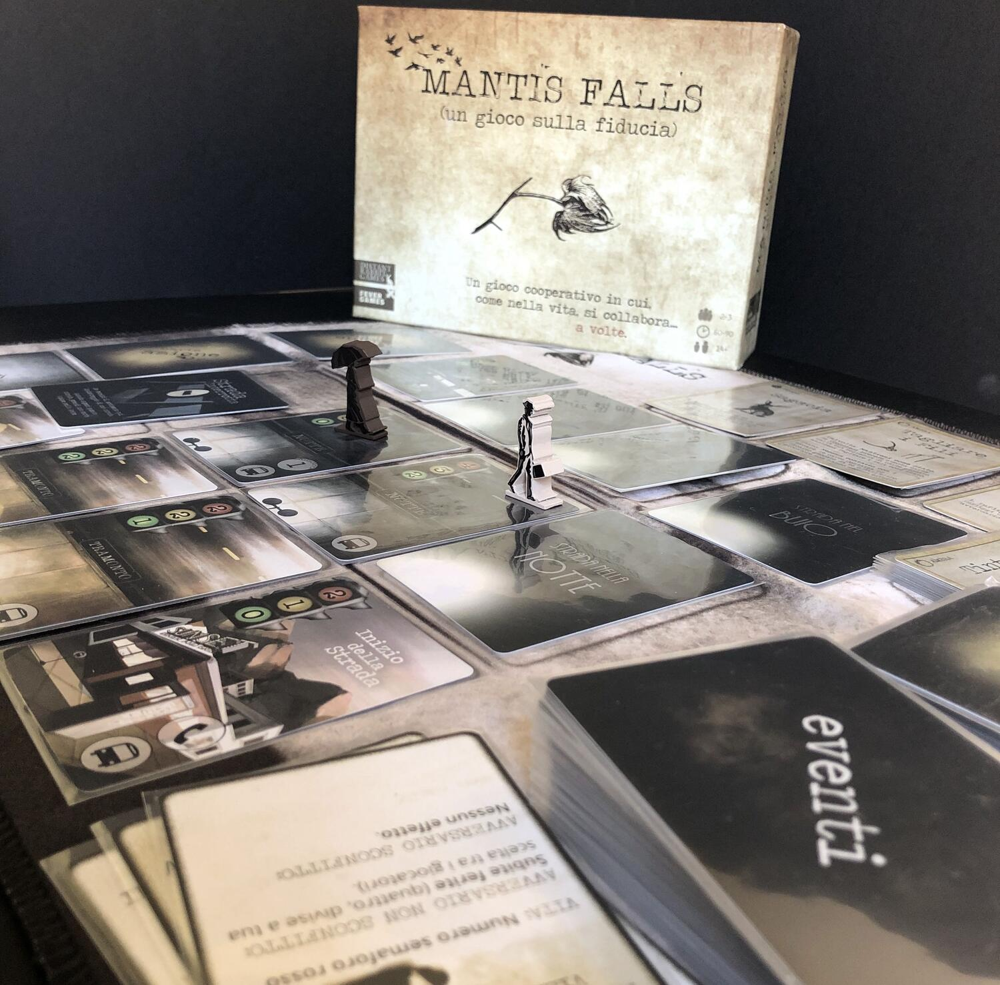
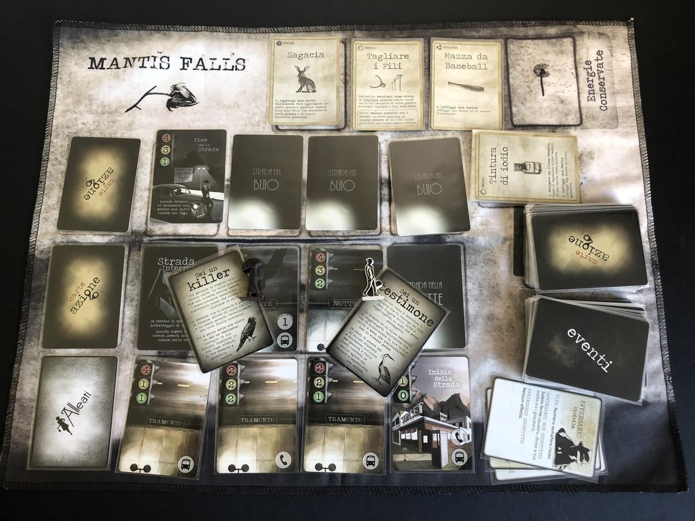

<Setting>

  Mantis Falls, Anni '40: sei il testimone di un omicidio. Ti viene detto che ti
  porteranno in salvo e al processo se raggiungerai la macchina che troverai in
  fondo alla città. Però ti dicono anche che non c'è più traccia del killer e
  che un altro testimone, o forse due, si uniranno a te. Che sia davvero quello
  che dice di essere? O magari non lo sei neanche tu…

</Setting>

<Rules>

  In Mantis Falls a ogni giocatore verrà dato uno dei due ruoli ad inizio
  partita: Testimone o Killer. Una volta definiti questi ruoli, i giocatori
  passeranno la partita cercando di sopravvivere mentre avanzeranno lungo la
  strada, sperando di non venire uccisi dagli eventi o dal killer nascosto, che
  dovrà bluffare cercando di non farsi scoprire fino a che non sarà in grado di
  porre fine alla vita dei suoi compagni di viaggio. Gli eventi verranno gestiti
  dai giocatori che dovranno giocare delle carte per poter proteggersi dagli
  stessi… o danneggiare indirettamente / direttamente gli altri giocatori!
  Fulcro del gioco sarà infatti sapere come e se colpire gli altri sfruttando al
  meglio un particolare tipo di eventi, che saranno visibili solo al giocatore
  attivo, che, senza barare, dovrà spiegare agli altri cosa sta succedendo…

</Rules>

<Feedback>

  Mantis Falls è un gioco particolare. Inutile negarlo. Vuoi per la cura estrema
  nei dettagli, vuoi per la qualità superiore dei materiali o vuoi per il set di
  bustine protettive regalate assieme al gioco: ma tutto questo fa brodo nel
  giudicare un gioco da tavolo. Uscito dalla piattaforma Kickstarter qualche
  tempo fa, poteva passare in sordina, ma per fortuna non è successo. Ora ci
  ritroviamo con un prodotto capace di regalare un diverso spin al tema dei
  giochi con traditore che può piacere sia agli scafati dei giochi da tavolo sia
  a chi si sta interessando solo ora al genere!

</Feedback>
