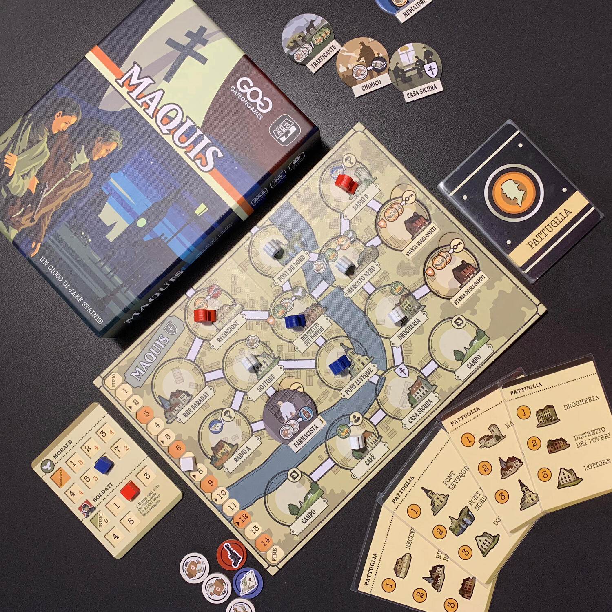
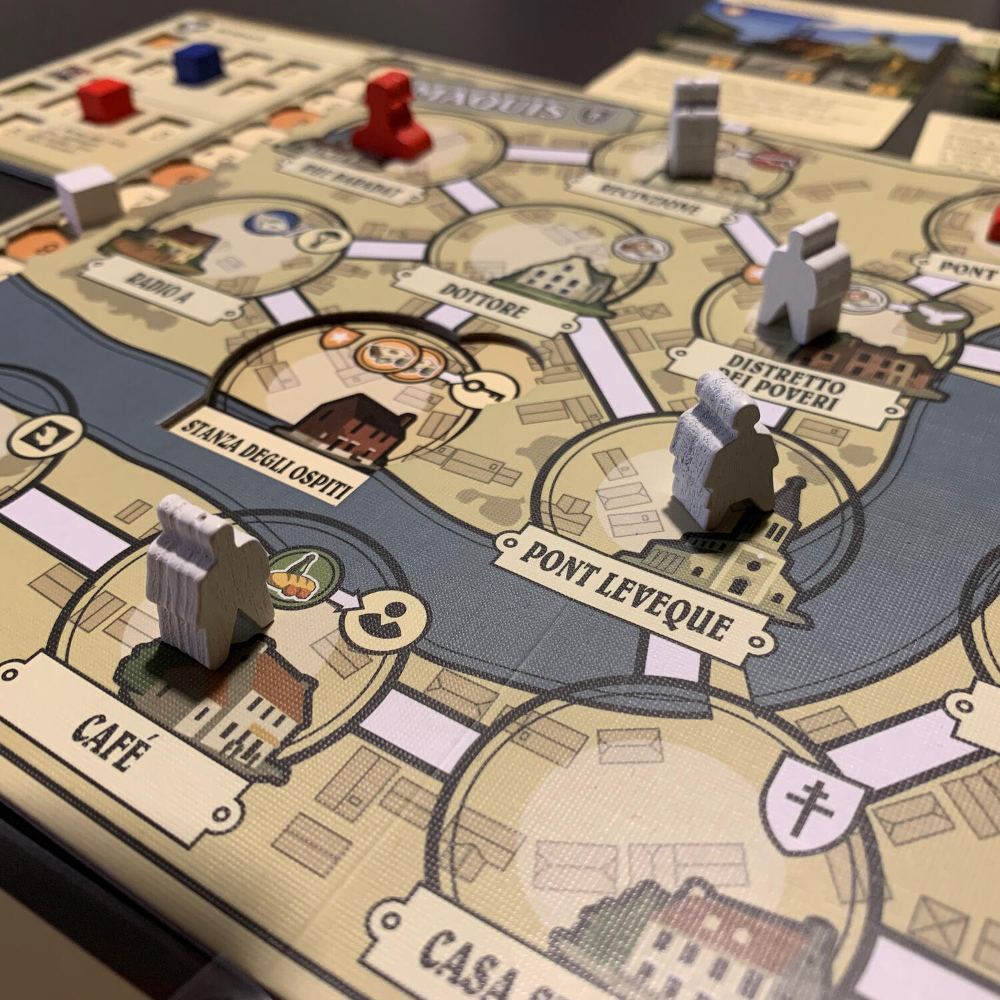
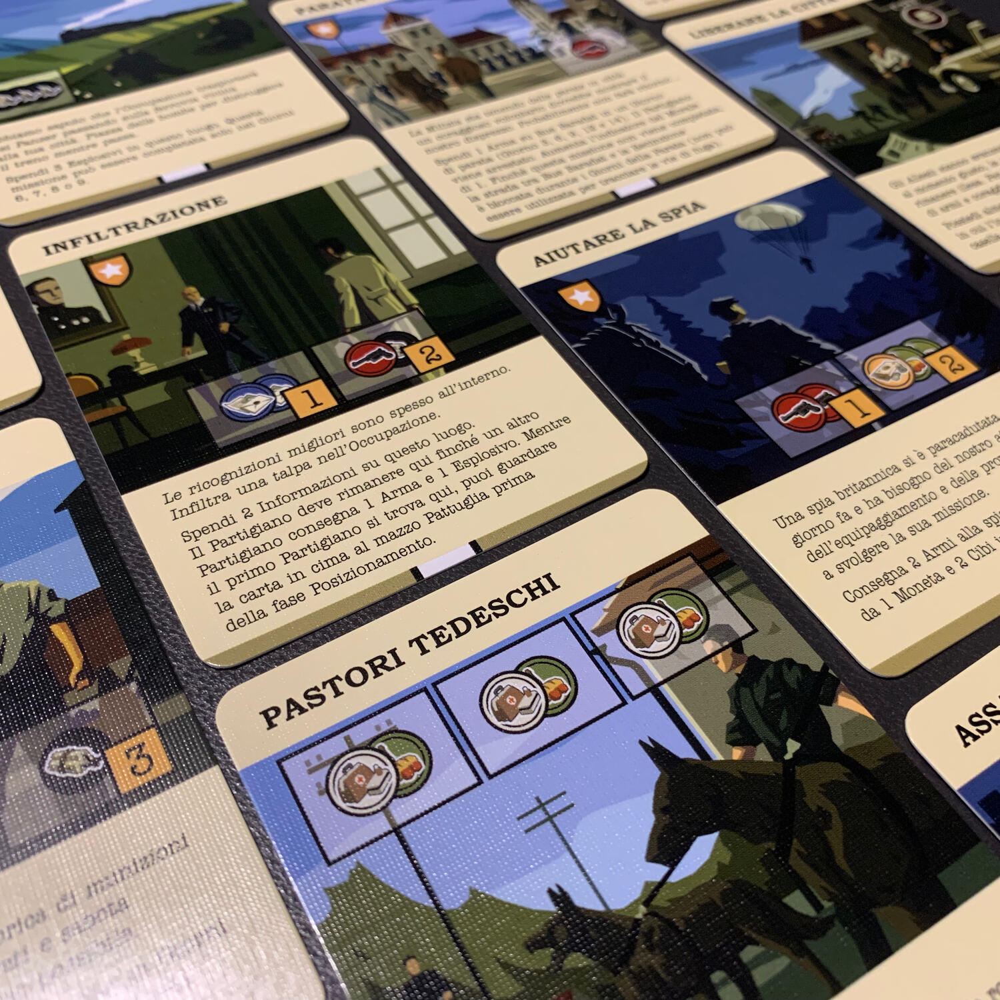

<Setting>

  Col termine <strong>maquis</strong> (in francese letteralmente “macchia”, nel
  senso di “boscaglia”) si indica il movimento di{" "}
  <strong>resistenza e liberazione nazionale francese</strong> durante la
  seconda guerra mondiale. I combattenti partigiani erano detti maquisards.
   
  Lo stesso termine in Spagna indica il movimento di resistenza armata al
  franchismo che, dopo la fine della guerra civile spagnola, fu particolarmente
  attivo in Cantabria, sui Pirenei e in Andalusia.
   
  Chiaro il concetto?  
  Prendete armi e munizioni… e siate pronti a sparare alle ginocchia dell'invasore.

</Setting>

<Rules>

  Immaginate la plancia di Maquis come una mappa di una città, con tanto di
  mercato, di dottore e pure di un paio di ponti.
   
  Il nostro scopo sarà quello di mettere a segno <strong>due missioni</strong>,
  scelte casualmente a inizio partita. Queste missioni spaziano tantissimo: dal
  fare propaganda con dei graffiti nei punti focali della città al far saltare
  in aria le contraeree naziste. Per completare queste missioni dovremo gestire
  un gruppo di partigiani che, votati al credo, si sacrificheranno per ottenere
  del cibo, delle medicine, delle armi… da utilizzare per liberare la Francia
  dall'invasore.
   
  Per <strong>ottenere queste risorse</strong>, bisognerà spingere i maquisards
  a raggiungere delle zone della città e, soprattutto, essere certi che{" "}
  <strong>tornino a casa</strong> con quanto bramato. Ogni volta che, così
  facendo, posizioneremo un lavoratore, gireremo una carta che indicherà dove
  posizionare un poliziotto. Se, una volta posizionati tutti i nostri meeple, un
  agente ci blocca la strada di casa, il nostro incontro con la legge può finire
  in due modi: o il nostro lavoratore verrà arrestato e scomparirà completamente
  dal gioco oppure, nel caso avessimo un'arma, si potrebbe uccidere quel
  poliziotto e fuggire. L'agente di polizia sarà sostituito da un vero e proprio
  soldato, impossibile da uccidere, che non avrà problemi a farci sparire se
  dovesse incontrarci nei giorni successivi.{" "}
  <strong>    Tutti i maquisards che torneranno a casa ci daranno accesso alle sudate
    risorse.</strong>
   
  Quando avremo le risorse necessarie per completare una missione, manderemo un
  partigiano a consegnare quanto necessario e, nuovamente, spereremo di vederlo
  tornare all'uscio di casa.
   
  La partita sarà vinta se le missioni verranno completate in meno di{" "}
  <strong>15 giorni</strong>… altrimenti la resistenza non sarà stata
  sufficiente, anche se non per questo inutile.

</Rules>

<Feedback>

  Maquis è un capolavoro, nulla da dire.  
  Giocare questo gioco inonda il cuore di un bellissimo <strong>    sentimento anti-fascista</strong>, che ti porta a sacrificare il singolo per poter donare una vita di speranza
  alle prossime generazioni.
   
  Tornando al mero gioco, ogni partita è molto diversa dalle altre e modificarne
  il livello di difficoltà è molto semplice: le missioni hanno un <strong>    grado di sfida</strong>, da 0 a 3 che porterà ad avere partite di complessità da 0 a 6.  
  Ogni missione è diversa dalle altre: alcune avranno bisogno di risorse
  semplici, come del cibo, delle medicine; altre richiederanno delle armi, delle
  informazioni o addirittura documenti falsi. Queste ultime risorse non sono
  disponibili facilmente e bisognerà "costruire degli edifici" che ci aiuteranno
  a procurarci il necessario. Infatti, sulla plancia ci sono tre luoghi vuoti
  che si potranno riempire con alcuni scelti a seconda delle richieste.
   A inizio partita avremo uno stile di gioco parsimonioso, volto a portare
  sempre a casa i nostri compagni ma che, con il passare delle giornate, muterà e
  saremo portati a <strong>rischiare sempre un po' di più</strong>… altrimenti non
  riusciremo a completare tutti i nostri obiettivi.
   
  Se l'idea di posizionare le guardie basandosi su di un mazzo di carte non vi esalta,
  sappiate che queste sono 10 e che una volta rivelate, resteranno pubbliche fino
  a quando non rimescoleremo il mazzo. Va da sé che, a mano a mano che il mazzo si
  assottiglia, sapremo con certezza matematica dove andranno a pattugliare le guardie.{" "}
   
  Questo gioco mi ha fatto compagnia durante la mia esperienza Covid e mi ha
  davvero salvato la sanità mentale. Avrà per sempre un{" "}
  <strong>posto nel mio cuore</strong>.

</Feedback>

