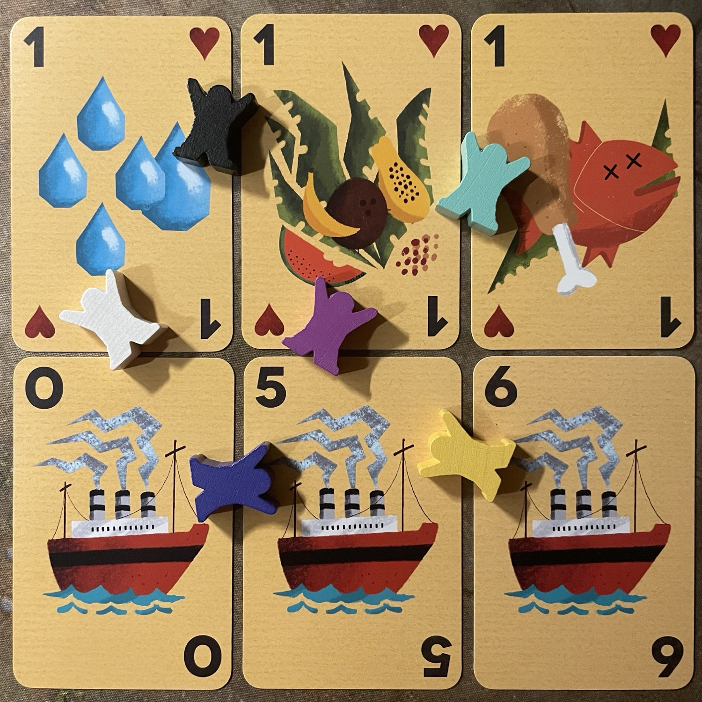
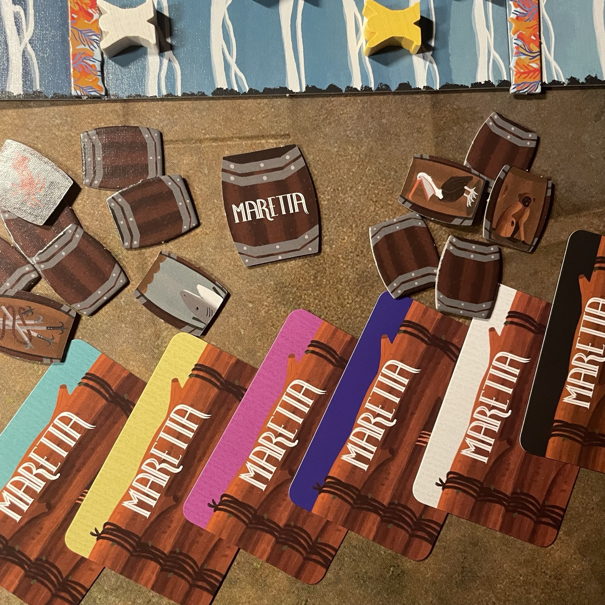

<Setting>

  Siete naufraghi che tentano di salvarsi da <strong>un’isola deserta</strong>… o da <strong>un vulcano in eruzione</strong>! Nel primo caso – ovvero <strong>Fuga da Maretta</strong> – farete una corsa contro gli altri naufraghi per fare in modo di salire sul piroscafo che vi salverà; nel secondo – <strong>Fuga da Vulcano</strong> – occorrerà invece correre a capofitto verso il mare mentre un fiume di lava incombe su di voi. In entrambi i casi… pronti, partenza, via!

</Setting>

<Rules>

 Questa piccola confezione contiene <strong>due modalità di gioco</strong>, Fuga da Maretta e Fuga da Vulcano, della durata di circa 20 minuti ciascuna. 
In una partita a <strong>Fuga da Maretta</strong> si gioca una serie di <strong>round</strong>, ciascuno suddiviso in <strong>tre fasi</strong>. Nella <strong>prima fase</strong>, i giocatori scelgono simultaneamente una carta tra le 4 disponibili nella propria mano e la collocano coperta sullo spazio di sinistra della propria <em>Zattera</em>. Queste carte vengono poi rivelate contemporaneamente da tutti. Segue la <strong>seconda fase</strong>, durante la quale, partendo dal primo giocatore, ognuno dovrà collocare una delle carte rimaste nella propria mano sullo spazio di destra (se libero) della <em>Zattera</em> di un avversario: il giocatore che riceve la carta si muoverà immediatamente lungo la plancia di un numero di passi pari alla differenza in termini numerici tra le due carte (è possibile che questo valore sia 0). Il giocatore attivo, quello che ha collocato la carta sulla <em>Zattera</em> avversaria, invece, si muoverà di 2 passi. Dopo il movimento, il giocatore successivo in senso orario svolgerà la medesima fase. Occorre precisare che solo qualora il giocatore attivo non potesse collocare una carta su nessuna <em>Zattera</em> avversaria (perché tutte occupate) potrebbe collocare la carta sulla propria <em>Zattera</em>, muovendo il proprio meeple di un numero di passi pari alla differenza numerica tra le proprie carte, ma senza i 2 passi bonus. Quando il meeple di un giocatore termina il proprio movimento su uno spazio in corrispondenza di uno o più <em>Barili</em> (che siano rivelati o meno), quel giocatore dovrà sceglierne uno e applicarne l’effetto immediatamente, prima di scartarlo dal gioco. È bene ricordare che nel momento in cui su una <em>Zattera</em> venisse collocata una carta identica sia per simbolo che per valore a quella ivi già presente, non avverrà un movimento: il giocatore attivo ruberà invece una carta dalla <em>Riserva</em> (vd. <em>infra</em>) di quel giocatore, ponendola nella propria. Nella <strong>terza e ultima fase</strong> i giocatori collocheranno le carte presenti sulle loro zattere nella propria <em>Riserva</em> (un apposito spazio della propria area di gioco). Prima di cominciare un nuovo round, si pescano due carte dal mazzo e si passa il segnalino primo giocatore a sinistra. Quei giocatori i cui meeple raggiungono il <em>Piroscafo</em> alla fine della terza fase di un qualunque round vengono dichiarati vincitori; inoltre, qualora si esaurisse il mazzo di pesca delle carte, vincerebbe il giocatore più avanti nel tracciato della plancia; infine, quando, durante la terza fase di un turno, uno o più giocatori hanno collocato una carta <em>Piroscafo</em> sulla loro <em>Zattera</em>, tutti i giocatori hanno la possibilità di vincere anticipatamente nel modo seguente: ogni giocatore calcola il valore di movimento in base alle carte attualmente sulla propria <em>Zattera</em> e vi somma un punto per ogni simbolo diverso presente sulle carte della propria <em>Riserva</em> (per salvarsi, salendo su questo “piroscafo di passaggio” occorre raggiungere un valore totale di almeno 7). Nel caso in cui nessuno si sia salvato, la carta <em>Piroscafo</em> viene rimossa dal gioco. 
<strong>Ruotando la Plancia</strong> e rimuovendo elementi specifici per Fuga da Maretta (le carte <em>Piroscafo</em> e i <em>Barili Seppia</em>) si può giocare a <strong>Fuga da Vulcano</strong>. Anche in questo caso si susseguono dei round suddivisi in <strong>quattro fasi</strong>: nella <strong>prima fase</strong>, a partire dal primo giocatore, ognuno colloca una carta scoperta su un <em>Carrello</em> avversario; nella <strong>seconda fase</strong>, il giocatore attivo dovrà piazzare sul proprio <em>Carrello</em> una carta che non abbia in comune né il simbolo né il valore della carta piazzata dall’avversario; svolto questo passaggio, nella <strong>terza fase</strong> le carte su ciascun <em>Carrello</em> verranno collocate nella <em>Riserva</em> personale, allineate per tipologia, e ogni giocatore farà tanti passi quante le tipologie diverse di simboli presenti sulle carte della <em>Riserva</em>. Tuttavia, nel caso in cui la somma dei valori presenti in una medesima colonna superasse il 5, tutte le carte di quella colonna verrebbero scartate prima del movimento. In una <strong>quarta fase</strong> il segnalino lava si sposta verso il basso di 3 passi, divorando eventuali meeple sul suo cammino (ed eliminando i relativi giocatori). Prima di procedere con un nuovo round si pescano 2 carte e si passa il segnalino primo giocatore. Il primo a raggiungere l’acqua (o l’ultimo ad essere rimasto in vita) vince la partita.

</Rules>

<Feedback>

  Nelle due modalità di gioco – a parte la freneticità, che in <em>Fuga da Vulcano</em> è certamente una caratteristica visibile, con il segnalino lava che incombe perennemente su tutti – cambierà la motivazione della scelta nella selezione delle carte da collocare su <em>Zattere</em> e <em>Carrelli</em>, ma fondamentalmente si tratterà di <strong>collezionare set</strong>. La semplicità di questa meccanica e la breve durata rendono <em>Maretta</em> – in entrambe le sue formule – un <strong>filler gustoso e accessibile</strong>, rivolgendosi preferenzialmente a un <strong>pubblico giovane, familiare e/o di neofiti</strong>. Il livello di <strong>interazione</strong> è significativo e consiste soprattutto nel causare svantaggi agli altri giocatori in base alla situazione contingente. La modalità <em>Fuga da Maretta</em> insiste sulla collaborazione mirata e meditata per ottenere un vantaggio personale al momento giusto: il momento del furto di una carta a un avversario va pilotato, per quanto possibile, al fine di ottenere il vantaggio determinante per strappare la vittoria al passaggio del piroscafo; lo stesso dicasi per la carta <em>Piroscafo</em>, che – se poco ponderata – può regalare la vittoria a un altro giocatore. L’elemento dei <em>Barili</em> introduce un fattore di adrenalina, soprattutto una volta che i simboli saranno memorizzati e abbinati ai relativi effetti, poiché si può trarne vantaggio sia sfruttandoli per sé che ai danni degli altri giocatori. 
Con la <strong>micro-espansione Carnivore Pack</strong> (che trova tranquillamente posto nella compatta scatola base) si può arrivare a 6 giocatori e contare su un’agevolazione in entrambe le modalità di gioco: in <em>Fuga da Maretta</em> la presenza di un tipo di risorsa in più per salire sul piroscafo renderà più facile la conclusione anticipata della partita; in <em>Fuga da Vulcano</em>, quel tipo di risorsa in più da collezionare consentirà di disporre di una colonna in più per evitare il fatidico 5. 
Di questo titolo si apprezza la possibilità di <strong>rendere modulare la plancia</strong>, su incoraggiamento stesso degli autori, che includono appositi materiali per <strong>personalizzare l’esperienza di gioco</strong>, e – come già per <Link to="/reviews/finis-terrae"><em>Finis Terrae</em></Link>, opera prima dei fratelli Sassi Zanichelli – apprezziamo la scelta di adottare <strong>materiali eco-friendly</strong>.

</Feedback>

