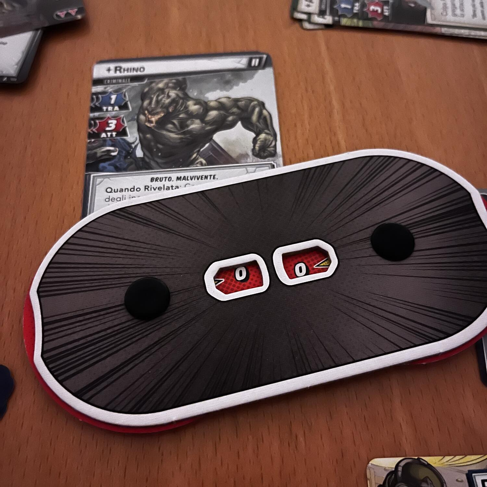
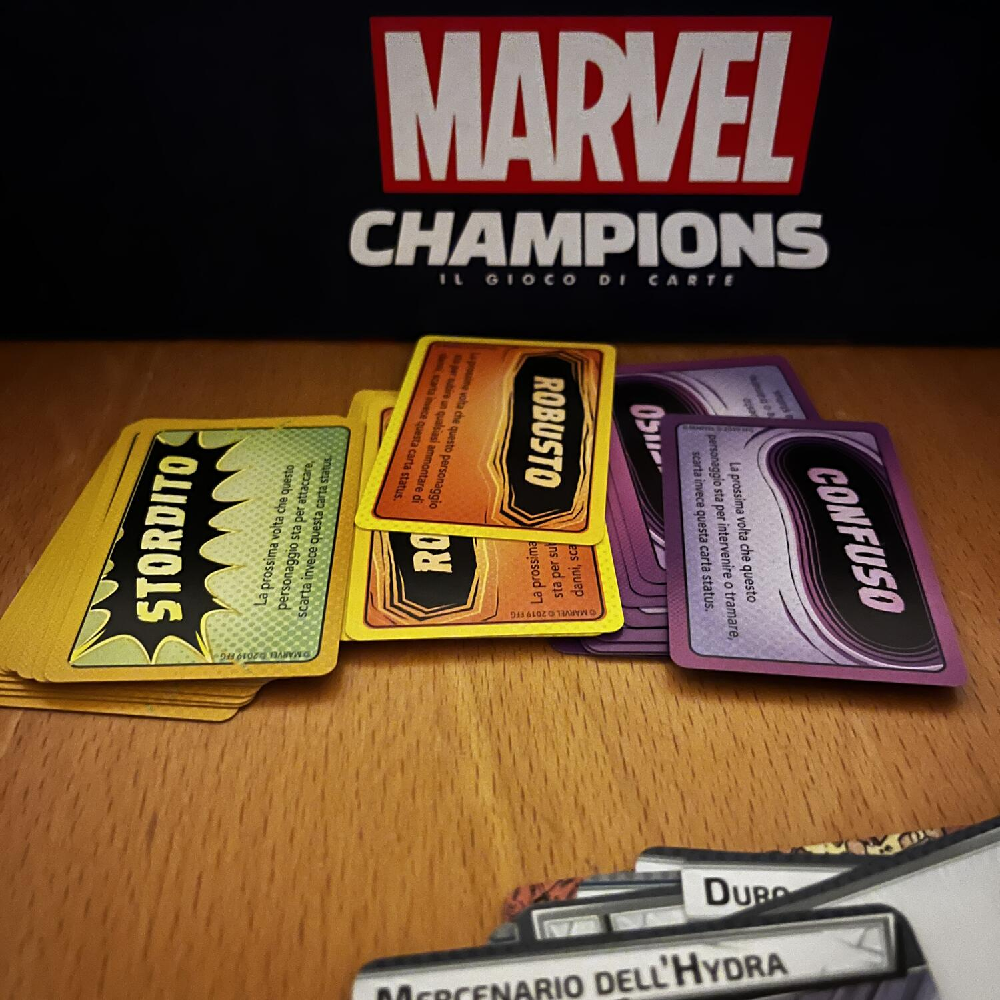

<Setting>

  Marvel. Supereroi contro Criminali. Serve dire altro? Probabilmente no. Ogni
  appassionato dei fumetti della celebre casa editrice potrà ripercorrere le
  famose saghe dei suoi supereroi preferiti in questo{" "}
  <Link to="//mechanisms/lcg"> lcg </Link> e crearne di nuove. In fondo, si è mai
  vista She Hulk combattere da sola contro Ultron? (ndr: in realtà sì, ma è una
  saga decisamente semisconosciuta).

</Setting>

<Rules>

Una partita a Marvel Champions inizia ancora prima di giocare. Infatti, dopo aver scelto un personaggio con un suo set di circa 15 carte obbligatorie, bisognerà completarlo con altre 25 carte minimo. Si potrà scegliere tra delle carte definite base e delle carte Offensiva, Giustizia, Autorità o Protezione che strutturerà la gestione del proprio eroe per tutta la durata della partita. <Link to="/mechanisms/deck-building"> Deck building </Link> in pieno stile Fantasy Flight!  
Una volta iniziata la partita i giocatori potranno una sola volta a turno decidere di cambiare lo stato del proprio personaggio da Supereroe al suo Alter Ego, permettendo così l’accesso ad azioni diverse. Si potranno inoltre giocare carte dalla mano. Ogni carta ha un costo e, generalmente, vale una risorsa, permettendo una interessante scelta tra tenerla in mano per giocarla in un turno successivo o scartarla.  
Le possibilità di gioco non finiscono qui, ma si complicano, perché i giocatori dovranno anche gestire i loro alleati per fronteggiare i minion nemici e il nemico principale, evitando che quest’ultimo completi la sua trama principale e quelle secondarie. 
Finito il round dei giocatori toccherà al criminale, che cercherà in tutti i modi di uccidere i supereroi e far proseguire la sua trama primaria, che gli procurerà dei vantaggi.

</Rules>

<Feedback>

  Tanto si potrebbe dire di questa scatola base di Marvel Champions e non
  sarebbe mai abbastanza. Una lettera d’amore per gli amanti dell’universo
  Marvel, grazie ad una grafica che sembra presa pari pari da una striscia
  (anche se non sempre). Un sistema di gioco che permette ai giocatori del buon
  deck building e delle partite non eccessivamente lunghe, a meno che non
  giochiate in 4 (evitate se vi disturba l’eccessiva durata).  
  In quanto lcg, Marvel Champions è espandibile con vari pack eroe, scenari ed espansioni
  campagna, ma se ci limitiamo al gioco base è bene notare che il deckbuilding in
  sé sarà molto limitato, come anche la rigiocabilità. Si potranno sì giocare tutti
  i personaggi contenuti nella scatola base in modo diverso, ma ci sarà sempre lo
  stesso livello di funzionalità? Si riuscirà a sconfiggere il Criminale di turno
  ad eroico 4?! E sarà davvero possibile vincere ad eroico 4??

</Feedback>

