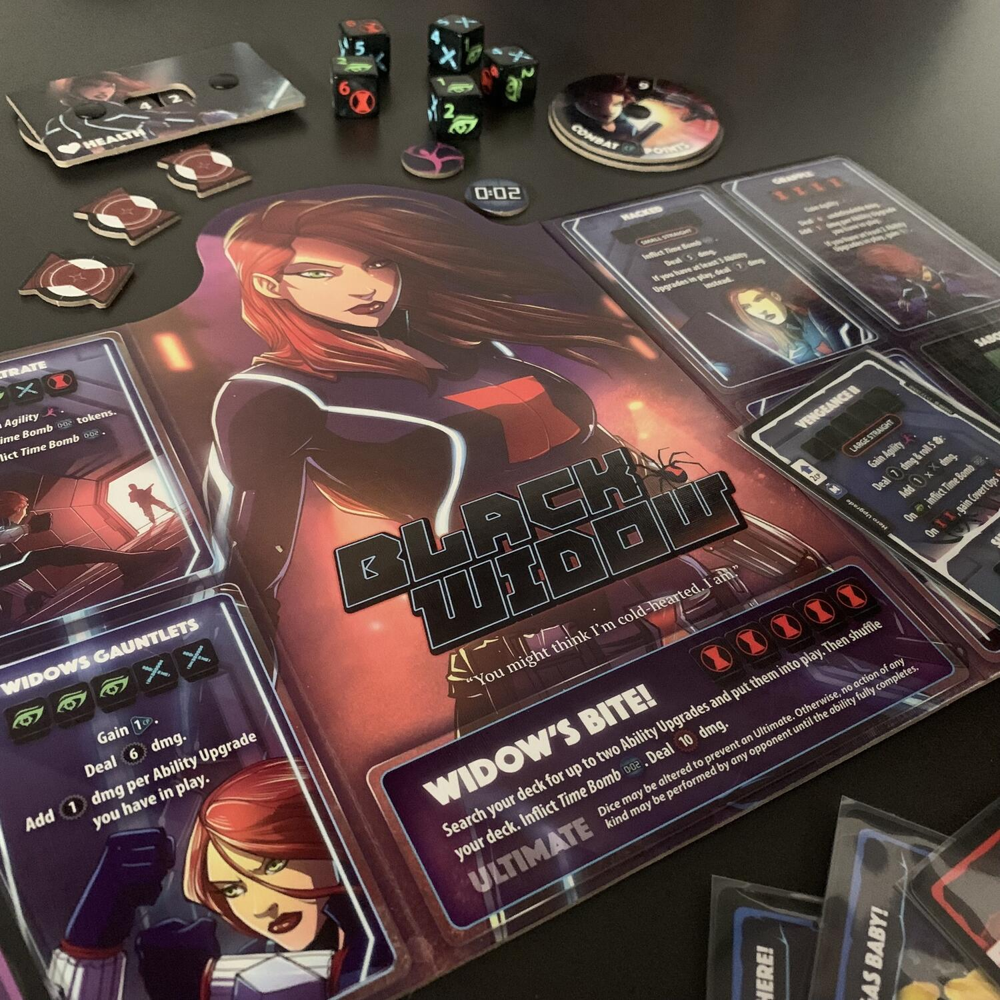
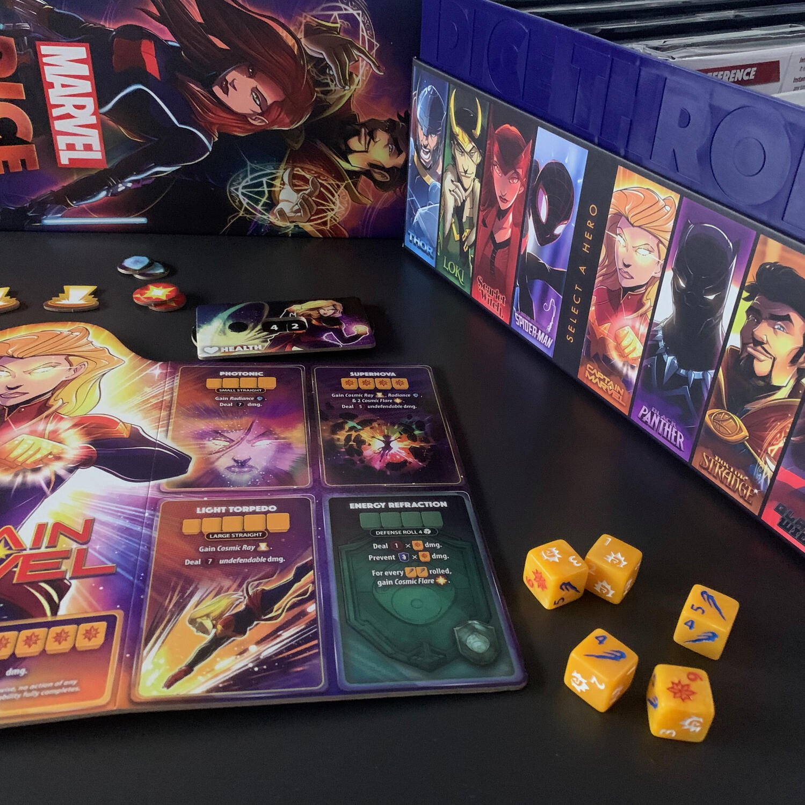

<Setting>

  Cosa succederebbe se improvvisamente gli Avengers decidessero di prendersi a
  sberle invece che aiutarsi l'un l'altro contro il cattivone di turno?  
  Quanto sarebbe umiliante per il Dr. Strange essere imprigionato dalle ragnatele
  di Spider-Man mentre Thor lancia il Mjöllnir a destra e a sinistra?
   
  Tutto questo può diventare reale semplicemente aprendo una scatola.

</Setting>

<Rules>

  Marvel Dice Throne mette a disposizione <strong>8 eroi</strong> dalle
  caratteristiche asimmetriche, ciascuna in relazione allo stile di
  combattimento e alla personalità del personaggio.
   
  <ul>
    <li>      <strong>Thor</strong> lancerà il Mjöllnir come fosse un boomerang;</li>
    <li>      <strong>Scarlet Witch</strong> altererà la percezione della realtà dei
      nemici rendendoli incapaci di attaccare come vorrebbero;</li>
    <li>      <strong>Loki</strong> si nasconderà dietro a delle illusioni per scappare
      dagli attacchi;</li>
    <li>      <strong>Captain Marvel</strong> genererà raggi cosmici che non fanno
      proprio bene alla pelle di chi li riceve;</li>
    <li>      Miles Morales (<strong>Spider-Man</strong>) userà la sua agilità per
      rendersi invisibile e attaccare anche due volte in un turno;</li>
    <li>      <strong>Black Panther</strong> ci insegnerà che prendere botte porta anche
      a dei benefit;</li>
    <li>      <strong>Dr. Strange</strong> avrà a disposizione un libro pieno zeppo di
      magie che non esiterà a lanciare contro gli avversari;</li>
    <li>      <strong>Black Widow</strong> si equipaggerà come nessun altro e
      appiccicherà bombe sulla schiena degli altri per guardarli esplodere,
      sorridendo.</li>
  </ul>
  Ogni eroe ha una plancia con <strong>8 abilità</strong> (di cui solitamente una
  di difesa), una ultimate (una specie di fatality alla Mortal Kombat), <strong>    un mazzo di carte</strong>, <strong>5 dadi</strong> e dei <strong>token status</strong>. 
  Questi token sono molto vari e specifici per ogni eroe: le ragnatele di
  Spider-Man immobilizzano l'avversario, l'elettrocinesi di Thor gli permette di
  pescare molte più carte, il "Reality warp" di Scarlet scambia un dado
  dell'avversario con uno della strega… impedendo il formarsi di qualsiasi set
  di 5 simboli.
   
  Dopo un <strong>setup</strong> di circa <strong>20 secondi</strong> sarete già
  pronti a schiaffeggiare la dignità del vostro avversario. Per farlo dovrete{" "}
  <strong>giocare delle carte</strong> e <strong>lanciare dei dadi</strong>. Le
  carte possono migliorare la plancia del vostro eroe, aggiungere o rimuovere
  status fastidiosi, andare a modificare i valori dei dadi e molto, molto molto
  altro. I dadi, invece, si gestiscono con un meccanismo simile a quello di{" "}
  <strong>Yahtzee</strong>, ovvero si lanciano tutti e 5 assieme, si tengono
  quelli che si vogliono e si rilanciano gli altri per un massimo di tre volte.
  Il risultato finale serve per eseguire un attacco: ogni abilità ha un set di
  simboli o di numeri richiesti per poter essere attivata. Se il tiro
  corrisponde ad un’abilità desiderata (scelta dopo il lancio), questo viene
  eseguito. La mano passa quindi al difensore che utilizzerà delle carte e
  lancerà a sua volta un numero di dadi pari a quanto descritto dalla sua
  abilità di difesa. Si fa una semplice differenza, si applicano gli status e si
  infliggono così i danni.  
  L'ultimo eroe a rimanere in piedi vince.

</Rules>

<Feedback>

  2006. Italia - Francia. Grosso al dischetto pronto a tirare il rigore. Tira.
  Goal. Italia campione del mondo. Ti ricordi la sensazione che hai provato?
  Quella scarica di <strong>adrenalina</strong> che ti fa{" "}
  <strong>alzare in piedi</strong> e ti fa esultare in giro per casa? Ecco,
  questo è quello che provo giocando a Marvel Dice Throne.
   
  Il gioco è più facile da giocare che da spiegare. Il tutto gira come un
  orologio, senza dubbi, senza dover mai rileggere il regolamento. Facile come
  bere un bicchier d'acqua, ma non per questo banale.  
  Il gioco sta tutto nella <strong>gestione delle probabilità</strong> e nel capire
  come e quando andare ad utilizzare le carte.
   
  Ogni eroe è rinchiuso in una scatolina nera tutta sua, con la plancia, i dadi e
  le carte, permettendovi di intavolare il gioco in un batter d'occhio.  
  Alcuni dei personaggi (Black Panther, Captain Marvel) sono più facili da
  giocare di altri (Black Widow e Dr. Strange) ma non per questo meno forti.
  Nella mia esperienza del gioco, su dieci partite almeno la metà sono terminate
  con una <strong>doppia kill</strong>, ovvero con entrambi gli eroi sconfitti
  contemporaneamente: questo è possibile perché alcune abilità di difesa fanno
  anche danno all'attaccante, e questo salire la tensione, specie in situazioni
  in cui quel piccolo graffio in più può portare al pareggio… o alla vittoria!
  Ed è proprio in queste occasioni che ti senti Grosso e inizi a sbeffeggiare il
  tuo amico con tanto di caloroso saluto al fair play.
   
  Il retail del gioco non è uniforme: attualmente gli store italiani permettono
  di comprarlo solamente <strong>diviso in 3 box</strong> separate (4 - 2 - 2),
  altrimenti potete cercare di accaparrarvi la versione battle chest (come in
  foto), che è tanto bella quanto costosa.
   
  Altra cosa da sottolineare è che, nonostante le indicazioni presenti sulla
  scatola, il gioco è praticamente un <strong>1vs1</strong>. Va da sé che con 8
  personaggi potete organizzare un torneo e far giocare contemporaneamente 8
  persone, con tanto di gironi, semifinali e finali.
   
  Chi si porterà a casa la vittoria? il mio voto, ovviamente, lo ha Black Widow.

</Feedback>

