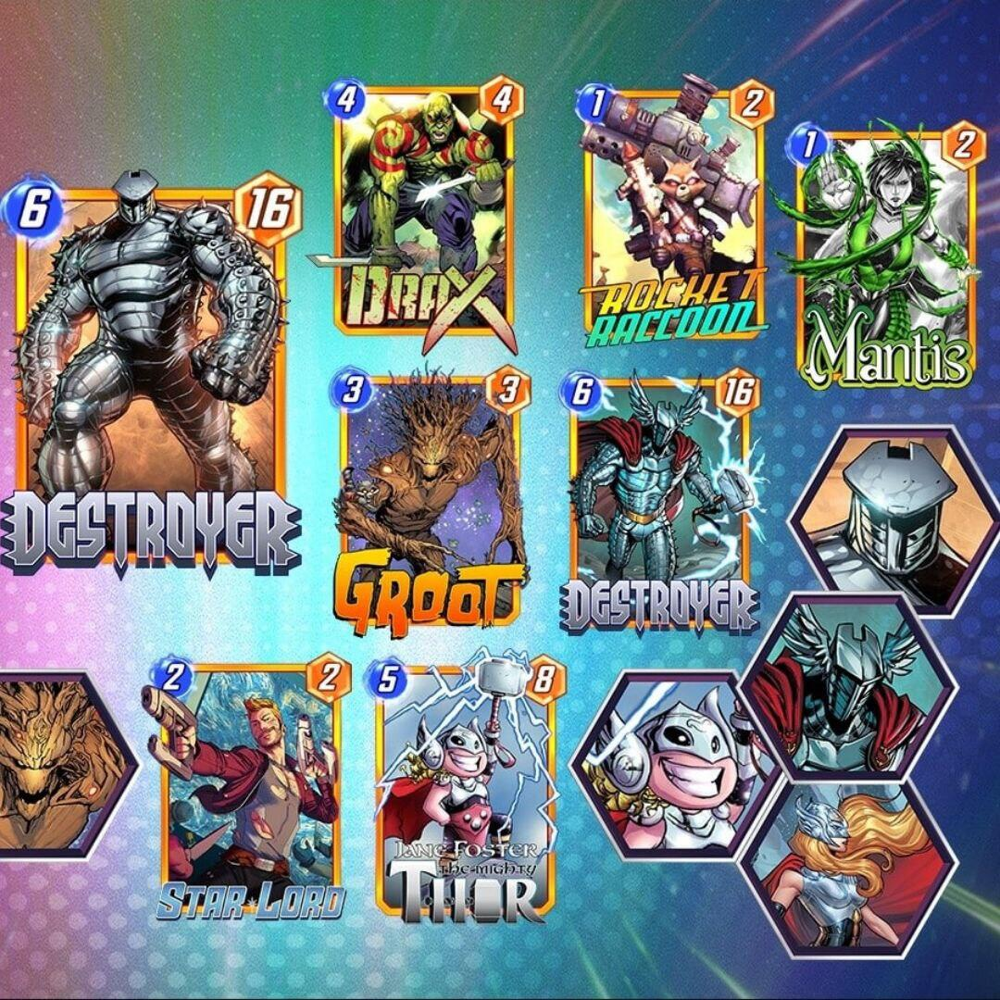
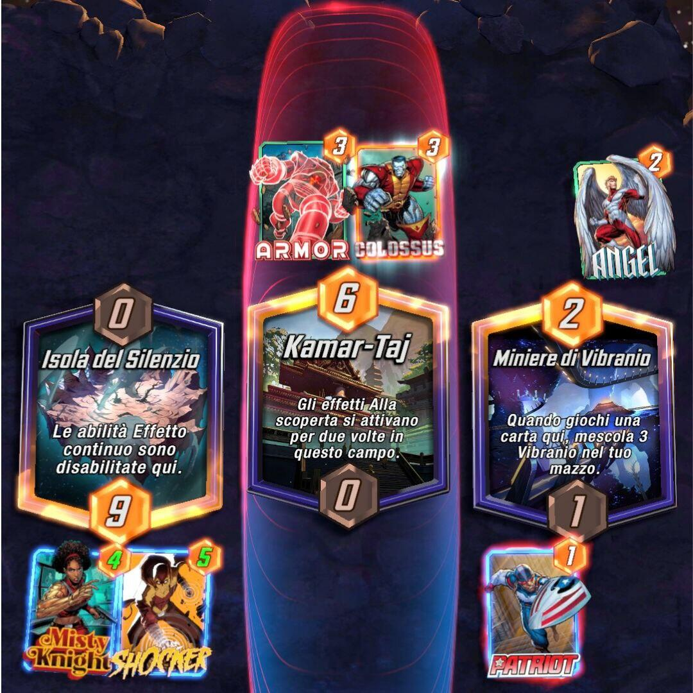
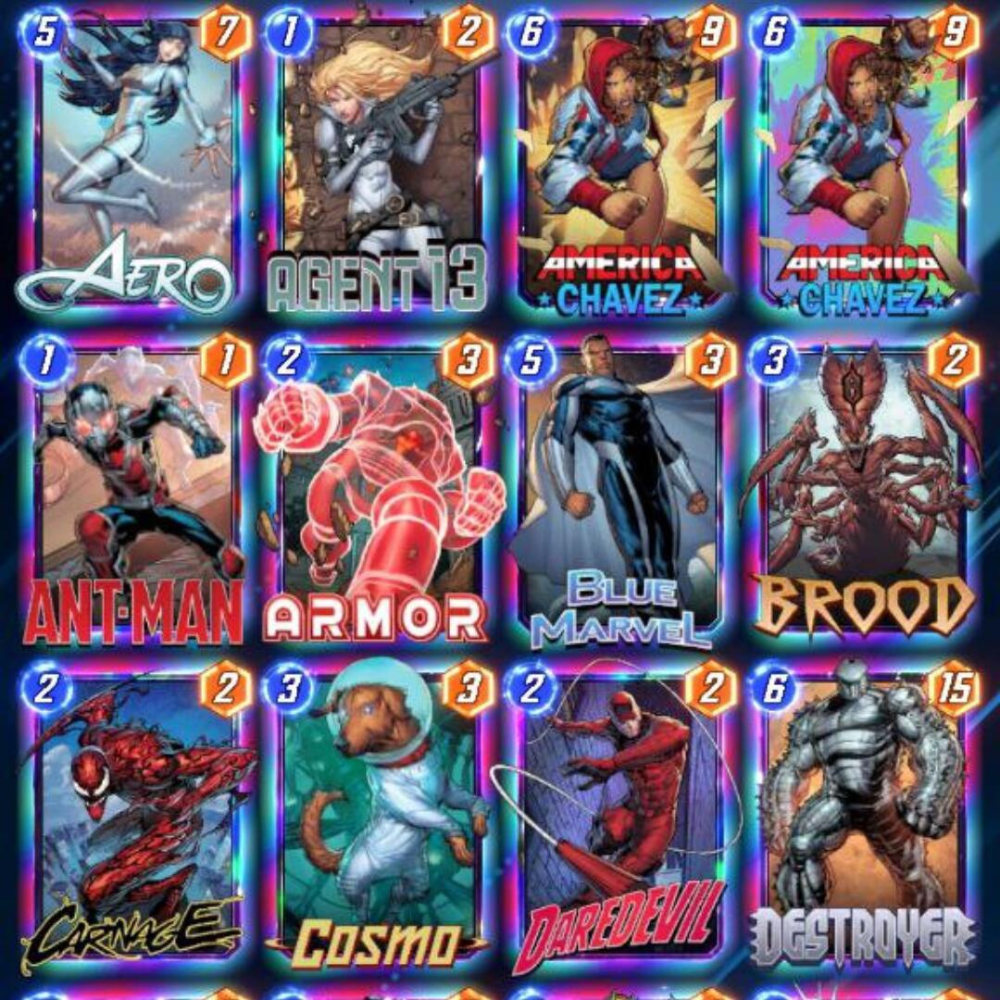

<Setting>

  Unisciti allo sterminato multiverso degli eroi e villains Marvel in epiche e
  coloratissime battaglie! Scatena i loro superpoteri, colleziona tantissime
  carte, migliora la loro estetica e ottieni varianti di famosi artisti e
  fumettisti.

</Setting>

<Rules>

  Ogni giocatore compone il proprio mazzo con 12 carte prese dalla propria
  collezione.
   
  Le partite sono composte da 6 turni: durante il primo, ogni giocatore pesca 3
  carte.
   
  Il tabellone di gioco è diviso in 3 campi, selezionati in maniera autonoma e
  randomica ad ogni partita dalla IA del gioco: esistono circa 80 campi,
  ciascuno con un effetto unico, in cui ogni giocatore può posizionare fino a 4
  carte.
   
  Per giocare una carta bisogna spendere una quantità di energia, indicata nella
  parte in alto a sinistra della carta stessa; le energie totali spendibili nel
  turno sono indicate nella parte centrale dello schermo in basso. Si parte con
  1 energia per giocatore e all'avanzare dei turni verrà aggiunta un’energia
  addizionale. Il costo in energia di ogni carta è indicato in alto a sinistra
  della carta stessa.
   
  <strong>    <strong>STRUTTURA DEL TURNO</strong></strong>
   
  <ul>
    <li>      Rivelazione del campo (per i primi 3 turni solamente e da sinistra verso
      destra);</li>
    <li>Pescare una carta;</li>
    <li>Giocare una o più carte;</li>
    <li>      Attivare le carte in base alla priorità di gioco (che si ottiene avendo la
      forza maggiore in ogni campo);</li>
    <li>      Attivare eventuali effetti del campo (come ad esempio distruggere una
      carta, scartare una carta dalla mano etc.)</li>
  </ul>
   
  <strong>    <strong>COME SI VINCE?</strong></strong>
   
  Ogni carta ha un valore di forza, indicato in alto a destra, che si sommerà a
  quello delle altre carte giocate nel campo. Al centro di ogni campo viene
  riportato per ogni giocatore il totale della forza e il giocatore che ha la
  forza totale maggiore ne ottiene il controllo. Alla fine dei 6 turni vince chi
  ha il controllo di 2 o più campi. In caso di pareggio di forza in alcuni di
  essi, può vincere chi ha la forza maggiore in un solo campo.
   
  <strong>    <strong>CUBI COSMICI</strong></strong>
   
  In alto al centro, tra i nickname dei due sfidanti, troviamo un cubo con un
  numero. Esso rappresenta i cubi cosmici, cioè{" "}
  <em>    i punti vittoria che possiamo ottenere vincendo la partita oppure i punti
    vittoria che perderemo se il nostro avversario avrà la meglio</em>  . Se secondo i nostri calcoli ci troviamo in una posizione di vantaggio e pensiamo
  di vincere, possiamo <strong>Snappare</strong>, ossia cliccare sul cubo e raddoppiare
  la posta in gioco a fine partita. Ogni giocatore è libero di rispondere allo Snap,
  quindi continuare a raddoppiare i cubi (fino a un massimo di 8) oppure ritirarsi
  dalla partita e lasciare all'avversario i cubi messi in palio fino al turno precedente.

</Rules>

<Feedback>

  Perché un giocatore da tavolo dovrebbe installare snap sul proprio smartphone?
  Quante volte ci siamo trovati nella situazione di voler intavolare un gioco,
  ma per mancanza di tempo oppure di altri giocatori non è stato possibile? Il
  punto di forza di Marvel Snap è <strong>l'immediatezza</strong>: il gameplay è
  semplicissimo e le partite durano pochi minuti; inoltre, non c'è bisogno di
  spendere centinaia di euro per avere un mazzo competitivo con il quale
  affrontare gli avversari. Per i fan della casa delle meraviglie{" "}
  <strong>sono disponibili centinaia di varianti delle art delle carte</strong>,
  talmente belle da non poter scappare ai collezionisti (Ricordiamo che ai fini
  del gioco non hanno uno scopo in quanto sono puramente dei disegni alternativi
  alle carte base.)
   
  Come anticipato, il sistema di ottenimento delle carte permette anche a{" "}
  <strong>    chi non vuole spendere soldi di collezionarle semplicemente giocando</strong>
  . La progressione sarà ovviamente più lenta ma non toglierà nulla all'esperienza:
  la IA, infatti, adotta un <strong>    sistema di matchmaking delle partite in base al quale incontreremo sempre un
    altro utente con il livello di colleziona pari o molto simile al nostro.</strong>
   
  <em>Ma qual è il rovescio della medaglia?</em>La progressione della collezione
  in realtà è randomica (al momento in cui scriviamo consta di circa 180 carte),
  quindi è possibile possedere molte carte utili ma non disporre di quelle necessarie
  all’attivazione di combo e di potenti sinergie; allo stesso modo, potremmo ritrovarci
  ad affrontare un avversario che ha ottenuto casualmente o comprato delle carte
  che da sole riescono a costituire un archetipo oppure a fornirgli già delle combo.
  Se poi vogliamo trovare un altro difetto, alcuni giocatori potrebbero trovare frustrante
  il fatto che molte partite si perdono non per bravura dell'avversario ma per una
  sfortunata combinazione dei campi che potrebbe mandare all'aria tutte le strategie
  del loro mazzo.
   
  Un altro aspetto da considerare è il token shop, che viene sbloccato a livello
  collezione 500. Qui ogni 8 ore vedremo una carta che potremo acquistare con i token
  del collezionista; le carte sono divise in pool e il loro costo sarà:
   
  <ul>
    <li>POOL 3 = 1000 Token</li>
    <li>POOL 4 = 3000 Token</li>
    <li>POOL 5 = 6000 Token;</li>
  </ul>
     I token possono essere ottenuti sia da bundle presenti in negozio (da acquistare
    con soldi reali) oppure tramite le casse della collezione, dove però potremo
    trovarne solo 100 per volta. Quindi, ad esempio, arrivare a 1000 token per ottenere
    una determinata carta diventa una bella impresa se non vogliamo spendere nemmeno
    un euro sul titolo.

</Feedback>

