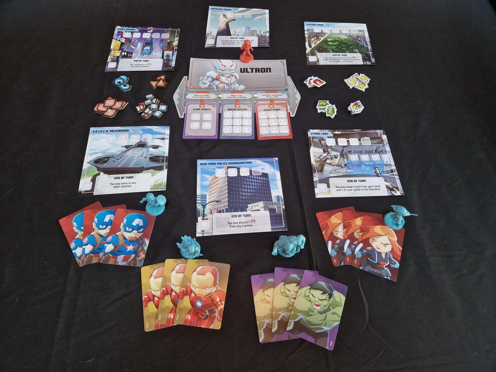
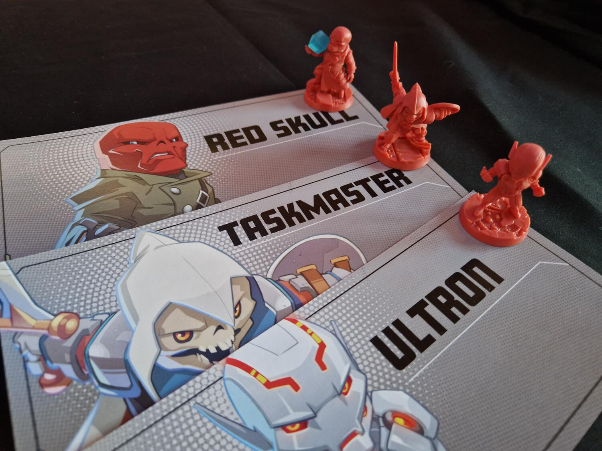

<Setting>

L’ambientazione di Marvel United non ha certo bisogno di presentazioni. Si tratta, infatti, dell’universo Marvel, dal quale il gioco riprende Eroi, Criminali e Luoghi iconici che abbiamo imparato a conoscere attraverso i fumetti e il Marvel Cinematic Universe, senza particolari riferimenti a eventi o storie dei personaggi. Infatti, in Marvel United, sarete voi a scrivere un pezzetto di storia del vostro Eroe preferito, affrontando di volta in volta i diversi villain presenti.

</Setting>

<Rules>

Durante la partita si alternano i turni degli eroi con il turno del nemico. La prima mossa spetta a quest'ultimo, ovviamente!
Nel turno dell’antagonista viene rivelata una carta dal mazzo Piano Malefico; la si posiziona intorno alle plance dei Luoghi e si eseguono le istruzioni riportate. Solitamente il cattivo si muoverà, aggiungendo scagnozzi e civili nei luoghi a lui vicini, ma potrebbe anche attivare la sua abilità “BAM!”, il cui effetto varia a seconda del personaggio.
Nel turno degli eroi, i giocatori prima piazzano in senso orario una carta accanto a quella del Criminale, come per comporre una storia fatta di azioni del malvagio e reazioni degli eroi. In seguito, svolgono le azioni descritte sulla propria carta e su quella giocata dall’eroe precedente, perché è solo unendo le forze che gli eroi potranno sconfiggere tutti i criminali!
Le azioni disponibili sono muoversi, attaccare, salvare civili o sventare delle minacce. Le ultime tre azioni sono utili per il completamento delle tre missioni della partita: salvare 9 civili, sconfiggere 9 scagnozzi e sventare 4 minacce. Attenzione, però, solo dopo aver completato almeno due missioni, sarà possibile attaccare il criminale, sconfiggerlo e vincere così la partita.

</Rules>

<Feedback>

Marvel United riesce perfettamente a integrare l’ambientazione eroica con le meccaniche di un gioco <Link to='/mechanisms/cooperativo/'>cooperativo</Link>. Infatti, la possibilità di poter utilizzare le azioni giocate precedentemente dai propri compagni porta i giocatori a partecipare attivamente nei turni dei compagni.
Il gioco non ha un’elevata difficoltà, il tema e le meccaniche lo rendono perfetto per le famiglie: ore di divertimento garantite e tantissime miniature di eroi e cattivi. Le espansioni sono fortemente consigliate, dal momento che la scatola base contiene solo tre Criminali da affrontare e una manciata di Eroi, e indispensabili se si vogliono visitare luoghi come Wakanda, Asgard o il Queens, e per affrontare tanti e nuovi nemici con il nostro amichevole Spiderman di quartiere.

</Feedback>

