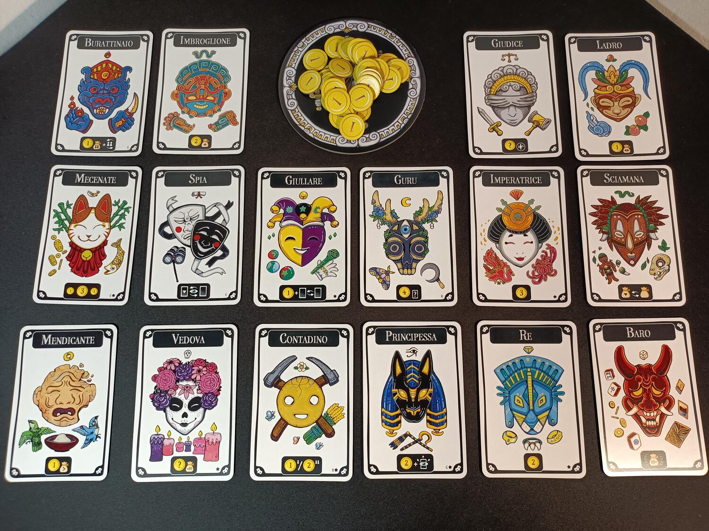
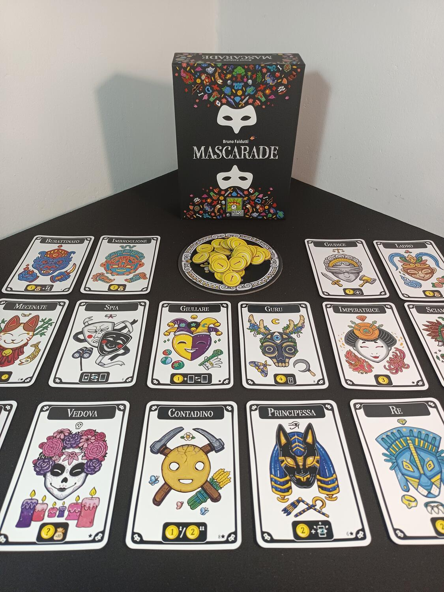
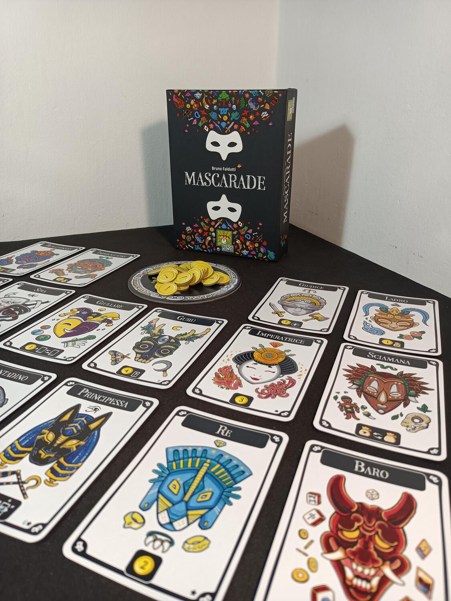

<Setting>

  Indossa la tua maschera e mischiati tra la folla. Gioca bene le tue carte e
  cambia il tuo ruolo quando ti è più comodo. Raggira i tuoi avversari con
  trucchi e inganni e raccogli più monete possibile per portare a casa la
  vittoria.

</Setting>

<Rules>

  In Mascarade dovrete indossare maschere di vari personaggi e cercare di
  accumulare tredici monete prima degli altri giocatori. Le carte maschera sono
  diverse e verranno scelte in base al numero di giocatori. Ognuno riceve una
  carta maschera coperta (nel caso di un numero basso di giocatori c’è la
  possibilità che alcune vengano poste al centro del tavolo, per aumentare la
  variabilità durante la partita), insieme a sei monete. A questo punto, i
  giocatori avranno la possibilità di vedere la propria carta. Durante i primi
  quattro turni i giocatori dovranno scambiare, o far finta di scambiare sotto
  il tavolo, la loro maschera con una dei giocatori avversari. Una volta fatti
  questi passaggi, la partita ha inizio.  
  Ad ogni turno, il giocatore dovrà scegliere una delle azioni seguenti: guardare
  la propria carta, scambiare o far finta di scambiare sottobanco la propria carta
  con un giocatore, o dichiarare il proprio ruolo. Quando un giocatore sceglie quest’ultima
  opzione, dichiara di possedere quella maschera e di attivare il suo effetto. A
  questo punto, ci sono due esiti: se nessuno contesta la veridicità del suo ruolo,
  il giocatore attiverà l’effetto della sua maschera, senza scoprire la carta; se
  invece uno o più giocatori contestano, essi devono dichiarare di possedere loro
  quella maschera e quindi di volerne attivare l’effetto. A questo punto tutti i
  giocatori che hanno contestato e il giocatore di turno rivelano le loro carte:
  tutti quelli che hanno una maschera diversa da quella dichiarata dovranno pagare
  una penale di una moneta; il giocatore che possiede quella maschera ne attiverà
  invece l’effetto.  
  La partita continua fino a che un giocatore ha ottenuto almeno 13 monete, o
  quando un giocatore ha perso tutte le sue monete: in questo caso il giocatore
  con più monete vince la partita.

</Rules>

<Feedback>

  Mascarade è un ottimo gioco da tavolo per gruppi numerosi. Semplice e facile
  da imparare ma con un’altissima rigiocabilità e un’interessante componente
  strategica. Il regolamento è facile da spiegare e imparare, ma il primo
  approccio non è semplice, principalmente per i meno esperti. I componenti sono
  pochi ma le illustrazioni sono davvero belle e attirano facilmente
  l’attenzione del pubblico. Le partite, anche quando con molti giocatori, sono
  abbastanza veloci e non annoiano. Ovviamente l’esperienza al tavolo si sente,
  e tanto. Molto spesso sarete costretti a dover fare mosse per ostacolare
  direttamente alcuni giocatori per non farli vincere, ma queste mosse non sono
  sempre così immediate durante le prime partite, soprattutto se sono presenti
  numerosi giocatori al tavolo. La rigiocabilità è molto elevata grazie al
  numero elevato di ruoli, ben 14, e alle diverse varianti. Alcuni ruoli sono
  davvero divertenti, e contribuiscono a mettere un bel pò di pepe al tavolo, ma
  sono comunque consigliate solo dopo diverse partite. Detto questo, Mascarade è
  un’ottima scelta se giocate spesso con gruppi numerosi, cosa per nulla
  scontata nel mondo dei giochi da tavolo, se volete uscire dalla routine dei
  classici come Lupus in tabula.

</Feedback>

