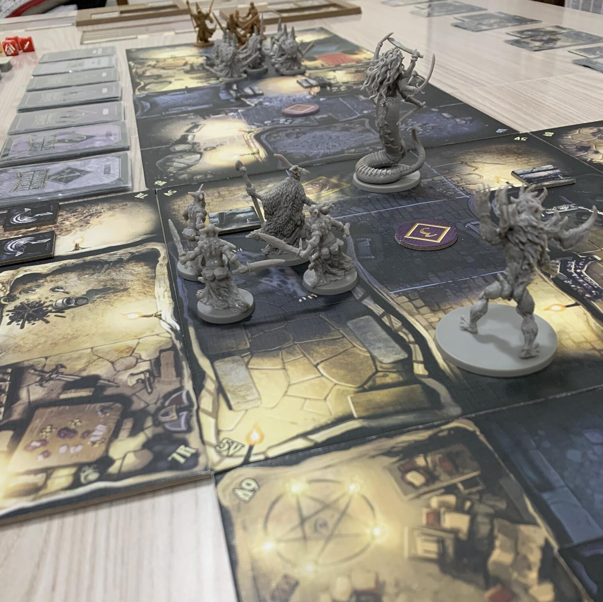
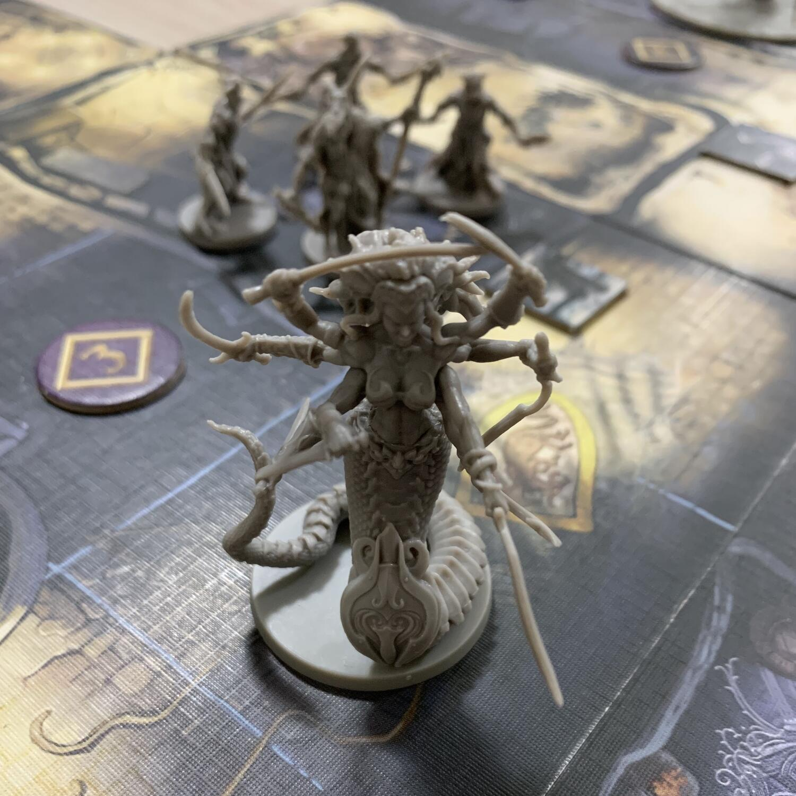

<Setting>

  C'era una volta una terra abitata da elfi, nani, maghi, Berserker e altre
  creature. Grazie alla loro cooperazione, erano riusciti a creare una vera e
  propria civiltà in cui regnava la pace... O così credevano. Al di là del loro
  territorio, oltre il confine, si estendevano lande selvagge popolate da esseri
  orrendi e spietati: orchi, goblin e nani malvagi! Ogni tanto poteva succedere
  di imbattersi in qualcuno di loro se si partiva per viaggi di esplorazione:
  dunque bisognava essere pronti a combattere. Ma di certo nessuno si sarebbe
  mai potuto aspettare ciò che accadde tutto a un tratto... Una brutale
  invasione di massa! Le forze del male avevano deciso di uscire allo scoperto
  per conquistare le vicine terre civilizzate, ma c'è di più. Erano guidate da
  un'entità misteriosa che le rendeva più compatte e minacciose che mai.
  Un'entità cupa e tenebrosa... l'Oscurità!  
  Scoppiò una guerra. Da una parte, orde di goblin arcieri, orchi picchiatori, nani
  difensori e nani combattenti avanzavano con ferocia e violenza. Dall'altra, il
  popolo invaso resisteva con coraggio e tenacia, ingegnandosi nel fabbricare armi,
  scudi, corazze e altri tesori di qualità sempre più elevata.  
  Ci vollero sette lunghi anni, ma alla fine un gruppo di valorosi guerrieri
  riuscì a mettere in fuga l'Oscurità: la guerra era vinta! Questi eroi vennero
  chiamati Portatori di Luce, simbolo di speranza, pace e giustizia.  
  È passato tanto tempo, ma oggi più che mai ci sarebbe ancora bisogno di loro. I
  nemici non sono scomparsi, hanno solo atteso pazientemente la loro vendetta, nascosti
  in vecchie fortezze, tetre caverne, celle e segrete abbandonate.  
  L'Oscurità sta per tornare. Ma stavolta gli Eroi sarete voi…

</Setting>

<Rules>

  Il gioco si articola in 10 missioni di difficoltà crescente, giocabili anche
  in modalità storia. Ogni Eroe ha a disposizione: tre slot di equipaggiamento,
  una per l'armatura e due per armi o scudi; tre spazi extra per altre armi o
  tesori; un massimo di 7 punti vita e di 30 punti esperienza (
  <strong>PE</strong>) cumulabili uccidendo i nemici, utili per sbloccare le
  abilità personali. Benché ogni missione presenti uno scenario diverso, con
  obiettivi specifici da portare a termine, lo scopo del gioco resta quello di
  liberare il dungeon dai nemici che si generano di volta in volta. I
  combattimenti si effettuano lanciando <strong>dadi</strong> speciali che
  contengono spade (ferite inflitte), scudi (colpi parati), diamanti e Bam
  (bonus). I segnalini ferita vi aiuteranno a contare i danni procurati agli
  avversari. La dotazione e i poteri di ogni Eroe stabiliscono quanti e quali
  dadi lanciare, mentre i nemici tirano quelli indicati dalle loro carte (su cui
  troviamo anche i punti vita) e dai tesori che vengono assegnati loro. Si
  possono effettuare attacchi ravvicinati, a distanza, in luce o in ombra.
   
  Il <strong>turno di gioco</strong> si compone di 4 fasi:  
  <ol>
    <li>      Fase degli Eroi. Ogni giocatore può compiere 3 azioni per turno: movimento
      (di casella in casella), raccolta tesori o attacco. L'esplorazione
      consiste nel pescare carte PORTA, che determinano la quantità di tesori e
      di nemici in ogni stanza, e carte GUARDIA con i cattivi da affrontare. Se
      attaccando un nemico non lo si riesce a uccidere, questo contrattacca
      subito l'Eroe che lo ha bersagliato.</li>
    <li>      Fase dei nemici. Se un Eroe si trova in linea di vista con un nemico,
      subisce un attacco. In caso di più Eroi visibili, l'avversario attaccherà
      quello con più PE. I nemici che non possono attaccare si spostano di
      massimo 2 movimenti verso l'Eroe più vicino.</li>
    <li>      Fase esperienza. Gli Eroi possono ottenere nuove abilità della propria
      scheda spendendo i PE richiesti.</li>
    <li>      Fase evento. Viene pescata una carta evento dal mazzo. Benedizioni
      dall'ombra o nuovi mostri inaspettati?</li>
  </ol>
  Come avrete capito, la fortuna ha un ruolo importante in questo gioco... Che i
  Portatori di Luce vi proteggano!

</Rules>

<Feedback>

  Premessa: se siete amanti degli <strong>American</strong> puri, questo gioco
  non fa esattamente per voi. Certo, ci sono le miniature che fanno il loro
  dovere, funzionali per l'ambientazione, ma la CMON ci ha abituati a standard
  decisamente più elevati (Cthulhu: Death May Die). Il problema è proprio
  questo: le aspettative erano alte ma non c'è stato l'effetto wow. Potrebbe
  essere un dungeon crawler ma non lo è, perché ogni missione ha già un suo
  set-up di partenza sulle tessere modulari, quindi l'esplorazione è limitata.
  Potrebbe essere un American ma via via tende a diventare noioso e ripetitivo,
  più godibile forse per chi è alle prime esperienze con i boardgames.
   
  Concentriamoci però un attimo sugli aspetti positivi. Ce ne sono, eh! Abbiamo
  apprezzato, per esempio, la storia e la sua varietà di personaggi: nani,
  orchi, troll, paladini, maghi... Il <strong>fantasy</strong> nella sua
  totalità. La squadra di Eroi risulta perfettamente bilanciata, ognuno con
  abilità diverse. Gli scenari di ogni livello vengono descritti in maniera
  evocativa, gli obiettivi chiari e precisi.  
  Ci si appassiona subito, giocando nella modalità storia. Fin dal primo livello
  sopravvivere si rivela arduo, con i pochi poteri acquisibili, e ad immaginare le
  ultime missioni viene paura! Poi però si arriva alla <strong>    vera nota dolente</strong> del gioco: la difficoltà dei livelli aumenta gradualmente... ma gli Eroi
  progrediscono in maniera esponenziale! Ogni giocatore può sbloccare i poteri della
  sua scheda personaggio per 5, 10 o 15 punti esperienza, perciò, dopo le prime 4-5
  missioni, ci si ritrova ad averli già tutti. E se è vero che negli ultimi livelli
  si trema, perché il gioco assegna ai nemici delle skills non indifferenti, va però
  detto che 10 missioni forse sono troppe. Ridurle a 6-7 avrebbe reso il gioco più
  avvincente, evitando lo stallo dei livelli intermedi dove gli Eroi arrivano “dopati”
  di abilità speciali mentre i mostri e le guardie non presentano grandi sorprese,
  per cui ucciderli si dimostra fin troppo facile. Ciononostante, il gioco è piacevole
  e divertente. Qualche miglioria lo avrebbe reso praticamente perfetto, ma alla
  CMON perdoniamo questo ed altro!

</Feedback>

