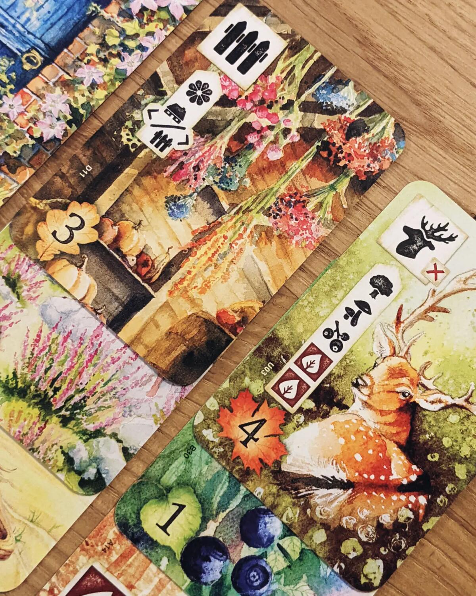
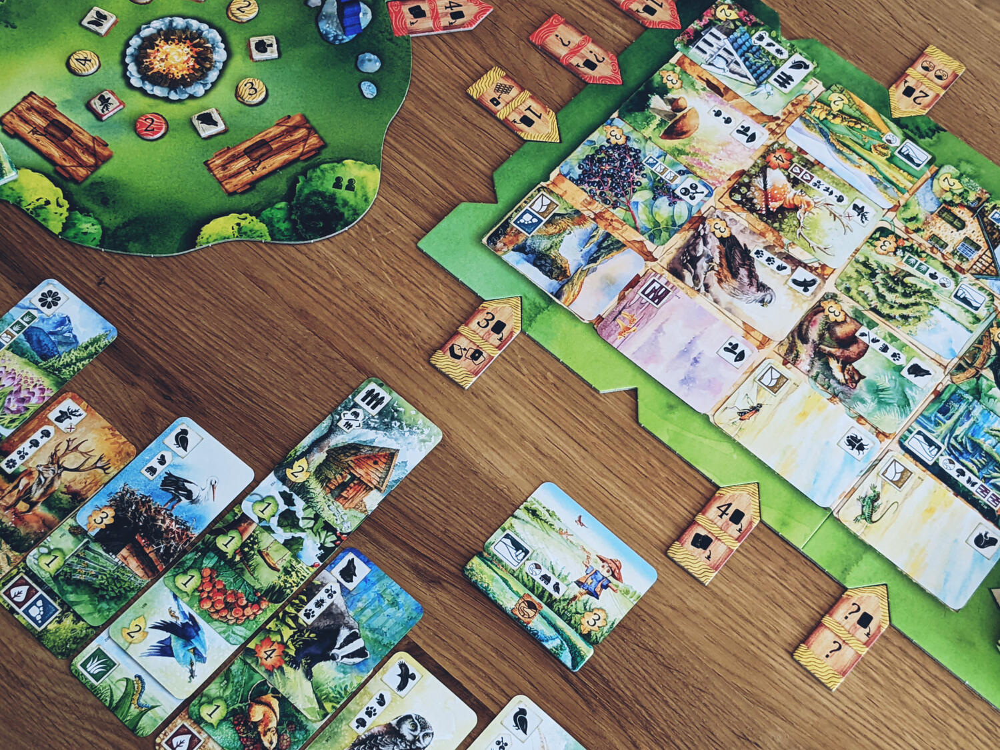
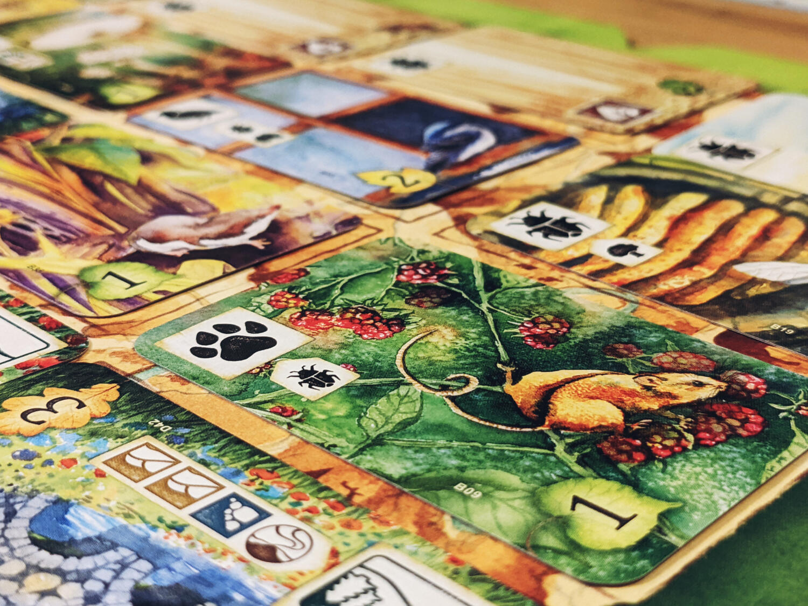

<Setting>

  In Meadow i giocatori diventano esploratori ed intraprendono un fantastico
  viaggio nella natura, esplorando la flora e la fauna circostanti e
  documentando tutte le scoperte fatte lungo il tragitto. Queste scoperte sono
  rappresentate da bellissime carte dalle illustrazioni acquerellate che
  raffigurano tutto ciò che gli esploratori incontrano lungo il cammino: ad
  esempio piccoli insetti e roditori, fino ad arrivare ad animali predatori, e
  naturalmente anche splendidi paesaggi. Il rispetto della natura e
  l'osservazione della sua bellezza sono i temi principali di Meadow.

</Setting>

<Rules>

  In Meadow, i giocatori a turno sceglieranno carte e le aggiungeranno al loro
  tableau, rispettando specifiche condizioni di piazzamento, ed avranno inoltre
  la possibilità di rivendicare obiettivi pubblici. Alla fine del gioco,
  l'esploratore con più punti sarà il vincitore.
   
  Più in dettaglio, durante il proprio turno, il giocatore dovrà aggiungere una
  carta alla propria mano scegliendo da una griglia 4x4, e successivamente dovrà
  giocare una carta dalla propria mano sul tableau personale. Ognuna di queste
  carte presenta diversi simboli: alcuni serviranno per le carte da giocare in
  seguito, altri invece rappresentano condizioni necessarie perché la carta
  possa essere piazzata. Seguendo queste facili regole, ogni turno ciascun
  giocatore costruirà il proprio ecosistema, e alla fine del gioco i punti
  presenti su ciascuna carta verranno sommati per determinare il vincitore.
   
  Un modo addizionale per fare punti è fornito da una plancia che fornisce
  obiettivi pubblici per i quali i giocatori competeranno. Questi obiettivi
  consistono nel possedere specifici simboli nel proprio tableau: il primo ad
  averli collezionati potrà reclamare l'obiettivo corrispondente.
   
  Alla fine della partita, i punti sulle carte e i punti degli obiettivi
  pubblici verranno sommati per proclamare l'esploratore vincente.

</Rules>

<Feedback>

  Meadow riesce a combinare un comparto estetico splendido (grazie ai bellissimi
  acquerelli di{" "}
  <a href="https://boardgamegeek.com/boardgameartist/128605/karolina-kijak">
    Karolina Kijak
  </a>{" "}
  ) ad un gameplay interessante ma soprattutto coinvolgente. Ogni decisione
  risulta sempre più tesa ed importante, soprattutto se si sta competendo per
  gli obiettivi pubblici. Nonostante questo, Meadow riesce a mantenere una
  sensazione amena, per cui scoprire la bellezza di ogni carta risulta
  importante quanto il gameplay stesso. Questo aspetto è coadiuvato da un
  fantastico libricino dove ogni carta viene descritta in dettaglio, nel caso si
  volesse scoprire cosa esattamente rappresenta.
   
  Meadow funziona ad ogni player count, ma sicuramente brilla in 2 e 3
  giocatori, riuscendo a mantenere così una lunghezza piacevole e senza
  trattenersi più del dovuto. Ma non fatevi ingannare: il gioco non è solo bello
  all' esterno, bensì fornisce anche un’esperienza stimolante, mai banale, ed a
  tratti anche complessa. Un gioco che per questa dualità riuscirà a conquistare
  un range di giocatori estremamente ampio!

</Feedback>

