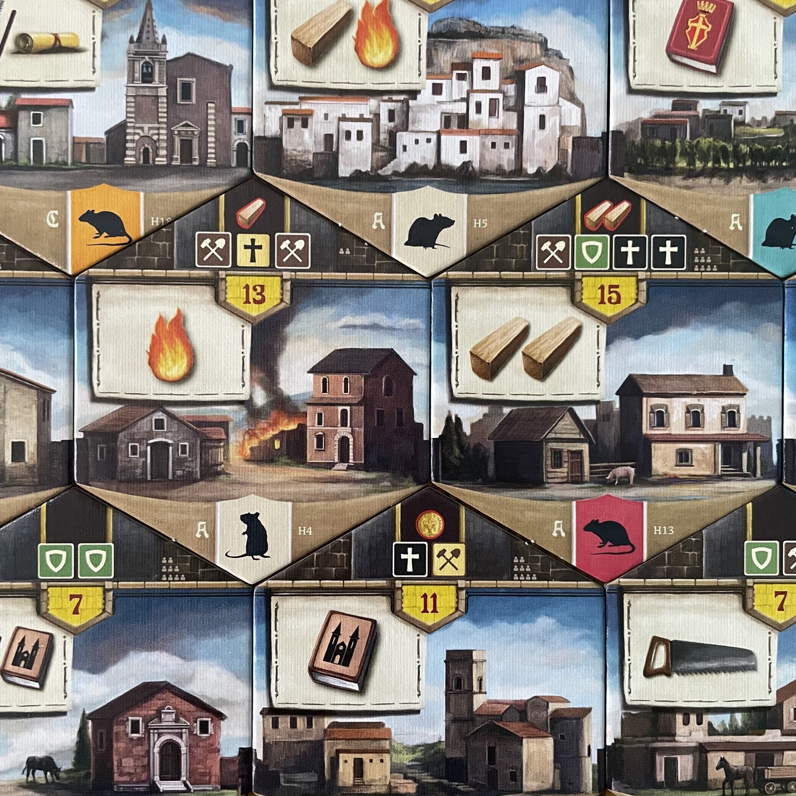
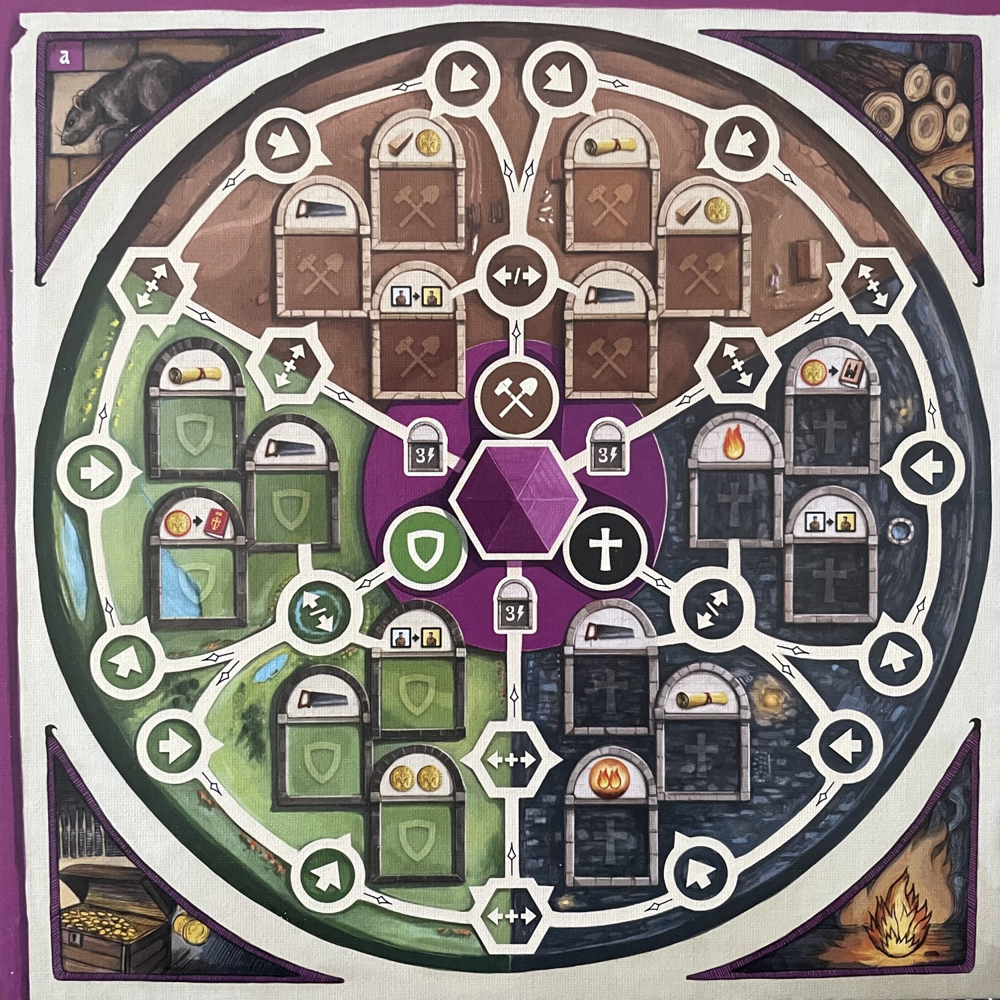
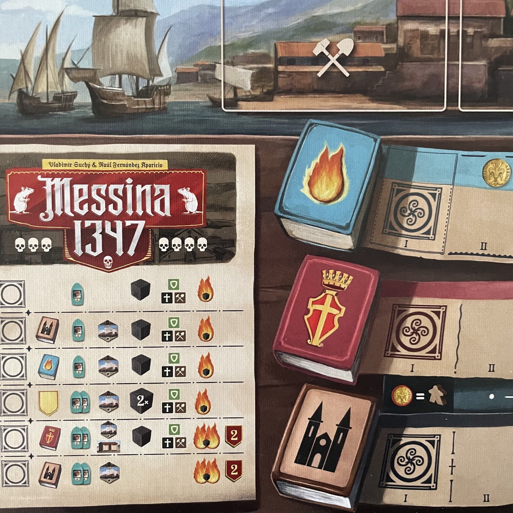

<Setting>

  La <strong>peste</strong> divampa a <strong>Messina</strong>, portata da topi giunti su imbarcazioni provenienti da
  est. <strong>L’Europa brucerà</strong>. La comunità cittadina intende riprendere possesso della città, attraverso
  l’operato dei suoi <strong>membri più illustri</strong>: mentre costoro si prendono cura degli{" "}
  <strong>abitanti in quarantena</strong>, il tempo trascorre e prima o poi la peste scemerà…

</Setting>

<Rules>

  Componete il tabellone con un numero di tessere (<strong>Rioni</strong>) variabile a seconda del numero di giocatori,
  collocando i porti negli spazi destinati e posizionando a fianco le tessere rimanenti. Assegnate una plancia ad ogni
  giocatore, con i relativi componenti personali, avendo cura di giocare tutti sul lato <strong>simmetrico</strong> o
  tutti su quello <strong>asimmetrico</strong>. Infine, allestite il <strong>Tabellone</strong>, allocando i vari
  elementi personali e comuni sui <strong>Registri</strong> e i vari settori.
   
  <strong>All’inizio di ogni turno</strong>, si guarda chi sarà il <strong>Primo Giocatore</strong>, sulla base di un
  criterio prestabilito e diverso di turno in turno. Poi si pesca una <strong>Tessera Molo</strong>, che indica in quale
  porto attraccherà la prossima nave in arrivo a Messina. Si fa quindi scorrere di uno “spicchio” la{" "}
  <strong>Ruota della Popolazione</strong>, indicatore dei quartieri in cui verranno posizionati cubetti peste e{" "}
  <strong>Abitanti</strong> (Religiosi, Nobili, Artigiani).
   
  Seguono i turni dei giocatori: nel primo turno i <strong>Luogotenenti</strong> (= meeple) verranno inviati nei
  quartieri mentre nei turni successivi quelli già presenti sulla mappa potranno spostarsi da un quartiere all’altro
  (gratis se andranno in un Rione adiacente o pagando una <strong>Moneta</strong> per ogni passo ulteriore). I giocatori
  agiranno uno alla volta e in senso orario, svolgendo <strong>Turni</strong> fino a che si hanno lavoratori
  disponibili. Quando un Luogotenente raggiunge un Rione, prima di tutto dovrà combattere la peste con il fuoco,
  guadagnando <strong>Popolarità</strong> (= avanzando sul relativo Tracciato); in secondo luogo, potrà prelevare un
  eventuale abitante ivi presente (collocandolo sulla propria plancia, o in quarantena se l’esagono era appestato);
  infine, può eseguire l’azione dell’esagono oppure, se ha a disposizione un <strong>Carro</strong>, potrà contribuire
  al <strong>Ripopolamento</strong> di Messina (al prezzo delle risorse e degli Abitanti indicati nella parte alta delle
  tessere Rione). Se sul Rione restano cubetti neri, il giocatore prende un <strong>Topo</strong> (= malus a fine
  partita) per ogni cubetto rimanente.
   
  Gli abitanti che vengono collocati sulla <strong>Plancia Personale</strong> (che siano nelle <strong>Capanne</strong>{" "}
  in quarantena, nelle <strong>Botteghe</strong>, o lungo i tre tracciati marcati dall’avanzamento dei{" "}
  <strong>Supervisori</strong>) consentono di ottenere <strong>Risorse</strong> importanti (ad esempio monete e fuochi)
  e innescare combo.
   
  La partita termina alla fine del Sesto Round. Vince chi ha più punti, sommando quelli derivanti dai tracciati
  cittadini, dal ripopolamento dei Rioni da eventuali bonus ottenuti sulla <strong>Plancia Pergamena</strong> ed altri
  segnalini.

</Rules>

<Feedback>

  Messina si sforza di corrispondere a{" "}
  <strong>tutto quello che un giocatore rodato potrebbe trovare appetibile in un gioco da tavolo</strong>: la variante
  in solitario, la variante più difficile, la variabilità delle meccaniche, la profondità strategica, l’accortezza
  tattica, la longevità, la particolarità dei materiali, l’ambientazione… Si sforza e{" "}
  <strong>soddisferà senz’altro i giocatori più esperti</strong>. Tuttavia{" "}
  <strong>non riesce ad assumere un carattere tale da imporsi sul mercato di massa</strong>, dove la concorrenza è
  spietata e dove titoli ben più essenziali, specifici e circoscritti nei loro meccanismi e nelle loro ambizioni possono
  averla vinta facilmente. Per intenderci, non potrei mai introdurre i neofiti della mia famiglia a Messina 1347, mentre
  una sola partita ad <Link to="/reviews/azul-summer-pavillon">Azul: Summer Pavillon</Link> è bastata per conquistare
  tutti.
   
  Il gioco è <strong>cromaticamente fittissimo</strong>, al punto che le prime partite potrà{" "}
  <strong>disorientare e confondere</strong>. La “chiarezza” e “linearità” per cui spesso lo si elogia si ottengono, a
  ben vedere, al costo di <strong>un’attenta lettura e diverse consultazioni “on the road” del manuale</strong> (che
  poteva essere organizzato meglio), nonché padroneggiando le <strong>eccezioni</strong>. 
  Detto ciò, non si può certo lamentare in Messina 1347 alcun malfunzionamento: da un punto di vista “meccanico” il gioco{" "}
  <strong>fila liscio e trionferà ai tavoli degli amanti dei german</strong>. <strong>Tutti gli altri, alla larga!</strong>

</Feedback>

