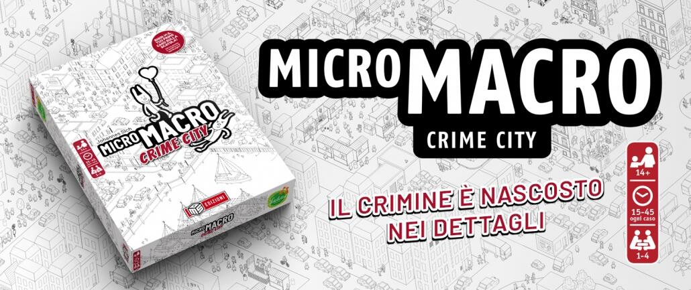

<Setting>

  Nella città più affollata e coccolosa del mondo si nascondono pericoli dietro
  ogni angolo. Non fatevi ingannare dagli abitanti dolci e carini della popolosa
  città di <strong>Crime city</strong>, perché essa cela ladri, traditori e
  criminali di ogni genere. Radunate i vostri amici, imbracciate{" "}
  <strong>le lenti di ingrandimento</strong> e preparatevi ad immergervi in
  questa favoloso avventura ricca di colpi di scena e misteri.

</Setting>

<Rules>

  In Micromacro dovremo risolvere 16 casi articolati che sono avvenuti nella
  città di Crime city. Ma per cosa si distingue dagli altri titoli investigativi
  questa piccola scatola?{" "}
  <strong>Iniziamo subito con il descrivere la mappa</strong>; infatti essa sarà
  il fulcro del gioco. Tutti gli avvenimenti presenti, passati e futuri sono
  dettagliatamente descritti e disegnati sulla carta. Ebbene sì, ci troviamo di
  fronte ad una <strong>mappa dinamica</strong>, in cui i personaggi della città
  si spostano e compiono azioni in vari archi temporali, intrecciando storie,
  avvenimenti e chi ne ha più ne metta.{" "}
  <strong>Le regole del gioco sono semplici</strong>: prendete le carte di un
  caso e cercate di arrivare alla sua conclusione. Ogni caso avrà una serie di
  carte da 5 fino a 11 in base alla difficoltà, le quali vi accompagneranno
  passo passo negli eventi che lo compongono, chiedendovi di rispondere ad una o
  più domande specificando ed indicando{" "}
  <strong>un preciso avvenimento riportato sulla mappa</strong>. Evidenzio
  questo punto, perché per andare avanti con il caso dovrete trovare, non solo
  grazie alle vostre capacità investigative ma anche alla vostra acuta vista, un
  preciso episodio che descrive la vostra risposta.

</Rules>

<Feedback>

  Micromacro è un piccolo capolavoro in scatola. Un titolo simpatico e
  divertente, ottimo per una serata tra amici. Avvincente e ricco di colpi di
  scena che vi faranno amare caso dopo caso questo titolo. Per i più esperti
  consiglio di cimentarsi fin dalle prime partite nella{" "}
  <strong>modalità avanzata</strong> per poter immergersi completamente nella
  suggestiva città di Crime city.{" "}
  <strong>La longevità non è altissima per il suo genere</strong>, pur avendo 16
  casi nel suo repertorio, il gioco si completa abbastanza velocemente anche a
  causa del fatto che un caso tira l'altro, e spesso dovrete mettere un freno
  alla vostra curiosità. I componenti sono di ottima fattura, e la mappa pur
  essendo molto grande è comunque abbastanza resistente.{" "}
  <strong>I disegni sono davvero stupendi</strong>, e il colpo d'occhio
  dell'intera città animata è fantastico. Per concludere Micromacro: Crime city
  è davvero una piccola perla, un titolo che esce fuori dagli schemi e che
  affascina e stupisce. Un gioco che tutti gli amanti del genere investigativo
  dovrebbero avere nella loro collezione o provarlo almeno una volta.

</Feedback>

