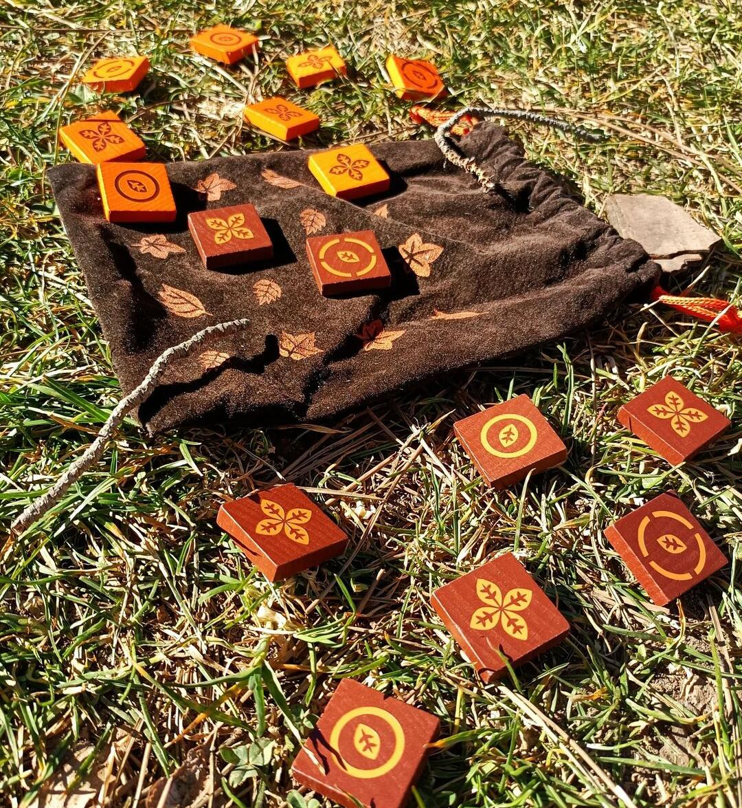

<Setting>

  Per tutti gli amanti dei giochi scacchistici, ecco a voi un titolo che
  porterete sempre con voi. Un piccolo sacchetto da viaggio ma che contiene ore
  e ore di divertimento. Poche regole e tanta strategia, ecco cosa nasconde
  questo fantastico borsastratto!

</Setting>

<Rules>

Lo scopo del gioco, in Mijnlieff, è quello di creare il maggior numero di linee ortogonali o diagonali di tessere consecutive del proprio colore. Un tris vi farà ottenere un punto Vittoria, un quater ve ne farà ottenere due.  
A turno, iniziando dal giocatore con le tessere marroni, i giocatori si alternano, posizionando ogni volta una tessera sulla plancia 4x4. Ma attenzione: ogni tessera avrà un'abilità speciale che limiterà il posizionamento al giocatore avversario. Vediamole più nel dettaglio:
<ul>
<li><strong>Ortogonali</strong>: Il giocatore avversario DEVE posizionare una tessera in uno degli spazi liberi sulle linee ortogonali rispetto a questa tessera. </li>
<li><strong>Diagonali</strong>: Il giocatore avversario DEVE posizionare una tessera in uno degli spazi liberi sulle linee diagonali rispetto a questa tessera. </li>
<li><strong>Vicinanza</strong> (tessera con il cerchio completo piccolo): Il giocatore avversario DEVE posizionare una tessera in uno degli spazi liberi adiacenti rispetto a questa tessera. </li>
<li><strong>Lontananza</strong> (tessera con il cerchio spezzato grande): Il giocatore avversario DEVE posizionare una tessera in un qualsiasi spazio libero escludendo gli 8 adiacenti rispetto a questa tessera. </li>
</ul>
La partita si avvia alla conclusione quando uno dei due giocatori piazza l'ultima tessera. A questo punto l'avversario avrà un'ultima chance di giocare, terminando poi effettivamente la partita. Il giocatore con più punti vittoria vince.  
<strong>Ultimo ma non meno importante</strong>: se ad un giocatore non è possibile posizionare una tessera perché non ci sono spazi liberi disponibili, dovrà <strong>Passare</strong>. A questo punto l'avversario avrà la possibilità di giocare una sua tessera in un qualsiasi spazio libero sulla plancia. È importante ricordare che questa possibilità può ripetersi più volte.

</Rules>

<Feedback>

  Come si dice, la mela non cade mai lontana dall’albero, ma in questo caso è la
  foglia. Lo Studio Supernova, con questo titolo, ci regala un’altra perla.
   
  Tra i borsastratti, Mijnlieff è sempre stato il mio preferito. Componenti
  stupendi, semplici e curati e la borsa stessa che diviene la scacchiera su cui
  giocare rendono questo gioco ottimo per i viaggi e per tutte quelle persone
  che amano intavolare un gioco da tavolo in posti sempre diversi. Le regole
  sono immediate e veloci da spiegare e le partite scorrono rapide una dopo
  l’altra, grazie anche al fatto che in alcuni casi le mosse possibili saranno
  limitate. La semplicità del titolo però nasconde una profondità strategica per
  nulla scontata. Capirete fin da subito che il vostro scopo non sarà tanto
  quello di fare punti con i tris, bensì quello di ostacolare l’avversario
  facendogli passare il turno. Che dire, Mijnlieff è uno di quei titoli da
  centinaia di partite e oltre, da portare sempre con sé nello zaino durante i
  viaggi o all'università. Uno di quei giochi che si lascia insegnare a
  chiunque. E ovviamente è un gioco fantastico per l’estate, da portare anche in
  spiaggia! Non perdetevelo!

</Feedback>
