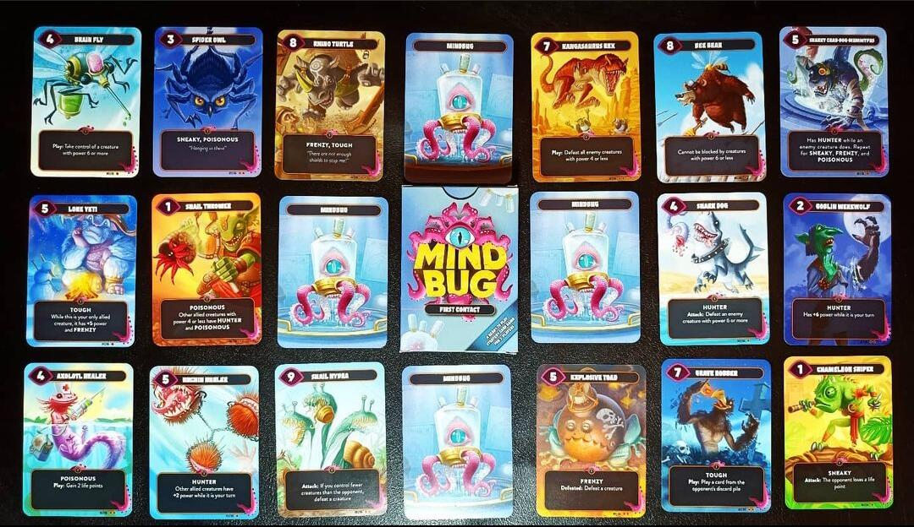

<Setting>

  Evoca mostruose creature ibride e affronta i tuoi avversari, ma attenzione ai
  Mindbug!!!

</Setting>

<Rules>

  In Mindbug ogni giocatore avrà un mazzo di 10 carte casuali prese da un mazzo
  comune. Con queste carte si dovranno portare a 0 i punti vita dell’avversario
  (3 ad inizio partita). Si avranno <strong>sempre 5 carte</strong> in mano,
  ognuna rappresentante una creatura. Le creature avranno una forza, con cui
  potranno attaccare l'avversario, e/o abilità che si potranno attivare in
  determinate occasioni, come ad esempio quando verranno giocate, distrutte o
  quando attaccheranno. Nel proprio turno un giocatore potrà giocare una carta
  dalla propria mano, senza nessun costo, o attaccare con una creatura già
  presente sul campo di battaglia. A questo punto il giocatore in difesa potrà
  subire un danno o bloccare con una creatura: ovviamente la creatura con meno
  forza perirà nello scontro. L'aspetto più interessante di questo gioco è il
  <strong>Mindbug</strong>: quando un giocatore gioca una carta dalla mano, l'avversario
  potrà rubare e <strong>prendere il controllo</strong> di quella carta usando un
  Mindbug, giocandola e attivandone tutti gli eventuali effetti, ribaltando di fatto
  le sorti della partita. Questa opportunità però è limitata, costringendo i giocatori
  a gestire al meglio le scarse risorse a loro disposizione.

</Rules>

<Feedback>

  Che dire, Mindbug è davvero ben fatto, piccolo, tascabile e pieno zeppo di
  strategia: quasi un Magic: the gathering liofilizzato. La semplicità delle
  regole, unita alle partite veloci e ricche di suspense, dove una singola
  mossa, come un Mindbug al momento sbagliato, vi farà perdere, vi terranno
  incollati alle sedie partita dopo partita. La rigiocabilità, pur avendo solo
  48 carte nella versione base, è comunque abbastanza elevata. Giocherete ogni
  volta con solo dieci carte per giocatore ma le sorprese e i colpi di scena
  saranno sempre dietro l'angolo. I giocatori più competitivi potranno giocare
  al meglio di tre, scambiandosi il mazzo di carte dopo la prima partita, dato
  che ogni tanto il mazzo di carte davvero forte può arrivare… E tuttavia la
  possibilità di vincere c'è sempre, grazie appunti alla trovata dei Mindbug. I
  materiali, anche se il design e le arts sono davvero belle da vedere, non
  fanno gridare al miracolo.
   
  In conclusione, Mindbug è un gioco che sorprende, un cofanetto che racchiude
  davvero un piccolo mondo di strategie e divertimento: uno di quei giochi da
  tavolo da avere sempre in tasca o nello zaino per una partita. Una piccola
  chicca da non farsi scappare.
   
   
  Ringrazio <a href="https://www.kickstarter.com/projects/nerdlab-games/mindbug-first-contact" target="_blank">il team di Mindbug</a> per avermi concesso una copia per questa recensione.

</Feedback>

