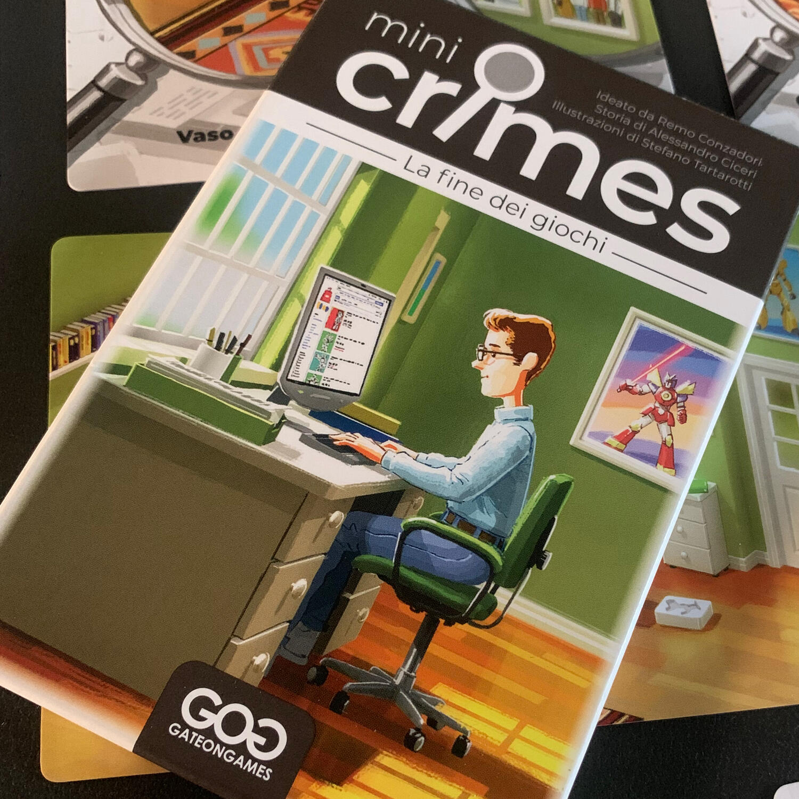
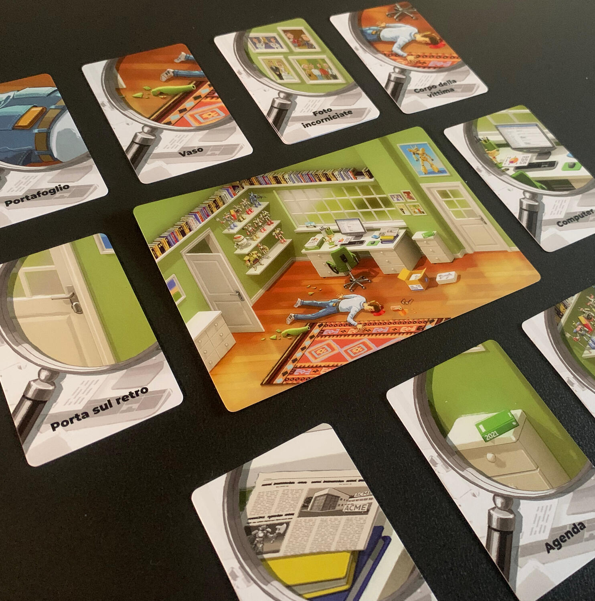

<Setting>

  25 marzo 2021.
   
  Matt, un appassionato di fumetti, giocattoli e fantascienza, viene trovato
  morto in casa sua, colpito in testa da un vaso. Come può una persona semplice
  e amata da tutti fare una fine così terribile?

</Setting>

<Rules>

  Il gioco è composto da <strong>1 carta luogo e 10 carte indizio</strong>:
  queste rappresentano i dettagli dello spazio in cui è stato commesso
  l'omicidio.
   
  Dopo aver letto l'introduzione al caso, si posizionano queste 11 carte sul
  tavolo e, una volta che vi sarete fatti un'idea di cosa potrebbe essere
  successo, dovrete cercare delle conferme girando le carte indizio nell'ordine
  che preferite. Infatti, ogni carta indizio ha un testo sul retro che spiega
  cosa viene scoperto analizzando quell'oggetto o quella parte di stanza.
   
  Man mano che <strong>girerete gli indizi</strong>, otterrete sempre più
  informazioni che ci permetteranno di rispondere ai 3 quesiti posti dal caso.
  Ogni risposta giusta vi farà guadagnare dei punti, mentre ogni carta girata
  dopo la sesta ve li farà perdere.  
  La sfida del gioco sta nell'essere in grado di <strong>    analizzare il minor numero di indizi</strong> per arrivare alla giusta conclusione!

</Rules>

<Feedback>

  Un'avventura tascabile, 11 carte e una bella profondità di gioco: questo è
  quello che riesce a darvi questo titolo della collana <em>Mini Crimes</em>.
  Sì, stiamo parlando di una collezione di casi{" "}
  <strong>investigativi tascabili</strong>, con ambientazioni e personaggi
  diversi e, come potete immaginare, persone poco contente di avere i vostri
  occhi puntati addosso.  
  La peculiarità di questa collana risiede nel <strong>    numero di materiali davvero contenuto</strong> e nella profondità delle storie narrate. Vi lancerete in discussioni
  infiammate per cercare di <strong>ricostruire la dinamica</strong> degli eventi
  e trovare una spiegazione ad ogni indizio.
   
  La durata del gioco dipende tutta da voi, dalle argomentazioni che riuscirete a
  costruire, dall’attenzione ad ogni singolo indizio, dalla disponibilità a prendere
  in considerazione nuovamente le strade che avevate definito come chiuse. Ed è proprio
  questa la bellezza del titolo: <strong>    argomentare, discutere, convincere</strong>. 
  Nonostante le regole essenziali e il poco materiale, sbagliereste a pensare
  che questo titolo sia solamente per un pubblico di neofiti. Certo, non
  aspettatevi neanche uno{" "}
  <Link to="/reviews/sherlock-holmes-consulente-investigativo/">
    Sherlock Holmes Consulente Investigativo
  </Link>
  , ma nemmeno un <em>Decktective</em>: siete davanti a un modo tutto nuovo di proporre
  il genere investigativo.
   
  <em>Mini Crimes</em> è davvero come le ciliegie? Ve lo farò sapere, speriamo di
  non fare indigestione.

</Feedback>
