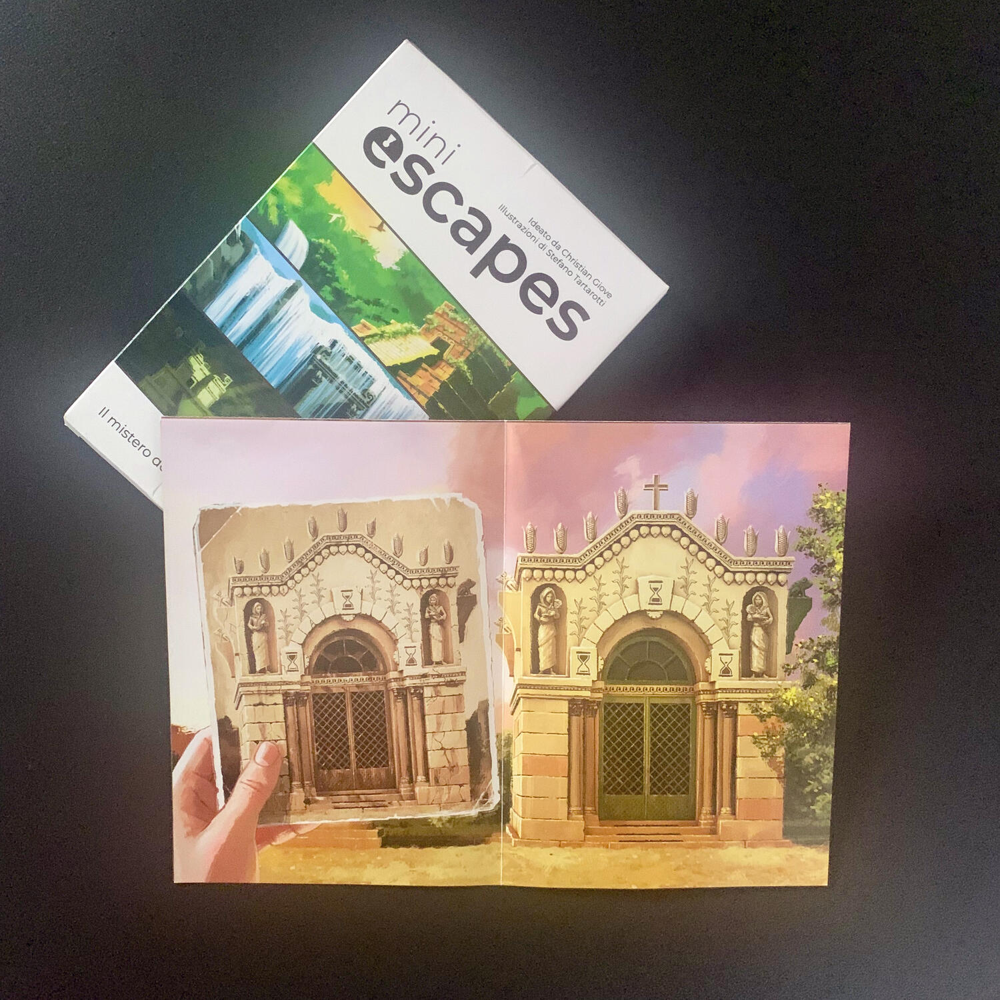

<Setting>

  <em>Diario di Emily Mound,</em>   
  <em>    alla fine sono riuscita a scovare le antiche rovine perdute al centro di
    questa intricata giungla! Chissà quali meravigliosi tesori troverò al loro
    interno…ma non devo abbassare la guardia! Prima di entrare, ci sono enigmi e
    misteri da risolvere, avrò bisogno di tutto il mio ingegno e di tutta la mia
    perspicacia!</em>   
   
  Siete pronti a impersonare Emily e a risolvere enigmi per scoprire la verità su
  Cristobal de Mendoza e sul culto che stravolse la sua vita?

</Setting>

<Rules>

  Mini Escapes - Il Mistero del Culto Perduto è un nuovo tipo di escape room:
  ognuna delle 3 sfide (più quella introduttiva) presenti nella scatola è
  strutturata su un grande foglio A3 "ripiegato".
   
  Una volta connessi al{" "}
  <a href="https://www.gateongames.com/miniescapes/" target="_blank">
    sito web
  </a>{" "}
  e scelta l'avventura corretta, veniamo teletrasportati in Spagna, nei panni di
  Emily Mound, un'archeologa pronta a svelare uno degli enigmi più grandi di
  tutti i tempi.
   
  Dopo aver <strong>aperto il foglio</strong> come indicato dal sito, è il
  momento di azionare tutti i nostri neuroni per passare al livello successivo.
  Inserendo un <strong>codice alfanumerico</strong> nell'applicazione web
  sapremo se la nostra deduzione è corretta. In tal caso, ci verrà spiegato come
  gestire nuovamente il foglio per entrare nella stanza successiva e via via
  così fino ad arrivare all'ultima stanza e, quindi, all'enigma finale.
   
  Come al solito, in caso di stallo, potremo domandare dei suggerimenti per
  sbloccarci e proseguire con le nostre gambe.
   
  Tutto qui, niente di più, niente di meno.

</Rules>

<Feedback>

  La particolarità di questa (si spera) famiglia di escape room è che gli{" "}
  <strong>enigmi hanno senso</strong>: non bisogna andare a contare i pappagalli
  sulla ringhiera del vicino per aprire una cassaforte, né bisogna osservare
  l'ombra generata dal sole che colpisce un gargoyle, a meno che non venga
  specificato che ci si trova in un determinato posto, in un determinato giorno
  a una determinata ora dell'anno. Questa caratteristica, oltre a differenziarla
  dalle altre (es{" "}
  <Link to="/reviews/escape-tales-i-bambini-di-wyrmwoods/">
    Escape Tales: I Bambini di Wyrmwoods
  </Link>
  ), mi ha permesso di <strong>immedesimarmi</strong> ed <strong>    immergermi</strong> ancora di più nell'avventura, dandomi l'impressione di essere all'interno
  di un'escape room fisica.
   
  <strong>Gli enigmi non sono sempre facili</strong>, a volte richiedono un po' più
  di logica o di matematica del solito, ma il fatto che siano "concreti" e che ci
  siano i suggerimenti sul sito aiuta sicuramente.
   
  La vera forza di questa escape room è la <strong>dimensione</strong> e la <strong>    portabilità</strong>: immaginate di avere un normale foglio ripiegato in 4 nello zaino e di
  poter andare in spiaggia e "spiegare" sotto l'ombrellone il foglio a mano a mano
  che avanzate, senza la necessità di un mazzo di carte o di ingombranti scatole.
   
  Questa escape room è il primo <strong>esperimento</strong> del suo genere ed è{" "}
  <strong>riuscito</strong>. Sicuramente, ci sono alcuni elementi che si potrebbero
  migliorare nelle avventure successive come, ad esempio, la taratura della difficoltà
  di alcuni enigmi o il design del sito.
   
  Tuttavia rimane… tanto piccola, quanto geniale.

</Feedback>

