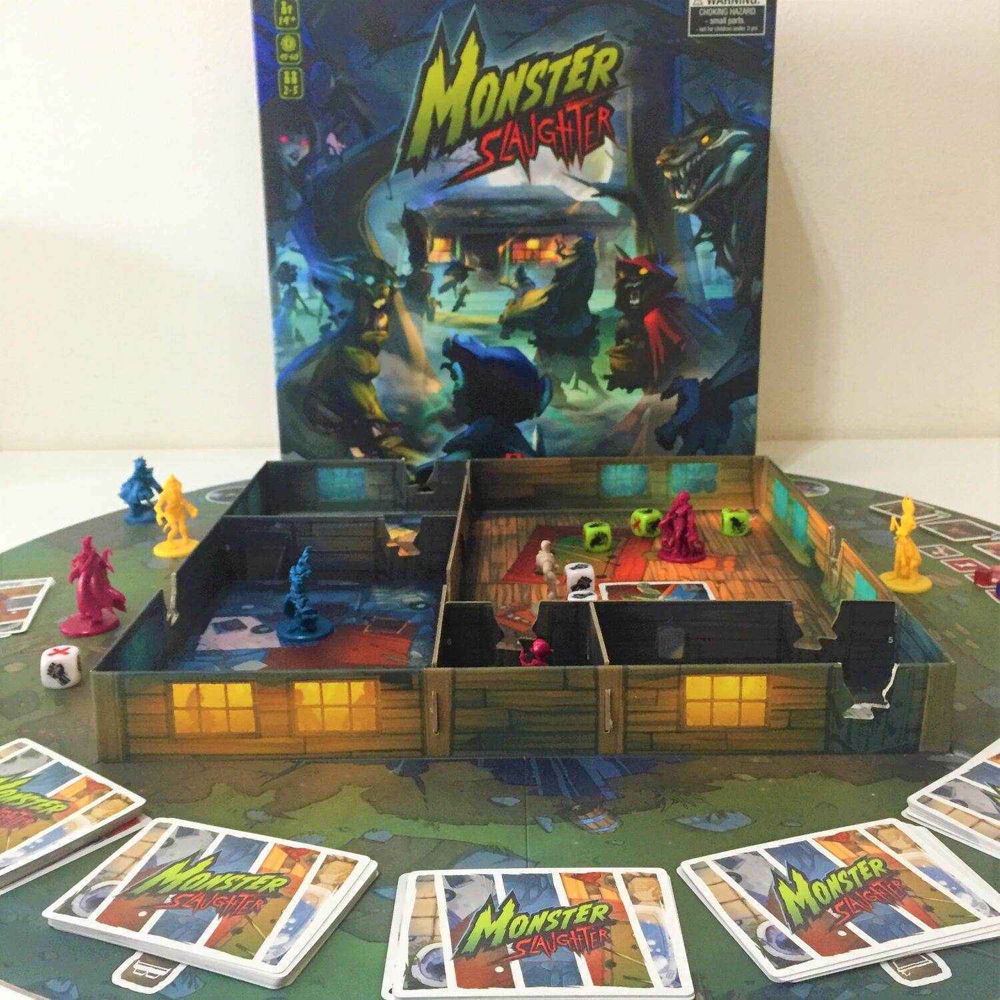
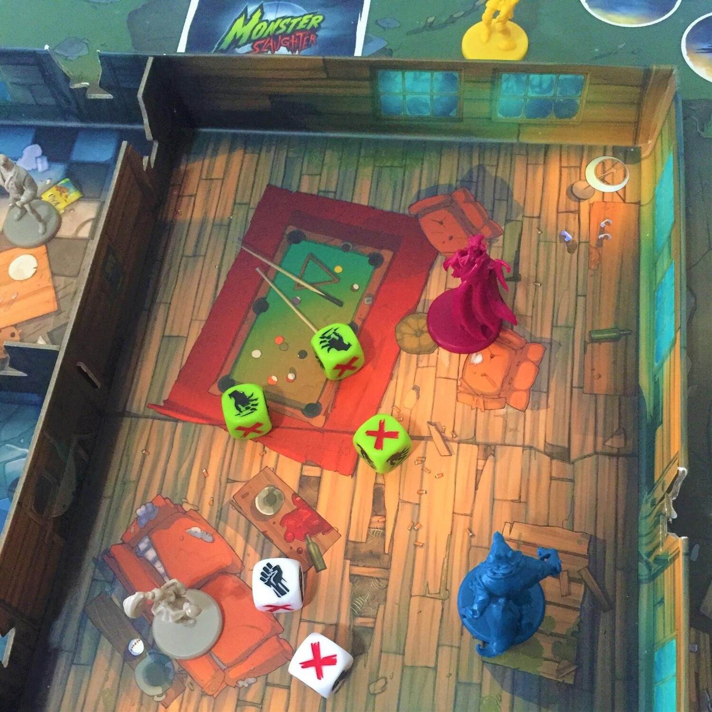

<Setting>

  Una comitiva di adolescenti ha preso in affitto una casa nel bosco per tenere una piccola festa. Ma non si tratta di
  una casa nel bosco qualsiasi, bensì di “quella casa nel bosco”. E, appena calerà la notte, delle oscure presenze si
  imbucheranno al party più sanguinoso dell'anno!  
  In Monster Slaughter non sarete i tipici protagonisti di un film horror slasher. Al contrario: interpreterete le diaboliche
  creature che daranno loro la caccia. Ogni giocatore assumerà il ruolo di una famiglia di mostri e si contenderà con gli
  avversari le succulente prede, in un gioco del gatto e del topo al cardiopalma in cui le giovani vittime tenteranno di
  sfuggirvi, di opporvisi, di nascondersi.
   
  L'obiettivo è stanare quanti più invitati possibile prima che sorga il sole. Ma, come ben saprete, ci sono delle regole!
  Tutti sanno chi è il primo a morire. Oppure no?

</Setting>

<Rules>

  Ad ogni giocatore viene assegnata una famiglia di mostri composta da 3 carte personaggio e dalle relative miniature.
  Ogni tipo di personaggio ha a disposizione le stesse azioni, ma ogni famiglia di mostri ha un'abilità caratteristica.
  I giocatori provano quindi (in segreto) a predire l'ordine in cui le vittime moriranno e scelgono la loro preda
  preferita. Si monta quindi il tabellone, si compongono i mazzi delle stanze della casa, sulla cima dei quali ci
  saranno le carte delle vittime.
   
  La partita inizierà con i giocatori che spieranno le stanze della casa dall'esterno, per farsi un'idea di dove si
  trovano le vittime. Quindi, senza ulteriori indugi, sfonderanno la porta e s'introdurranno nella catapecchia per dare
  inizio al banchetto.
   
  Ogni personaggio, come anticipato, ha a disposizione un certo numero di azioni e di dadi azione durante il proprio
  turno. È possibile sfondare le porte per aprirsi il passaggio verso un'altra stanza (questo costringerà le vittime a
  nascondersi nella stanza, e quindi il mazzo sarà mescolato). Si possono anche spiare le stanze vicine, guardando
  segretamente la prima carta del mazzo, o anche ispezionare la stanza in cui il personaggio si trova, pescando tante
  carte quanti saranno i successi sui dadi azione. Se si pesca una vittima, la sua carta è rivelata e la pedina compare
  nella stanza. Quando una vittima è scoperta, è possibile attaccarla. Ma non così in fretta: i mostri avversari possono
  decidere di aiutare le vittime, lanciando loro delle armi per difendersi con i dadi reazione. Inoltre, i mostri
  possono spaventare le vittime per farle spostare da una stanza all'altra, per farle cadere direttamente nelle loro
  fauci o, al contrario, per salvarle dalle grinfie degli avversari.
   
  Quando l'ultima vittima sarà sbudellata o la notte sarà passata, è il momento di tirare le somme e di capire qual è
  stata la famiglia più cruenta. Ferire le vittime vi darà dei punti. Dare loro il colpo di grazia? Più punti.
  Indovinare l'ordine in cui muoiono? Altri punti. Uccidere la preda prescelta? Molti più punti! E si capisce: chi ha
  più punti è dichiarato il vincitore.

</Rules>

<Feedback>

  L'aspetto che più colpisce di Monster Slaughter sono i materiali. Il tabellone di gioco, infatti, è costituito dal
  fondo della scatola stessa, che simulerà la casa nel bosco. Le miniature, peraltro molto ben dettagliate, sono
  colorate (a tinta unita) in maniera diversa per ogni famiglia di mostri, rendendole immediatamente distinguibili dalle
  altre.
   
  In quanto al genere, parliamo di un american molto snellito, adatto anche a famiglie (a cui piaccia il genere), quindi
  essenzialmente un gioco molto ambientato e con un'alta componente aleatoria. Il regolamento si spiega in una manciata
  di minuti ed è piuttosto intuitivo, il che lo rende, nonostante la mole e la durata, un ottimo (kind of) party game,
  adatto anche a giocatori inesperti. Le meccaniche, infatti, sono poche e ben interconnesse tra di loro: spendo
  l'azione, lancio i dadi, risolvo l'azione in base ai successi. Altri elementi, come le carte oggetto e gli eventi,
  aggiungono un po' di pepe al mix.
   
  Nonostante l'ambientazione horror, l'atmosfera che si respira al tavolo è di pura caciara. Ci sono sicuramente delle
  strategie da dover mettere in atto per assicurarsi il maggior numero di punti, e a volte si dovrà sacrificare
  un'opzione per ottimizzarne un'altra. Ma tutta la tensione è sciolta dal rollare dei dadi e dalle grida di esultanza
  dei giocatori che banchettano sulle vittime o di frustrazione per essersele lasciate scappare. In questo senso, il
  flusso di gioco può essere abbastanza imprevedibile da partita a partita e, con l'eccezione di pochi punti saldi, sarà
  in definitiva regolato dalle previsioni dell'ordine di morte fatte dai giocatori, dalle carte pescate e, ovviamente,
  dai risultati dei dadi. Con lo stesso player count, abbiamo fatto partite da 2 ore come da 45 minuti.
   
  Il gioco presenta una modalità base e diversi scenari, ciascuno con nuovi personaggi ma anche con intere e inedite
  meccaniche, il che ne assicura l'ottima longevità.
   
  Poche sono le grinze: un set-up piuttosto laborioso, anche a livello manuale, e l'altissima dose di fortuna potrebbero
  renderlo un titolo non adatto a tutti (o che non si apparecchia troppo volentieri); il regolamento, inoltre, non è
  sempre molto chiaro sulla risoluzione di alcune azioni o sulla loro interazione, e spesso la risposta migliore è
  affidarsi all'intuito, al “come ha più senso che funzioni”. Il difetto principale del gioco, in realtà, è un flusso
  ripetitivo, dato da un pool di azioni tutte sempre disponibili, e limato dalla sola presenza delle carte Evento e di
  alcune carte azione. Ciononostante, il suo appeal visivo parecchio accattivante e lo scorrere di adrenalina dato dal
  rotolare dei dadi ne fanno sicuramente un gioco perfetto per una serata da trascorrere in leggerezza.

</Feedback>

