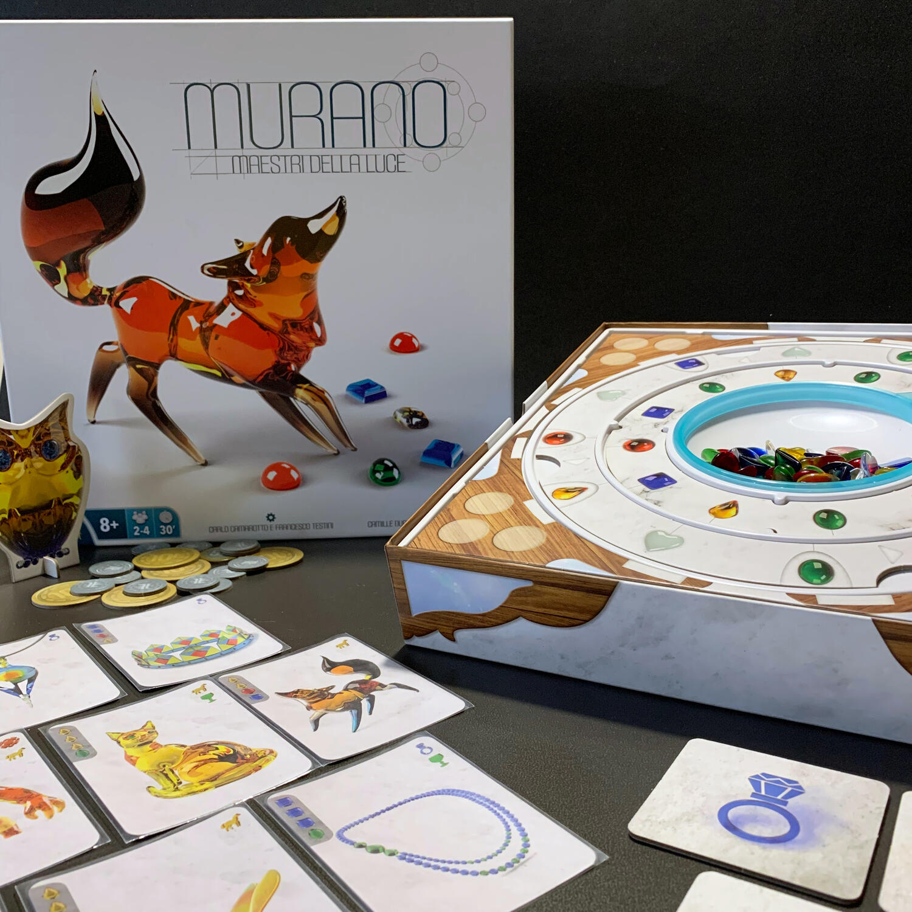
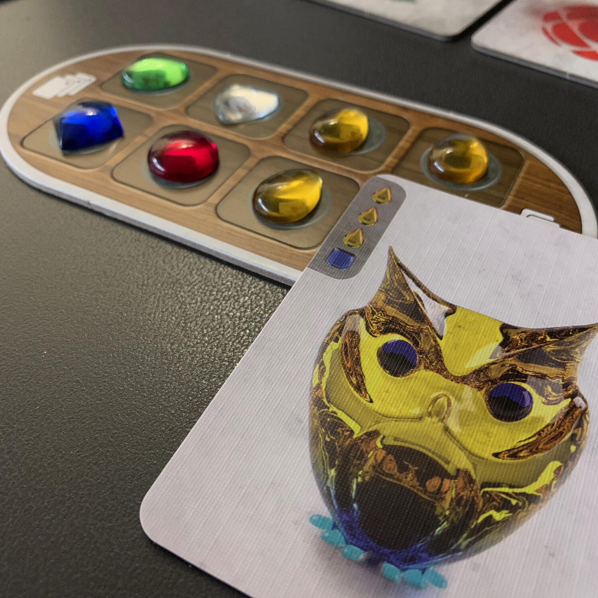

<Setting>

  La storia del Vetro di Murano nasce nel 1291 quando si decretò che le vetrerie
  di Venezia, attive probabilmente già prima del mille, fossero trasferite a
  Murano dal momento che i forni dei laboratori erano spesso responsabili di
  disastrosi incendi.
   
  In "Murano - Maestri della luce" si vestono i panni di mastri vetrai
  dell'omonima isola della laguna veneziana, pronti a soffiare il vetro e a
  tramandare questa splendida arte.

</Setting>

<Rules>

  Inizialmente ogni giocatore ottiene 5 carte creazione il cui ordine non potrà
  mai essere cambiato.
   
  Il turno di gioco si divide in tre fasi: raccogliere, negoziare e completare
  creazioni.
   
  Nella prima fase, dopo aver girato l'indicatore azzurro in senso orario, si
  procede con la raccolta dei due frammenti indicati.
   
  La seconda fase è il cuore del gioco: bisogna procurarsi i vetrini necessari
  per le creazioni nel numero minore di passi, scegliendo se scambiare, comprare
  o vendere.
   
  Scambiare ti impone di posizionare un frammento già in tuo possesso in uno dei
  quattro angoli (mercati) del tabellone e ottenerne, così, fino a due; comprare
  permette di spendere due lire per ottenere tutti i frammenti presenti in uno
  dei mercati; infine, con la vendita si scartano dei frammenti in cambio di 1
  lira.
   
  Si entra così nella terza fase, ovvero quella che permette di completare le
  carte creazione, fondendo i 4 frammenti necessari che devono essere già in
  proprio possesso per ottenere tante lire quanti sono gli slot frammenti ora
  liberi sulla propria plancia. Va da sé che raccogliere frammenti non utili
  diminuisce il valore delle vostre creazioni.
   
  Oltre al flusso standard del turno, si possono utilizzare, in ogni momento,
  alcune azioni extra che permettono di controllare un po' l'alea: ruotare
  l'anello, cambiare l'ordine della carte creazione e attivare dei vantaggi.
   
  Ruotare l'anello, al costo di 1 lira, fa girare l'anello esterno, che
  conferisce i frammenti a inizio turno e nell'azione di scambio, potenzialmente
  rovinando anche i piani dell'avversario. Anche cambiare l'ordine delle carte
  creazione costa 1 lira. Ogni carta creazione, inoltre, una volta completata,
  definisce un vantaggio variabile da partita a partita, utilizzabile, per una
  volta sola.
   
  La partita termina quando un giocatore completa tutte e cinque le carte
  creazione... e chi ha più lire è il vincitore.

</Rules>

<Feedback>

  Murano - Maestri della luce è un astratto colorato con frammenti di vero vetro
  davvero molto ben fatti e suggestivi. Le meccaniche sono semplici e di facile
  apprendimento, permettendo di potere intavolare il gioco con chiunque, data
  anche la bassa durata.
   
  I veri problemi del gioco sono la fortuna e i soldi, un po' come nella vita.
   
  Il fatto che il giocatore più ricco sia il vincitore, di per sé, non è un
  problema... se non che questa ricchezza deve essere utilizzata per combattere
  la sfortuna. Ci possono essere giocatori che non avranno mai bisogno di
  governarla, altri che se non lo fanno non riusciranno a giocare.
   
  Anche il fatto che i vantaggi siano abbinati a caso a un simbolo può
  permettere ad alcuni giocatori di avere poteri più forti di altri per il
  semplice fatto di aver ricevuto carte di un dato "seme" a inizio partita.
   
  Niente di irrisolvibile con qualche home-rule che ho provato in alcune
  partite.
   
  Bisogna sempre tenere a mente che si parla di un family game e che, magari,
  queste considerazioni sono rivolte a giocatori abituati a contare fino
  all'ultimo punto e a ottimizzare qualsiasi mossa.
   
  In ogni caso, a livello materico è davvero molto bello e incuriosisce tutti i
  giocatori attorno al tavolo, che puntualmente giocherellano con i frammenti
  trasparenti.

</Feedback>

