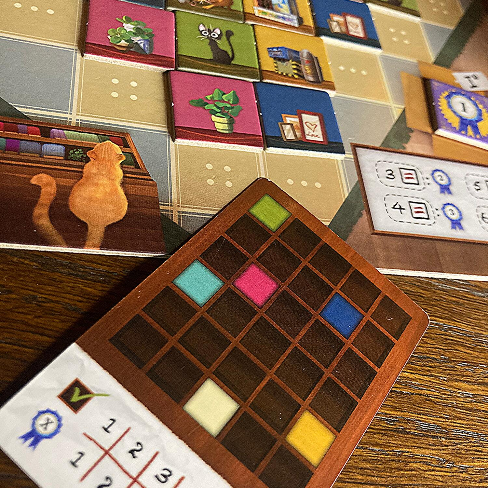
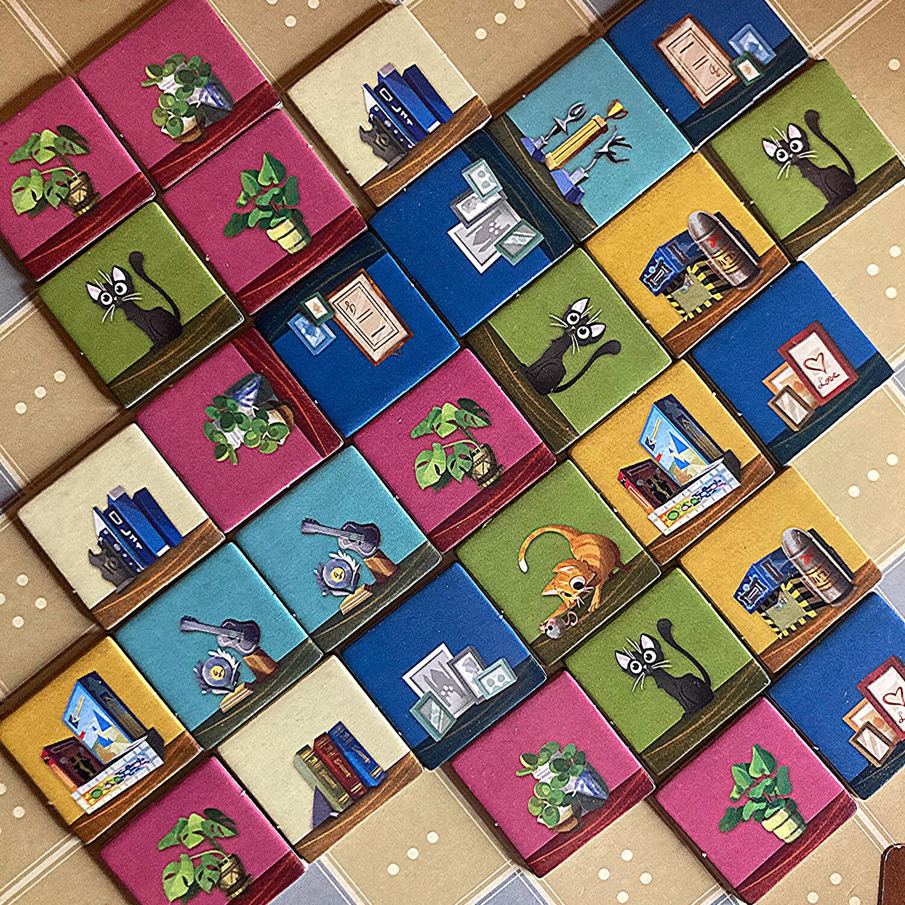
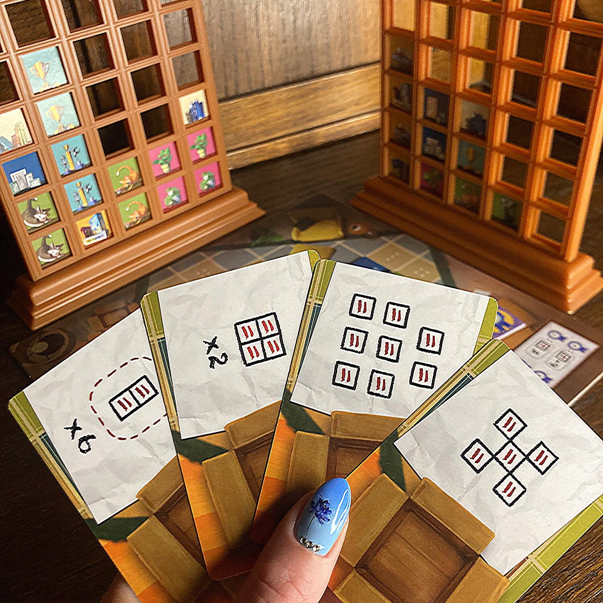

<Setting>

  È piuttosto comune l’opinione che rassettare casa e mettere in ordine tutte
  quelle cose che nel tempo si possono accumulare in salotto sia tra le cose più
  noiose da portare a termine! Ecco, se da oggi in poi lo farete pensando a
  questo gioco, il tutto prenderà sicuramente una piega più divertente!
   
  Libri, giochi, piante, quadri e gatti (perché sì: i gatti stanno sempre bene
  ovunque!) saranno i bellissimi protagonisti raffigurati sulle colorate tessere
  di questo gioco: osservateli, scrutateli e sceglieteli con attenzione per
  creare la vostra libreria perfetta.

</Setting>

<Rules>

  Ogni giocatore riceve una libreria e una Carta Obiettivo Personale, che dovrà
  tenere nascosta davanti a sé; poi verranno scelte casualmente due Carte
  Obiettivo Comuni che verranno posizionate sulla Plancia Salotto con i relativi
  segnalini; infine, si dovranno disporre sulla Plancia Salotto tutte le
  tesserine che durante la partita andranno messe in ordine nelle librerie.
   
  Durante il proprio turno, ogni giocatore potrà prendere 1, 2 o 3 tessere
  Oggetto dalla Plancia Salotto, seguendo queste semplici regole:
  <ul>
    <li>      Le tessere che si prendono devono essere adiacenti l'una all'altra e
      formare una linea retta.</li>
    <li>      Tutte le tessere che si prendono devono avere almeno un lato libero (non
      toccare direttamente altre tessere) all'inizio del vostro turno (non
      potete, cioè, prendere una tessera che diventa libera dopo la prima
      scelta).</li>
    <li>      Le tessere scelte dovranno essere posizionate nell’ordine che si gradisce,
      ma TUTTE nella STESSA COLONNA!</li>
  </ul>
  Nota: non si possono prendere più tessere del numero di spazi liberi in
  libreria.
   
   
  Se, alla fine del turno, le tessere sulla plancia sono tutte singole bisognerà
  pescarne di nuove dal sacchetto e ripristinare totalmente la plancia Salotto; come
  ad inizio partita, la quantità di tessere da posizionare dipende dal numero di
  giocatori.
   
  Il primo giocatore a riempire tutti gli spazi della propria libreria innescherà
  l’ultimo turno, finito il quale si potranno contare i punti.
   
  Il punteggio potrà essere influenzato dalla Carta Obiettivo Personale, dalle Carte
  Obiettivo Comune, dalle Tessere Oggetto adiacenti dello stesso tipo e dai Bonus
  di fine partita.

</Rules>

<Feedback>

  Nonostante la struttura della libreria ricordi moltissimo lo storico gioco
  Forza Quattro, e di fatto la base delle meccaniche non ci vada molto distante,
  My Shelfie nasconde una necessità di ragionamento non indifferente. È
  estremamente sfidante, infatti, l’idea di avere a disposizione tre obiettivi,
  potenzialmente tutti da completare, soprattutto perché questo spinge il
  giocatore a dover ponderare molto bene le sue scelte.
   
  Nonostante la partita venga interrotta al completamento della libreria da
  parte di un giocatore, a volte potrebbe convenire decidere di prendere meno
  tessere, ma posizionarle in maniera oculata e strategica, piuttosto che
  prenderne tre e magari ritrovarsi in una posizione scomoda il turno
  successivo.
   
  Sebbene sia un gioco estremamente godibile che porta spesso a giocare più
  partite in successione, richiede una qual certa attenzione poiché capita non
  di rado di sbagliare il posizionamento di una tessera finendo per bloccare il
  raggiungimento di un obiettivo.
   
  I materiali sono di buona fattura, anche se leggermente delicati: sicuramente
  poter inserire tesserine colorate in questa strana struttura attira subito lo
  sguardo dei più piccini.
   
  Una grande pecca riguarda la riposizione del gioco a fine partita, a causa del
  difficile inserimento delle librerie che, se ancora montate, impediscono la
  chiusura completa della scatola.

</Feedback>

