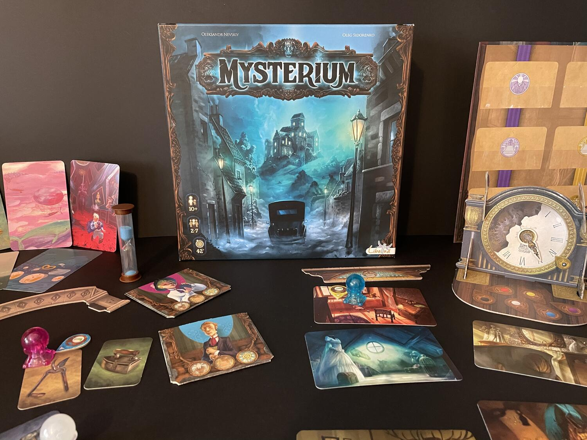
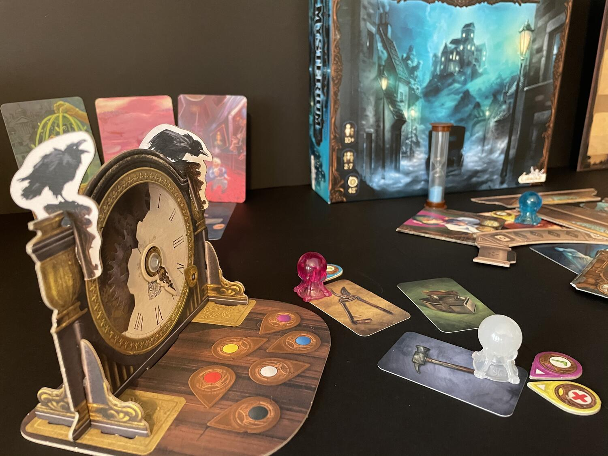

<Setting>

  Un gruppo di medium si è riunito in un'antica e misteriosa villa. Un omicidio
  è stato commesso, e il fantasma della povera vittima vaga per le camere
  cercando di comunicare l'identità del suo assassino. Le sue idee non saranno
  chiare fin da subito e le comunicazioni spesso risulteranno davvero poco
  comprensibili.
   
  Riuscirete a comprendere le misteriose visioni del fantasma e a risolvere il
  caso?

</Setting>

<Rules>

  In Mysterium un gruppo da 2-7 giocatori dovrà collaborare per cercare di
  capire il colpevole dell'omicidio avvenuto nella villa. Il gioco si struttura
  in due macro fasi: la fase Ricostruzione degli Eventi e la fase Rivelare il
  Colpevole.
   
  Un giocatore vestirà i panni del fantasma, gli altri saranno i medium. Durante
  la prima fase ogni medium sarà legato ad un <strong>    tris di carte</strong>{" "}
  noto solo al fantasma: un Personaggio, un Luogo e un Oggetto. Lo scopo del
  fantasma sarà quello di far capire ai giocatori la triade di carte a cui
  ognuno di essi è segretamente associato. Tutto questo non sarà affatto
  semplice. Innanzitutto, il fantasma{" "}
  <strong>non potrà parlare con i giocatori </strong>, ma avrà la possibilità di
  comunicare attraverso delle <strong>carte Visione</strong>. Queste
  rappresentano delle scene estremamente astratte e difficilmente comprensibili.
  Sarà nelle mani del fantasma la responsabilità di cercare la combinazione
  giusta di carte Visione per far indovinare a ciascun medium prima il
  Personaggio, poi il Luogo e infine l'Oggetto. I giocatori potranno collaborare
  e aiutarsi per decidere la risposta giusta e contemporaneamente cercare di
  ottenere <strong>punti Chiaroveggenza</strong>. Questi punti si potranno
  ottenere “scommettendo” sulle eventuali risposte giuste o sbagliate degli
  altri giocatori; ogni volta che avrete ragione otterrete un punto.
   
  La prima fase termina se tutti i giocatori avranno indovinato la loro
  combinazione di carte prima del <strong>settimo turno</strong>. In caso
  contrario, il fantasma svanirà nel limbo e tutti i giocatori perderanno la
  partita.
   
  All'inizio della seconda fase il fantasma è riuscito a ricordare il suo
  assassino, il luogo e l'arma del delitto e cercherà di comunicare per l'ultima
  volta con i medium. Dopo aver predisposto un certo numero di combinazioni,
  ciascuna composta da un Personaggio, un Luogo e un Oggetto, il fantasma dovrà
  selezionare tre carte Visione tra quelle rimaste nella sua mano: una legata al
  Personaggio, una al Luogo e una all'Oggetto, mescolarle e darle ai giocatori a
  faccia in giù. Queste ultime carte si riferiranno alla combinazione vincente.
  A questo punto, in base al livello di chiaroveggenza raggiunto nella prima
  fase del gioco, i vari medium potranno vedere più o meno carte Visione e
  decidere, senza poter comunicare tra loro, la risposta che ritengono esatta.
  Se la maggior parte dei giocatori avrà scelto la risposta corretta, tutti i
  giocatori vinceranno la partita.

</Rules>

<Feedback>

  Mysterium, senza troppi giri di parole, è il mio party game preferito. Uno di
  quei titoli che porto sempre con me per serate con tanti giocatori o novizi.
  Un connubio di meccaniche semplici da spiegare ed immediate che creano
  un'atmosfera davvero unica al tavolo. I componenti sono favolosi, dettagliati
  e ben fatti per un gioco di per sé anche abbastanza economico. I disegni sono
  pieni di dettagli, estremamente diversi tra loro e davvero curati, e posso
  ammettere che più di una volta mi sono soffermato ad osservare con più
  attenzione le carte Personaggio e le carte Visione, che sono davvero
  spettacolari e varie. Inoltre, i componenti fisici, come schermo e pedine,
  sono resistenti e perfetti per creare ancora più suspance al tavolo.
   
  La longevità è ad ottimi livelli, sia per la grande quantità di carte sia
  ovviamente perché la collaborazione tra i giocatori e la libera associazione
  tra le varie carte date dal fantasma creeranno partite sempre diverse. Sono
  presenti anche <strong>due espansioni</strong> che aumentano notevolmente la
  quantità di carte Visione e aggiungono i particolari e complicati{" "}
  <strong>Sogni</strong> al gioco. L'unico difetto che mi sento di evidenziare
  riguarda la <strong>preparazione</strong>. Pur essendo un party game, infatti,
  Mysterium necessita di una preparazione abbastanza lunga, che in alcune
  occasioni può risultare noiosa. Mi sento inoltre di aggiungere la possibilità
  di una variante <strong>semicompetitiva</strong> che utilizzo sempre nelle mie
  partite, in cui durante la seconda fase del gioco, i medium non dovranno più
  cooperare per trovare la risposta corretta, bensì <strong>competere</strong>{" "}
  tra loro. Il flusso del gioco sarà comunque lo stesso, ma solo i giocatori che
  avranno dato la risposta corretta porteranno a casa la vittoria. Facendo ciò,
  si aggiungerà ancora più pepe al gioco. Inoltre, durante la prima fase, la
  raccolta di punti Chiaroveggenza, otterrà ancora più importanza, poiché, nella
  seconda fase, ogni giocatore dovrà contare solo sulle proprie capacità e sulle
  carte Visione che potrà vedere in base al suo livello.
   
  In conclusione, Mysterium è un capolavoro tra i party game, un{" "}
  <strong> must have</strong> in tutte le collezioni dei giocatori da tavolo, un
  titolo sempreverde e bello da intavolare nelle serate con gruppi numerosi o
  con giocatori poco esperti. Semplice e con componenti davvero stupendi,
  Mysterium è un titolo da partite davvero <strong>fantasmagoriche</strong>.

</Feedback>

