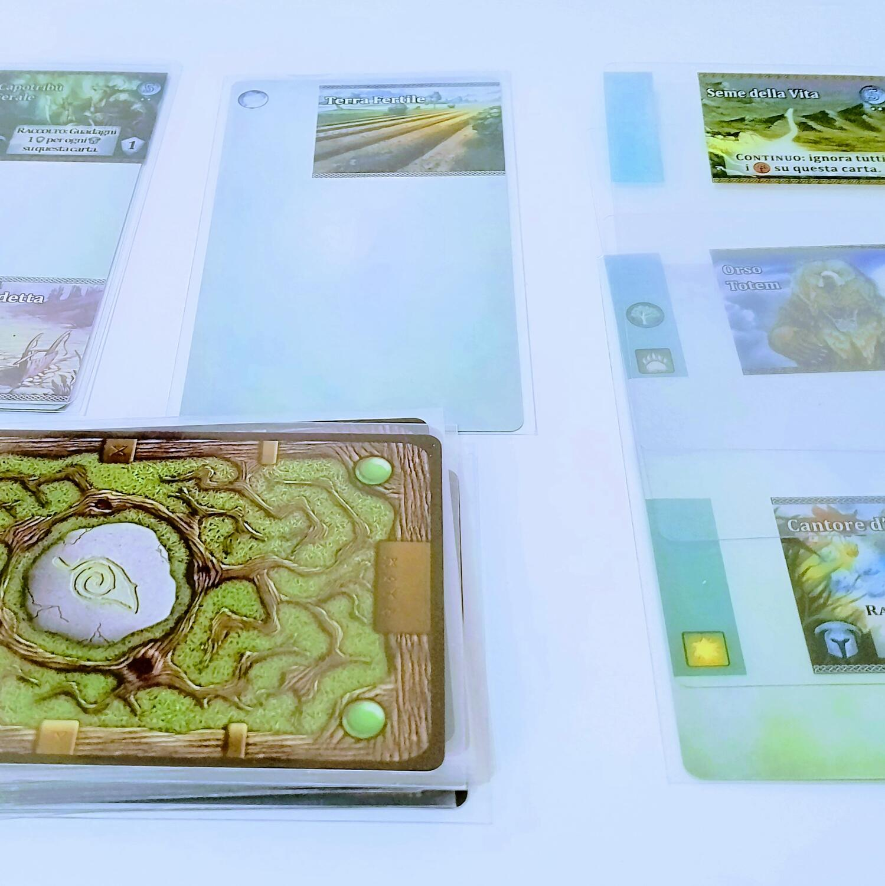

<Setting>

  La Valle della Vita è minacciata da una maledizione che porta al deperimento.
  Clan di druidi, rappresentati dai giocatori, dovranno intervenire radunando
  gli spiriti della natura e accrescendo gradualmente il potere dei loro
  incantesimi di guarigione. Ma solo un clan si distinguerà da tutti gli altri
  per l’impegno profuso...

</Setting>

<Rules>

  Il gioco è un <strong>deck building</strong> con una componente di{" "}
  <strong>push-your-luck</strong>. Durante il suo turno, il giocatore svolgerà
  principalmente due fasi. Nella fase di <strong>Semina </strong>potrà{" "}
  <strong>estrarre carte</strong> dalla cima del proprio mazzo finché lo
  desidera, ma stando attendo a non superare i{" "}
  <strong>3 simboli Decadimento</strong> visibili, pena l’immediata fine del suo
  turno. Quando si fermerà, entrerà nella fase di <strong>Raccolto</strong>:
  potrà spendere il mana e i segnalini spirito collezionati sulle proprie carte
  per ottenere rispettivamente le <strong>carte Avanzamento</strong>, da
  aggiungere al proprio mazzo, e le <strong>carte Valle</strong>, che rimarranno
  scoperte nella sua area di gioco. Tramite gli effetti delle carte sarà
  possibile ottenere dei <strong>Punti Vittoria</strong> da una riserva comune,
  al cui esaurimento verrà dichiarato vincitore il giocatore con più Punti nella
  sua riserva personale e sulle sue carte.
   
  La particolarità di questo gioco, tuttavia, sta in un innovativo meccanismo
  detto <strong>Card Crafting System</strong>. Le carte Avanzamento, infatti,
  non sono di cartoncino e non vanno semplicemente aggiunte al mazzo: sono{" "}
  <strong>carte di plastica trasparente</strong> da infilare nelle bustine
  protettive che ospitano le carte normali. Ogni carta può avere un massimo di
  tre elementi visibili e ogni Avanzamento ne possiede solo uno; per cui, a
  partire da una carta vuota, è possibile inserire fino a tre Avanzamenti nella
  sua bustina, purché ogni elemento occupi una posizione diversa.

</Rules>

<Feedback>

  <em>Mystic Vale</em> è un titolo <strong>molto audace</strong> che è riuscito
  ad incorporare nel gameplay un elemento accessorio del mondo dei giochi,
  ovvero le bustine protettive. Ma ovviamente la sua vera particolarità sono le
  carte Avanzamento e il meccanismo della sovrapposizione di immagini stampate
  su plastica, che fino all’uscita di <em>3000 Canaglie</em> (2022) non era
  stato replicato (o almeno non ce n’è giunta notizia). Si tratta, in effetti,
  di un <strong>sistema un po’ borderline</strong> che cerca di{" "}
  <strong>superare i limiti</strong> imposti alla carta stampata e, per
  estensione, al modo stesso di immaginare i giochi da tavolo come combinazioni
  di elementi materiali relativamente stabili.
   A livello di gameplay, il Card Crafting System apre nuove possibilità e permette
  di <strong>indagare variabili inedite</strong> della meccanica del deck building.
  Non sono solo importanti la carta e il suo peso nell’economia strategica del mazzo,
  ma anche la sua posizione all’interno di una carta, che potrebbe essere vuota o
  ospitare già altri Avanzamenti: questo permette di <strong>    manipolare il bilanciamento del mazzo</strong>, consentendo al giocatore di scegliere in che misura avere carte molto
  forti ma rare, contro carte di medio valore ma disponibili per una strategia più
  affidabile. La domanda allora diventa: questo basta, al netto dell’esperienza di
  gioco, a giustificare un meccanismo così poco ortodosso?
   
  Al di là della sovrapposizione della carte, <em>Mystic Vale</em> confeziona una{" "}
  <strong>solida esperienza ludica</strong> che riesce a far collimare perfettamente
  deck building e push-your-luck, creando quasi una meccanica nuova e pulita. I turni
  scorrono, pur non troppo veloci, e si sta con gli occhi puntati sulle carte dell’avversario,
  sperando che perda il turno. Altri titoli hanno calcato le sue orme, alcuni anche
  con un discreto successo: solo l’anno scorso <em>Living Forest</em> (che ripropone
  le meccaniche principali di Mystic Vale, tranne per la sovrapposizione delle carte)
  ha vinto l'As d’Or per il miglior gioco nella categoria Initié.
   
  Ciononostante, ad oggi <em>Mystic Vale</em> rischia di essere un gioco “<strong>    superato</strong>”. E la causa, a ben vedere, potrebbe essere proprio il Card Crafting
  System. La presenza di carte di plastica che vanno “impacchettate” in una sola
  bustina rende <strong>l’esperienza sensoriale goffa a tratti</strong>, sfidando
  anche uno dei concetti più importanti dei giochi di carte, ossia che la carta non
  dovrebbe essere riconoscibile mentre non è scoperta in gioco. Inoltre, per il tipo
  di esperienza che offre, la produzione è decisamente troppo costosa (45€ sul listino)
  e, vista la presenza di diverse copie dei singoli Avanzamenti, dopo un po’ <strong>    la rigiocabilità ne esce compromessa</strong>. 
  In conclusione, <em>Mystic Vale</em> è sicuramente un titolo che ha{" "}
  <strong>tanto da dire</strong>, ma forse{" "}
  <strong>non altrettanto da dare</strong>. Attualmente è fuori produzione ma se
  ne trovano ancora delle copie in giro e ne esiste anche una{" "}
  <strong>versione app</strong>, che forse ha più senso recuperare rispetto alla
  versione fisica.

</Feedback>

