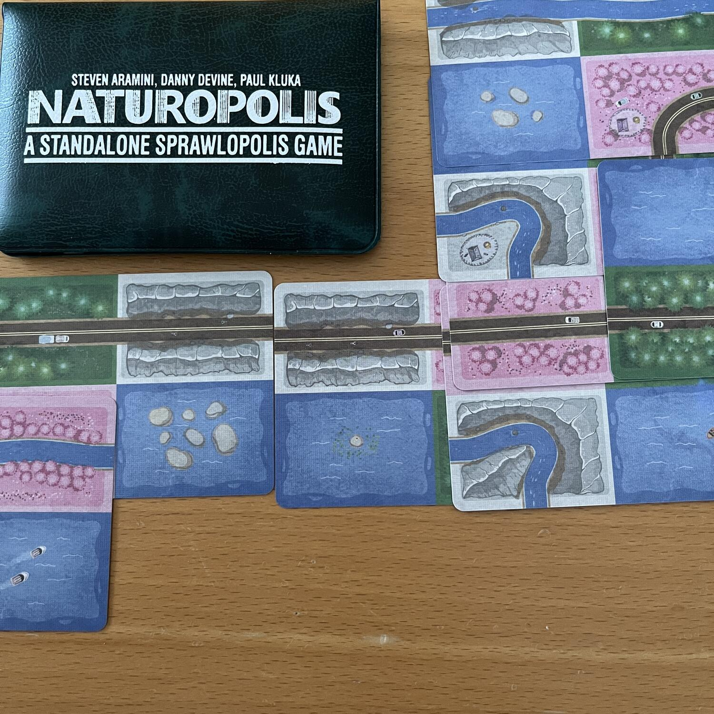
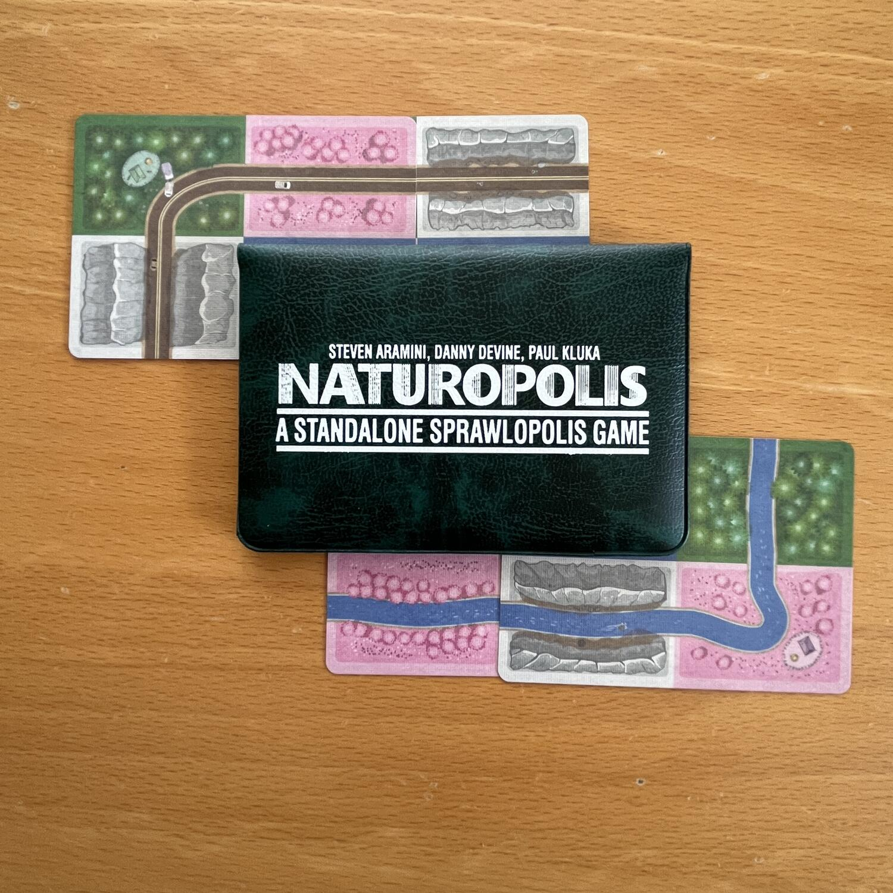

<Setting>

  Dopo aver costruito la vostra <Link to="/reviews/sprawlopolis">Città</Link> e la vostra{" "}
  <Link to="/reviews/agropolis">Campagna</Link> ideale, ora è il momento di costruire il vostro parco dei sogni! Questa
  volta ci saranno da considerare due nuovi elementi: i fiumi e le tende dei turisti! Riuscirete a fare un buon lavoro
  anche questa volta?

</Setting>

<Rules>

  In Naturopolis, i giocatori gireranno casualmente tre carte per vedere le regole di punteggio del gioco e il punteggio
  da raggiungere per vincere la partita. Si sommano i valori di tutte e tre le carte e quel numero è il punteggio che si
  deve raggiungere per vincere. Ogni partita ha regole di punteggio drasticamente diverse in combinazioni uniche con un
  punteggio da battere, che varia da 6 a 51 punti!  
  Ogni turno, i giocatori giocheranno una carta dalla propria mano al fine di sviluppare in modo efficiente grandi aree in
  ognuno dei quattro tipi di zona. Attenzione, però: la manutenzione delle strade non è economica e ogni strada costerà punti
  alla fine. In Naturopolis va anche peggio, in quanto saranno -2 punti per strada!

</Rules>

<Feedback>

  Ahh… l’ennesimo gioco -polis, l’ennesimo gioco della <Link to="/publishers/button-shy">Button Shy</Link>. Che dire se
  non che Combopolis sta diventando sempre più grande?  
  Personalmente trovo questa terza iterazione del sistema -polis un po’ meno ispirata di Agropolis, quasi un ritorno all’origine.
  Qui non ci sono modificatori extra di difficoltà (come se servisse...) e gli obiettivi si intersecano un po’ peggio di
  Agropolis. Non ai livelli di Sprawlopolis, per carità, però succede più spesso del dovuto. Eppure, questo giro gli obiettivi
  sono molto più ispirati e permettono di pensare in maniera molto più ispirata alla situazione di gioco! Quindi Naturopolis
  è il -polis migliore finora? No. È comunque terribilmente bello e divertente? <strong>Assolutamente sì!</strong>

</Feedback>

