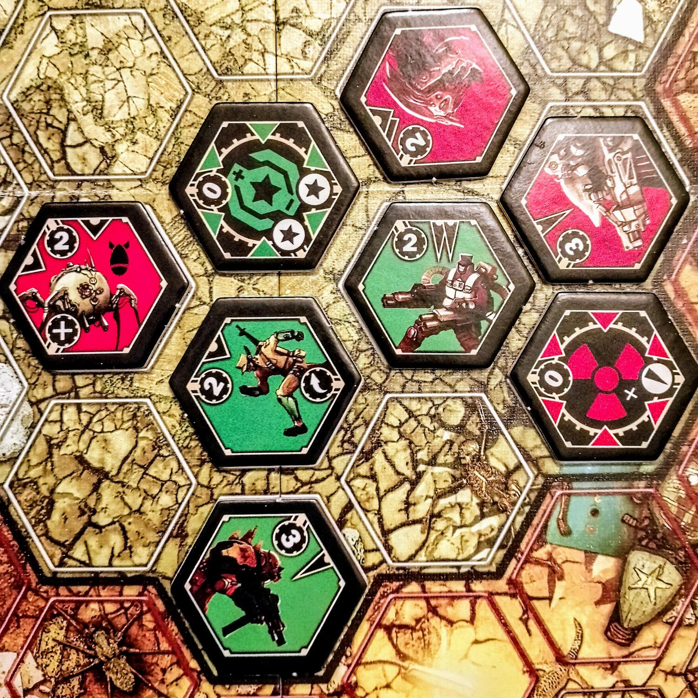
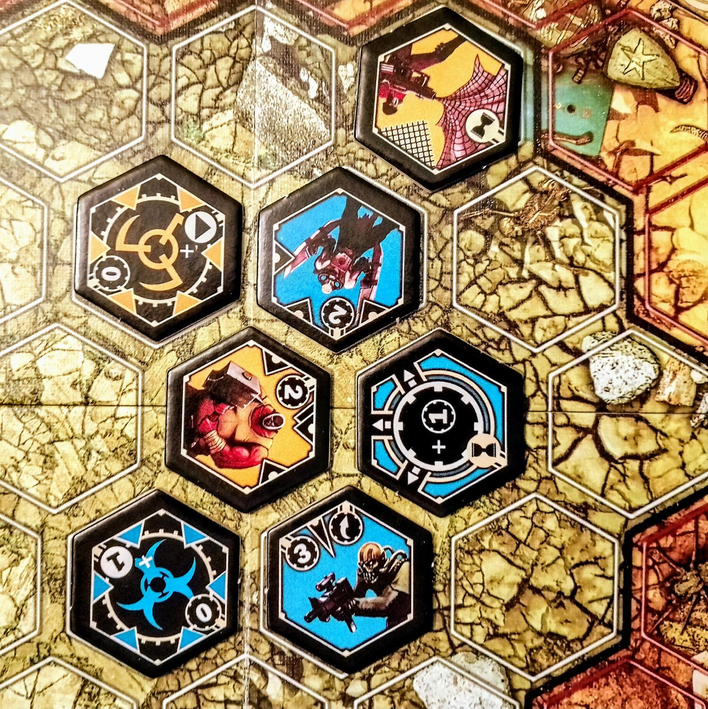
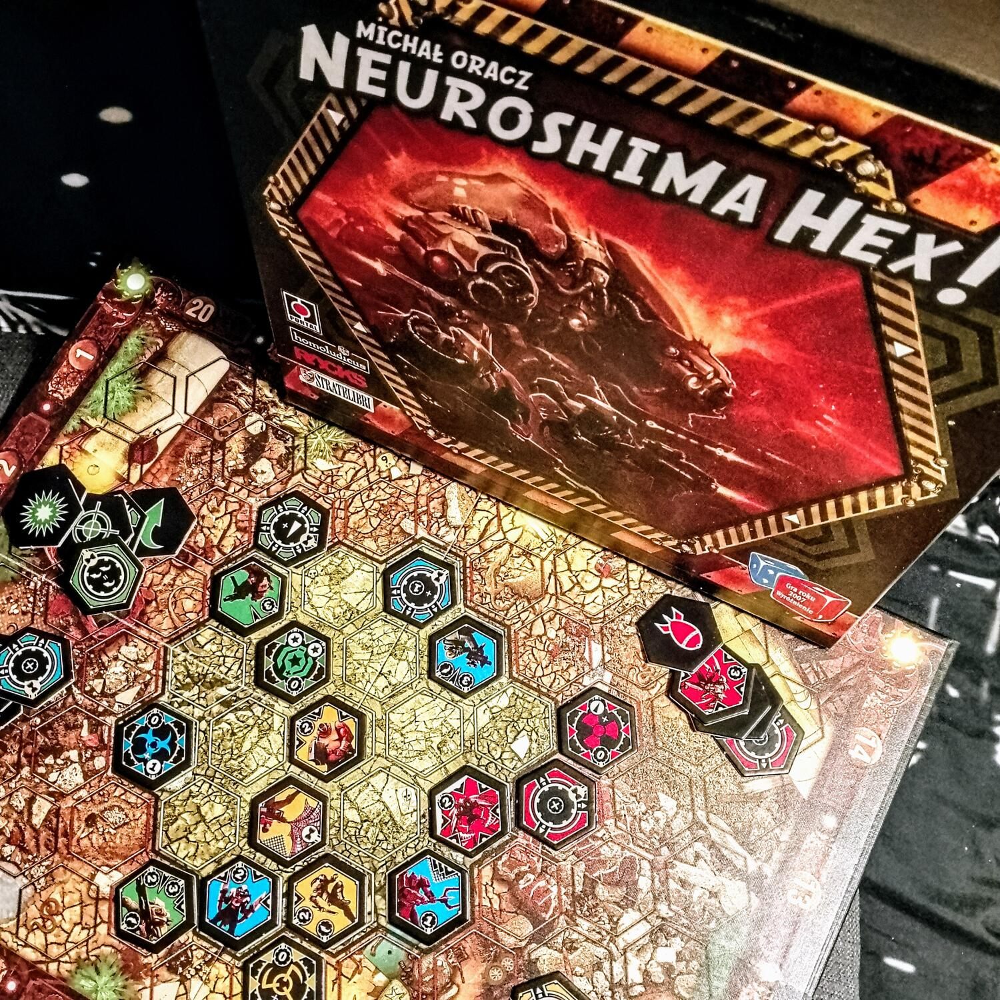

<Setting>

  Neuroshima è un universo post-apocalittico in cui un'intelligenza cibernetica chiamata Moloch ha guidato una rivolta
  delle macchine contro l'umanità, che ora vive in un paesaggio desolato popolato da clan in costanti guerriglie tra
  loro, oltre che contro Moloch. In Neuroshima Hex assumerete il ruolo di leader di una delle quattro fazioni principali
  di questo universo:
   
  <ul>
    <li>      <strong>MOLOCH</strong>, le macchine;</li>
    <li>      <strong>BORGO</strong>, i mutanti;</li>
    <li>      <strong>OUTPOST</strong>, la resistenza;</li>
    <li>      <strong>HEGEMONY</strong>, i pacifisti.</li>
  </ul>
      Ciascuna di queste avrà un suo personale stile di combattimento, con punti di forza e di debolezza che il
      regolamento ha cura di illustrare.

</Setting>

<Rules>

  <em>Neuroshima Hex</em> è un gioco di <strong>piazzamento tessere</strong> su
  <strong> griglia esagonale</strong> di genere <strong>tower defense</strong>. Ciascun giocatore (sebbene il gioco ne supporti
  fino a 6, sono fortemente consigliati 2 soli giocatori) riceve la pila di 35 tessere del clan scelto, caratterizzato da
  un colore specifico. Dopo aver piazzato la tessera HQ (<strong> Quartier Generale</strong>) e aver mescolato le restanti
  coperte, i giocatori si alterneranno in turni in cui pescheranno fino ad avere 3 tessere nella loro riserva temporanea:
  una di queste tessere andrà scartata, le altre due potranno essere giocate, scartate o conservate per il turno successivo,
  in qualsiasi combinazione. I primi due turni hanno delle eccezioni spiegate nel dettaglio sul regolamento.
   
  Oltre al HQ, ci sono altri 3 tipi di tessere.
   
  <ul>
    <li>      Le <strong>unità </strong>rappresentano i combattenti che vanno giocati piazzandoli su uno spazio vuoto della griglia.</li>
    <li>      I <strong>moduli </strong>sono dei potenziamenti che seguono le stesse regole di piazzamento delle unità alleate e, se collegati ad esse, forniscono dei bonus e.</li>
    <li>      Le <strong>azioni </strong>non sono piazzate ma, una volta giocate, vengono risolte e scartate direttamente.</li>
  </ul>
      La parte principale del gioco consiste però nella
      <strong> pianificazione della battaglia</strong>, che viene innescata dalle apposite tessere azione o da situazioni
      di gioco particolari. Le unità in gioco hanno delle caratteristiche ben precise che determinano che tipo di attacco
      possono compiere (ravvicinato o a distanza), in che direzioni, quanti danni provocano, in che ordine di iniziativa,
      ed eventualmente se hanno delle protezioni o dei bonus passivi. La battaglia viene risolta in ordine decrescente di
      iniziativa: solitamente gli ultimi a colpire sono proprio i HQ che infliggono 1 danno a tutte le tessere nemiche adiacenti.
       
      Lo scopo del gioco è proprio quello di
      <strong> abbattere il HQ nemico</strong>, che si comporta come un'unità ma ha ben 20 punti salute.
       
      Se un giocatore riesce a portare a 0 la salute del HQ nemico, vince immediatamente la partita. In caso contrario,
      nel momento in cui un giocatore non ha tessere da pescare all'inizio del proprio turno, viene innescata una
      battaglia finale, al termine della quale chi avrà il HQ con più salute rimanente sarà dichiarato vincitore.

</Rules>

<Feedback>

  A qualcuno potrebbe sembrare che <em>Neuroshima Hex</em> sia uno di quei casi (come{" "}
  <Link to="/reviews/ankh/">Ankh</Link>, ad esempio) in cui, una volta interiorizzate delle regole piuttosto specifiche,
  il gameplay sia immediato e il flusso scorrevole. Poi viene innescata la prima battaglia e ci si rende conto che i
  calcoli fatti non erano sufficienti. Alla fine della prima partita, si ha l'impressione di aver frainteso qualcosa -
  possibilità da non escludere.
   
  Sebbene la griglia sia piuttosto contenuta, è difficile tenere traccia di tutto l'intreccio di azioni che sta sospeso
  sulla plancia come una torre fatta di bastoncini di Shangai, in cui una minima rotazione può fare cadere tutta la
  costruzione. Basta una sola pedina nel posto e al momento giusto per ribaltare con una reazione a catena tutta la
  strategia faticosamente messa in piedi fino ad allora. Per apprezzare questo gioco, è necessario riuscire a
  <strong> visualizzare e</strong> finanche ad
  <strong> anticipare gli outcome</strong> che cambiano forma come in un caleidoscopio estremamente sensibile.
   
  Qualche parola va spesa anche sulla <em>simbologia </em>scelta per le azioni che, per quanto esaustiva, in alcuni casi
  è davvero
  <strong> poco intelligibile</strong>. Se da un lato questa caratteristica rende il gioco completamente indipendente
  dalla lingua, dall'altro può generare fraintendimenti, che a fronte di interazioni così sottili e precarie possono
  tradire drasticamente l'esperienza confezionata dal designer. Ciononostante, dopo qualche partita, si comincia a
  capire che quelli appena elencati non sono dei difetti, quanto piuttosto degli ostacoli che il giocatore è chiamato a
  valicare per accedere ad un <strong> gameplay stratificato</strong>, teso in mezzo a miriadi di variabili in cui anche
  la fortuna diventa un avversario che si può superare in astuzia.
  <strong>    <em> Neuroshima Hex</em></strong>
  <em> premia la dedizione</em>, più che l'esperienza. Non è un titolo per un pubblico generico da tirare fuori
  casualmente, ma un appuntamento obbligato per appassionati che vogliono allenarsi e superare i propri limiti. Lo
  dimostrano la fan base molto attiva su BoardGameGeek, che ogni mese acquista poche ma fedeli reclute, e il team di
  sviluppo che ogni anno dal 2006 progetta una nuova fazione: pochissimi giochi possono godere di un supporto così
  longevo e costante.  
  Se si è disposti a stare alle sue regole, <em>Neuroshima Hex</em> si trasfigurerà per quello che è al di là della sua apparenza
  materiale: un complesso apparato di ingranaggi e proiezioni in cui a spuntarla sarà il calcolatore più freddo che non disdegni
  una saggia dose di caos.
   
  Il gioco ha diverse edizioni, tutte compatibili tra di loro e tutte fuori stampa, ma ne sono presenti diverse copie usate
  su internet. Di più difficile reperibilità sono invece le espansioni, che servono a dare quella variabilità che in un gioco
  di fazioni precostituite è importante. Per gli avventori consiglio la <em>versione app</em>, che oltre ad essere molto
  economica permette anche l'accesso a 5 fazioni aggiuntive e risolve il problema della risoluzione della battaglia che nel
  gioco fisico rischia di dare non poche rogne.

</Feedback>

