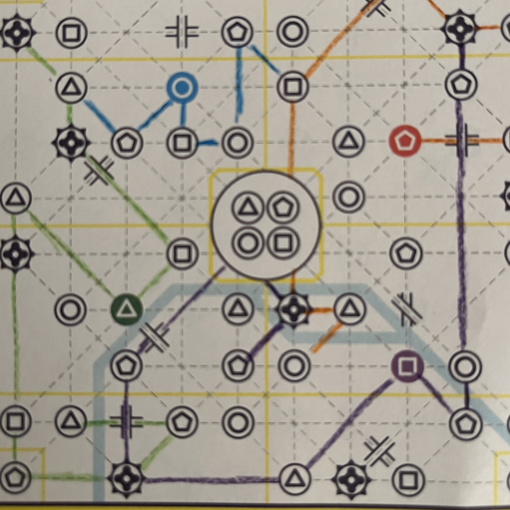
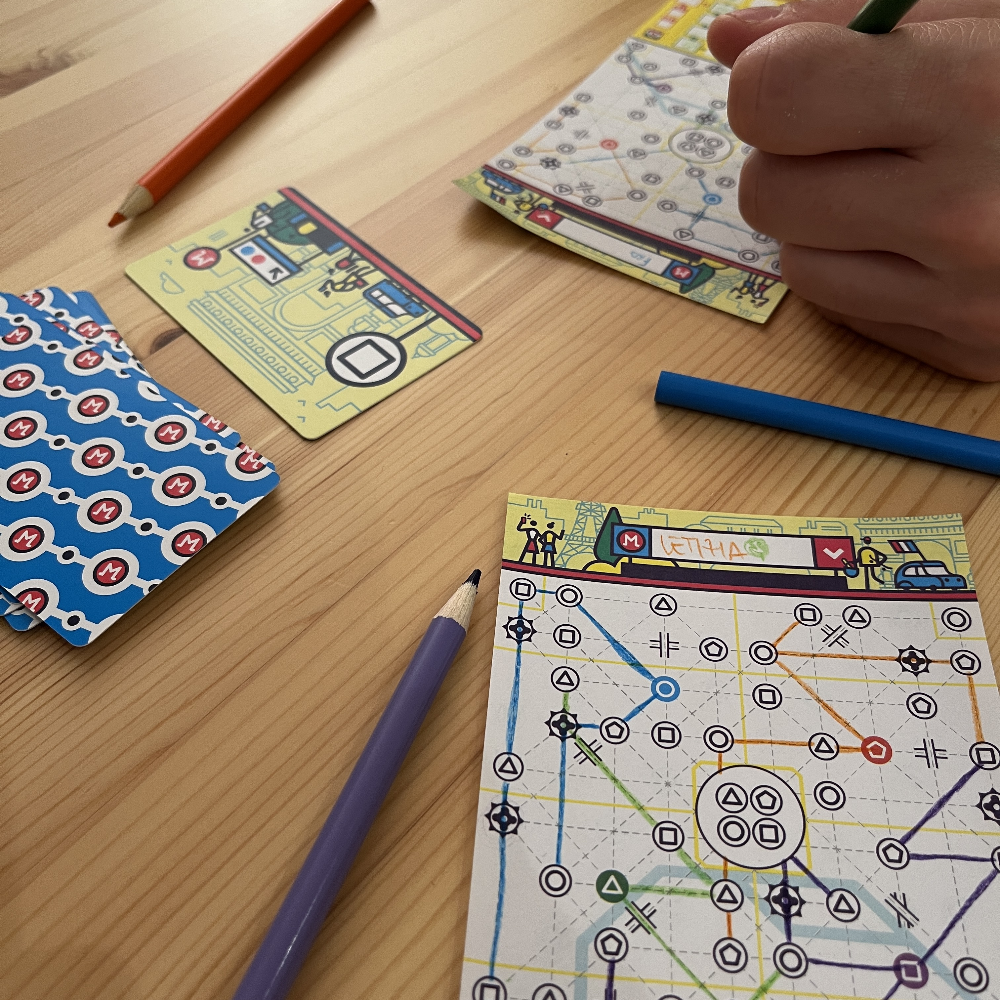
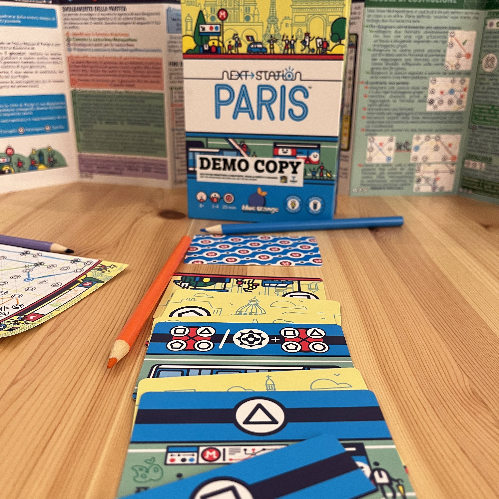

<Setting>

  Ahh… Parigi…   Il tuo compito è “semplice”. Sì semplice! Devi solamente proporre il progetto della linea{" "}
  metropolitana migliore! Riuscirai nell'impresa?

</Setting>

<Rules>

  Next Station Paris è un gioco da 1 a 4 giocatori basato sull'idea del{" "}
  <Link to="/mechanisms/flip-and-write">Flip and Write</Link>. Data una mappa ad ogni giocatore, essa sarà divisa in
  sezioni contenenti delle fermate di metro differenziate tra loro da un diverso simbolo: ad ogni turno i giocatori
  rivelano una carta comune che indicherà verso che simbolo la propria linea della metro dovrà svilupparsi. Rivelate 5
  carte di un colore speciale, il round finirà e bisognerà calcolare il punteggio provvisorio. E subito via con il round
  successivo. La partita finisce quando i giocatori hanno completato le 4 linee della metro. Considerando che ogni linea
  è rappresentata da un colore diverso e che i collegamenti tra le varie fermate non si possono accavallare, a fine
  partita la propria mappa sarà molto colorata e, si spera, molto fruttuosa! Punti extra verranno assegnati a quei
  giocatori che saranno stati in grado di sfruttare al meglio i ponti e a fare in modo che più linee convergano verso le
  stesse fermate.  
  Inutile dire che entrambe queste occasioni di succosi punti extra sono difficili da massimizzare e combinarle alla perfezione
  con i punti di fine round si rivelerà una sfida alquanto interessante!!

</Rules>

<Feedback>

  Creare una metro non è un'impresa facile. Creare una metro che frutti un sacco di punti è un'impresa ancora più
  difficile.  
  Eppure Next Station Paris è un gioco che si <strong>lascia giocare</strong>. Nel bene e nel male. Nel male perché incastrare
  tutte le linee della metro nel miglior modo possibile non è appunto banale e la differenza tra un giocatore bravo e un
  giocatore mediocre si fa sentire, portando alle volte a chiedersi se si sta giocando ad un titolo il cui peso non sia maggiore
  di quello indicato. Il che in realtà non è del tutto vero: sono i vostri amici supercompetitivi il problema!  
  Nel bene, invece, perché l'esperienza è appunto super snella. I round si susseguono veloci in maniera soddisfacente.
  Collegare le varie linee, incastrare le varie linee è facile. È non combinare pasticci che è difficile! Inoltre,
  diffidate dalle regole avanzate presenti nella scatola. L'extra livello di complessità non paga il tempo in più speso
  per giocarci. Next Station Paris è un gioco da 8 con le regole base, utilizzando le regole avanzate diventa però un 5!{" "}
   
  <strong> Semplice è meglio </strong>.

</Feedback>

