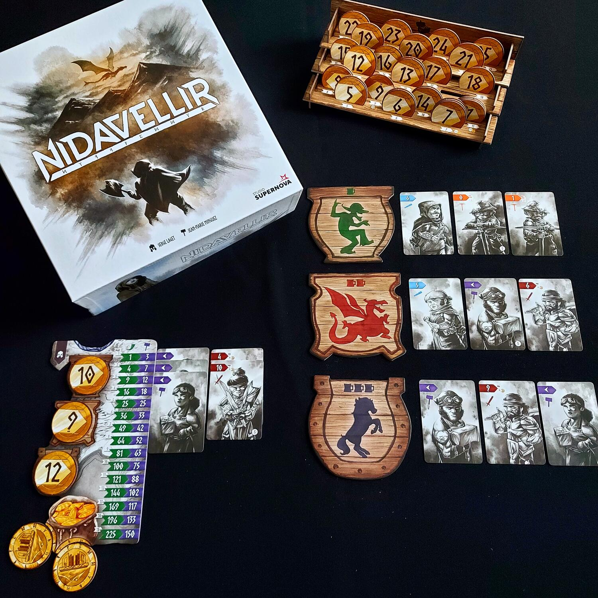
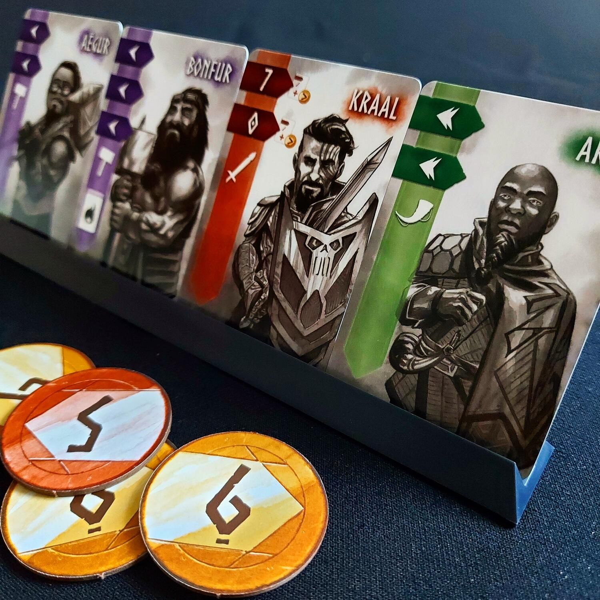

<Setting>

  Il regno dei Nani ha vissuto in pace per millenni, ma nelle terre selvagge e
  gelate di <strong>Nidavellir</strong> un male oscuro si è risvegliato. Il
  terribile drago <strong>Fafnir</strong> si è liberato e vuole realizzare la
  sua vendetta: saccheggiare l'oro accumulato nel regno e distruggere i suoi
  nemici.
   
  In qualità di <strong>Elvaland</strong>, rispettato membro del Consiglio e
  comandante militare, sei stato invitato da re per formare un esercito capace
  di fermare questo mostro sanguinario: recluta i Nani più abili e gli Eroi più
  famosi per formare la migliore compagnia.
   
  Il gioco non si concluderà però con una battaglia vera e propria: lo scopo
  sarà, infatti, unicamente quello di formare il miglior esercito possibile,
  attraverso i meccanismi di asta a scelta vincolata e set collection.

</Setting>

<Rules>

  Una partita a Nidavellir si divide in due Ere, separate da una fase di
  attribuzione delle onorificenze.
   
  I giocatori riceveranno un set iniziale di monete uguale per tutti ed una
  plancia di gioco personale; le monete non verranno mai spese: semplicemente
  nel corso della partita il loro valore potrà essere aumentato attraverso un
  originale meccanismo di coin-building.
   
  Nel corso di ciascun round di gioco, nelle tre taverne verrà posizionato un
  numero di carte Nano pari al numero di giocatori e ciascun giocatore punterà
  in ciascuna taverna della propria plancia di gioco una moneta coperta. Dopo
  che tutti avranno effettuato le proprie puntate (3 monete negli spazi Taverna
  della plancia e due nella Borsa), si riveleranno contemporaneamente le monete
  piazzate: chi avrà puntato di più avrà la priorità nella scelta della carta
  per la relativa taverna.
   
  L'aspetto più particolare di Nidavellir è la meccanica del coin-building,
  vediamo di cosa si tratta: come abbiamo detto tutti i giocatori partono con un
  set di cinque monete uguali di valore 0, 2, 3, 4 e 5. La{" "}
  <strong>moneta da “0”</strong> permette di effettuare un'
  <strong>azione di trasformazione</strong> secondo la seguente regola: si rivelano
  le due monete piazzate nella borsa, se ne somma il valore, si prende dal Tesoro
  Reale una moneta di quel valore e si scarta la moneta nella borsa di valore più
  elevato. In questo modo i giocatori differenziano progressivamente il proprio set
  di monete.
   
  Per la scelta strategica dei Nani da reclutare, si deve tenere conto che i Nani
  si dividono in cinque classi, contrassegnate da colori diversi, e che ciascuna
  classe attribuirà punti in maniera differente; inoltre, ogni volta che un giocatore
  completa una linea, ovvero un gruppo formato da 5 Nani di classi diverse, può immediatamente
  assoldare una Carta Eroe. Infine, alla fine della prima era per ciascuna classe
  viene conferita un'onorificenza al giocatore che possiede più gradi in quella classe.
   
  Le Carte Eroe consentono di puntare su varie strategie. Alcune appartengono alle
  cinque classi dei Nani e andranno piazzate insieme nella classe di appartenenza
  (contano per punteggio e maggioranze), mentre altre sono Carte Eroi neutrali, dunque
  non appartengono a nessuna classe, ma sono dotate di potenti abilità.

</Rules>

<Feedback>

  La parte più difficile di Nidavellir è il conteggio dei punti, per il quale ci
  viene in soccorso un'efficiente <strong>App</strong> scaricabile
  gratuitamente. Suggerisco perciò di giocare le prime partite senza tener conto
  dei punti, allo scopo di familiarizzare con le meccaniche del gioco, che per
  contro risultano essere molto lineari e semplici, oltre che costituire il{" "}
  <strong>vero punto di forza</strong> di Nidavellir, in particolare il
  meccanismo davvero originale del coin-building e la possibilità di assoldare
  Carte Eroe che renderanno ciascuna partita unica.
   
  Il gioco è adatto a qualsiasi tipo di giocatore, ma la profondità strategica
  lo renderà sicuramente più piacevole a giocatori esperti.
   
  Va detto che l'ambientazione è solo un pretesto, tanto è vero che non se ne
  trova traccia nelle meccaniche di gioco, mentre invece la fortuna non ha
  praticamente alcun peso.
   
  Non convince la modalità di gioco in 2 giocatori, mentre in 5 i tempi di
  attesa rischiano di diventare eccessivamente lunghi.
   I materiali sono ottimi, in particolare le monete sono di un bella dimensione
  e di cartone rigido; anche le carte sono di grandi dimensioni e, pur non dovendo
  essere mescolate spesso, è consigliabile utilizzare ugualmente le bustine protettive.

</Feedback>

