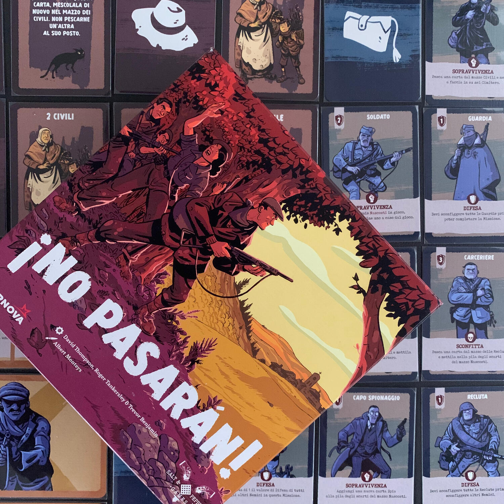
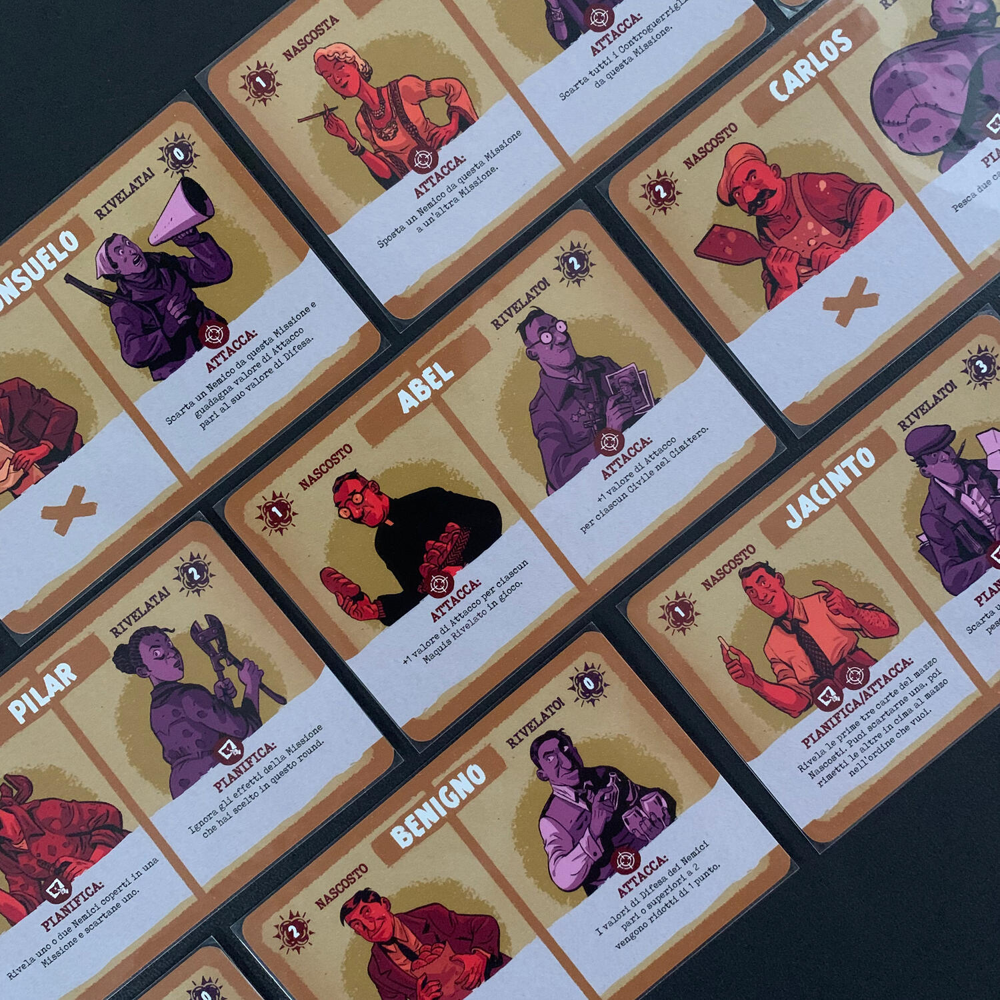
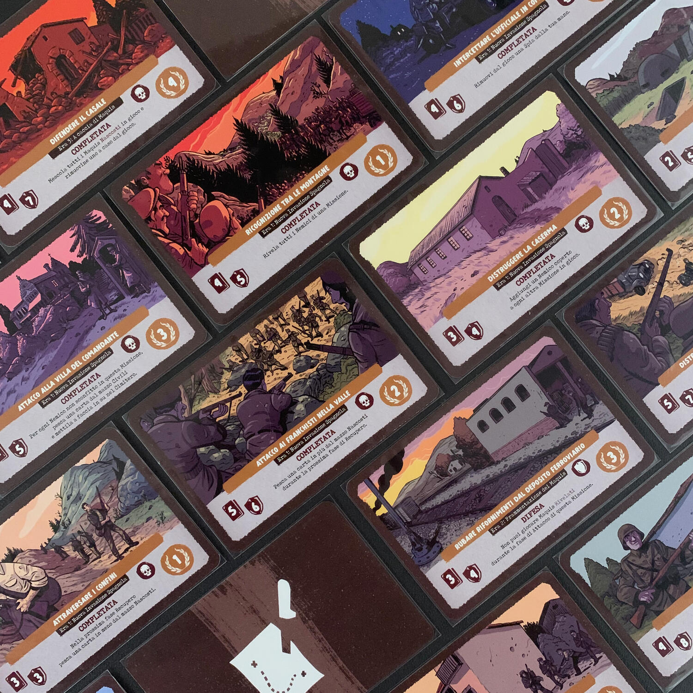

<Setting>

  Spagna, 1936.
   
  Il <strong>generale Franco</strong> e le sue truppe avanzano attraversando la{" "}
  <strong>Spagna</strong>, iniziando un lungo periodo di guerra civile e
  repressioni. Dopo la <strong>Guerra Civile Spagnola</strong>, un gruppo di
  fedeli alla Repubblica continuò la lotta armata, formando gruppi di resistenza
  conosciuti come "<strong>Maquis</strong>".
   
  Nascosti tra le montagne, queste persone rischiarono la loro vita per
  difendere gli ideali di democrazia e libertà. Dovettero affrontare l'Esercito
  di Franco, la Guardia Civile e la Polizia Armata, ma i Maquis, che avevano
  perfezionato le tecniche di <strong>guerriglia</strong> in Francia durante la
  seconda guerra mondiale, erano determinati a riprendere la propria terra.
  Nella loro testa risuonava l'eco della speranza di molti compatrioti: ¡No
  pasarán!

</Setting>

<Rules>

  Lo scopo del gioco è quello di ottenere il maggior numero di{" "}
  <strong>punti vittoria</strong>, completando più missioni possibili delle 10 a
  disposizione: a inizio partita, saranno scelte in maniera casuale, avendone
  quattro di livello 1 e tre per i livelli 2 e 3. Ogni missione è caratterizzata
  da un numero di nemici che si porranno tra noi e il successo e da un bonus /
  malus che verrà azionato una volta completata o meno la missione. Per
  completare la missione, quindi, dovrete andare a{" "}
  <strong>combattere con i vostri maquis</strong>: se la forza totale dei vostri
  maquis sarà maggiore di quella della missione e della forza dei nemici, allora
  la missione avrà successo.
   
  Il turno di gioco si svolge in 4 fasi:
  <ol>
    <li>      <strong>Pianificazione</strong>: si giocano dei maquis, si sceglie la
      missione da affrontare e si rivelano i nemici coperti a "difesa" della
      missione;</li>
    <li>      <strong>Attacco</strong>: si giocano ulteriori maquis;</li>
    <li>      <strong>Conseguenze</strong>: si verificano le perdite tra i civili e il
      risultato della missione. È in questo momento che si deve decidere se
      continuare con la resistenza o fermarsi e andare a contare i punti;</li>
    <li>      <strong>Recupero</strong>: se si decide di proseguire, si scartano i
      maquis giocati, si pesca una nuova mano di carte e si torna alla fase 1.</li>
  </ol>
  Il gioco sta tutto nelle prime due fasi. Vi domanderete perché schierare dei
  maquis in pianificazione quando si hanno meno informazioni piuttosto che
  aspettare… beh è presto detto. Immaginate ogni carta Maquis divisa in due
  "sotto-carte", la parte sinistra <strong>"nascosta"</strong> e la parte destra{" "}
  <strong>"rivelato"</strong>; ognuna di queste parti può avere un potere
  attivabile se giocato nella fase corrispondente. Questi poteri permettono di
  rivelare nemici nascosti, di assassinarne alcuni prima di entrare in
  guerriglia e molto altro.  
  Oltre a stare attenti alla fase in cui giocherete un maquis, dovrete decidere se
  giocarlo nascosto o rivelato. La seconda opzione è nettamente più forte… ma è l'ultima
  volta che la utilizzerete. In altre parole, <strong>    sacrificherete</strong> il compagno alla causa e non farà più ritorno nel vostro mazzo di pesca.{" "}
   
  Oltre ai Maquis, anche i nemici hanno dei poteri che vi daranno del filo da
  torcere: questi uccideranno civili, nasconderanno delle <strong>    spie</strong>{" "}
  tra le vostre fila (nel mazzo di pesca) e molto altro ancora.
   
  La partita può finire in 4 modi, solamente uno dei quali è positivo, ovvero
  quando decidete voi di ritirarvi. Gli altri 3 modi, invece, dipendono dalle
  troppe spie, dai troppi civili ingiustamente uccisi o dal fallimento di 2
  missioni.

</Rules>

<Feedback>

  Se mi seguite da un po', avete sicuramente capito che mi piace giocare in solo
  e che mi viene la pelle d'oca quando si parla di <strong>resistenza</strong>.
   
  La parte che preferisco di questo titolo è sicuramente il{" "}
  <strong>draft iniziale</strong> delle carte Maquis che permette di costruire
  il mazzo secondo i nostri gusti, cercando di renderlo solido per le missioni
  che affronteremo: vengono pescati due Maquis, uno si tiene e uno si scarta.
   
  La <strong>curva di apprendimento</strong> di questo gioco{" "}
  <strong>non è semplicissima</strong>: le prime 2-3 partite saranno sicuramente
  fallimentari; bisognerà tenere duro e, partita dopo partita, si capirà il
  codice dietro il gioco e si porteranno a casa sempre più punti.
   
  Tenete a mente che, oltre al gioco, alla meccanica fine a se stessa, verrete
  lanciati in un mondo di <strong>scelte etiche</strong>, di{" "}
  <strong>sacrificio</strong> e di <strong>coscienza</strong>: è più doloroso
  sacrificare dei civili o seppellire Consuelo? Posso permettermi di far fallire
  una missione per stanare le spie e cacciarle? Dovrei smetterla di resistere o
  rischio la pellaccia dei miei compagni per un'ultima missione?
   
  ¡No pasarán! è un titolo spettacolare che si è preso un posticino a fianco di{" "}
  <Link to="/reviews/maquis/">Maquis</Link> e che non lo lascerà per un bel po'.

</Feedback>

