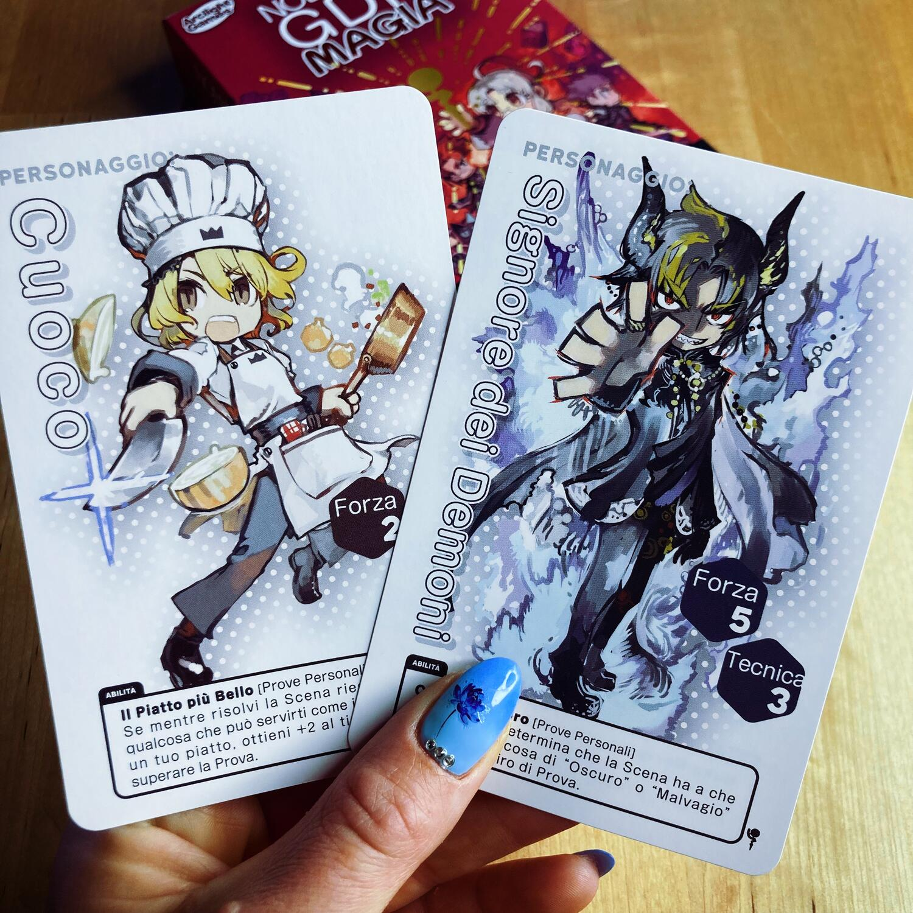
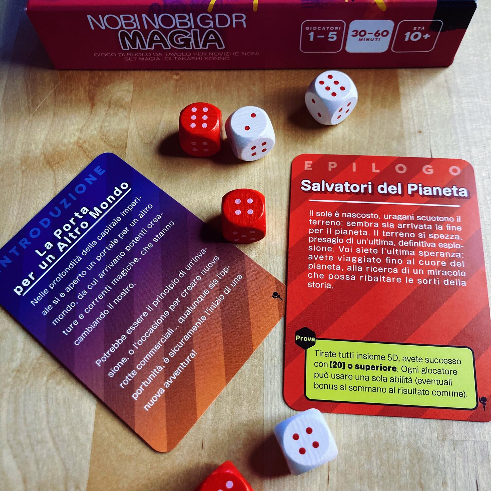

<Setting>

  Che sia il mazzo Spada o Magia, l’ambientazione è sicuramente super Fantasy e
  giocando tu potrai personalizzarla a piacimento!!  
  La tua avventura sarà tra le fronde di un bosco incantato oppure tra le mura di
  un oscuro castello in cima ad una collina?  
  Il limite sarà solo la tua fantasia e quella dei tuoi amici!

</Setting>

<Rules>

  La preparazione del gioco è estremamente semplice: si scelgono i Personaggi,
  si decide chi tra i giocatori sarà il primo Master e chi il primo Protagonista
  e, infine, si pesca e legge una carta Introduzione.
   
  Appena i giocatori sono pronti a partire, il Master pesca una Carta Scena e la
  legge ad alta voce rivolgendosi al suo Protagonista, il quale si troverà ad
  affrontare una Prova (di Tecnica o di Forza) oppure una scena di Ruolo!
  <ul>
    <li>      <strong>Scena di Prova</strong>
      Le carte possono richiedere una prova di Forza o di Tecnica e, per
      affrontarle, il protagonista dovrà tirare due dadi; i risultati si
      sommeranno con il valore della caratteristica del personaggio relativa al
      tipo di prova e agli eventuali bonus dati dalle carte Luce/Ombra già in
      suo possesso. Inoltre, se altri Personaggi hanno abilità che possono
      aiutare il Protagonista, essi possono decidere di intervenire. Infine, si
      confronta il risultato totale con la difficoltà della Prova: se il
      risultato totale è pari o superiore alla difficoltà della Prova, questa è
      superata; se è inferiore, si avrà un fallimento.</li>
    <li>      <strong>Scena di Ruolo</strong>
      In questo caso si entra nel vivo del gioco di ruolo e il giocatore
      Protagonista dovrà narrare la risoluzione della Scena pescata.  
      Al termine della narrazione, il Master deciderà se la prova di Ruolo è un successo
      oppure un fallimento, osservando e tenendo conto, se lo riterrà opportuno,
      anche delle reazioni degli altri giocatori. È importante ricordare che le abilità
      da usare si scelgono prima di tirare i dadi e che il giocatore può usare una
      sola abilità per Scena.
      Alla fine del turno, se il Protagonista ha successo otterrà una carta Luce,
      altrimenti una carta Oscurità.</li>
  </ul>
  Dopodiché, i ruoli di Master e Protagonista passano al giocatore successivo in
  senso orario. Quando ogni giocatore è stato Master per 3 volte si innesca
  l’ultima fase di gioco: si pescherà allora una Carta Epilogo rivelando così la
  Prova Finale che il gruppo dovrà affrontare e si procederà con la narrazione
  della fine dell'avventura.

</Rules>

<Feedback>

  Questo è l’ennesimo gioco firmato Studio Supernova che mi lascia senza parole!
  È stato studiato perfettamente per introdurre in modo ottimale al gioco di
  ruolo coloro che non lo hanno mai provato e, allo stesso tempo, è un ottimo
  gioco di ruolo leggero e divertente per i giocatori più navigati!
   
  Le regole sono estremamente semplici e spiegarlo anche a chi non è avvezzo al
  gioco da tavolo è davvero facile. La prima partita potrebbe scorrere un po’
  lenta perché, essendo un gioco estremamente narrativo, potrebbe non risultare
  naturale a tutti improvvisare la risoluzione di una scena o spiegare il perché
  di un avvenimento, ma una volta superate le prime timidezze tutto scorrerà più
  liscio!
   
  Temevo che far terminare il gioco dopo tre round fosse un azzardo, ma mi sono
  dovuta ricredere, dato che più di una volta ci siamo trovati a volere
  addirittura prolungare l’avventura prima di pescare l’Epilogo.
   
  Un altro punto a favore di Nobi Nobi è l’estrema frequenza con cui possono
  susseguirsi scene improbabili, cosa che porterà i giocatori a dover escogitare
  ragioni plausibili per cui possano accadere! E questo potrà sicuramente
  generare delle situazioni estremamente buffe e divertenti!
   
  Infine, a favore di questo gioco si può senz’altro sottolineare che i due
  mazzi possono essere uniti, dando così ai giocatori la possibilità di
  moltiplicare pressoché all’infinito le avventure da giocare.

</Feedback>

