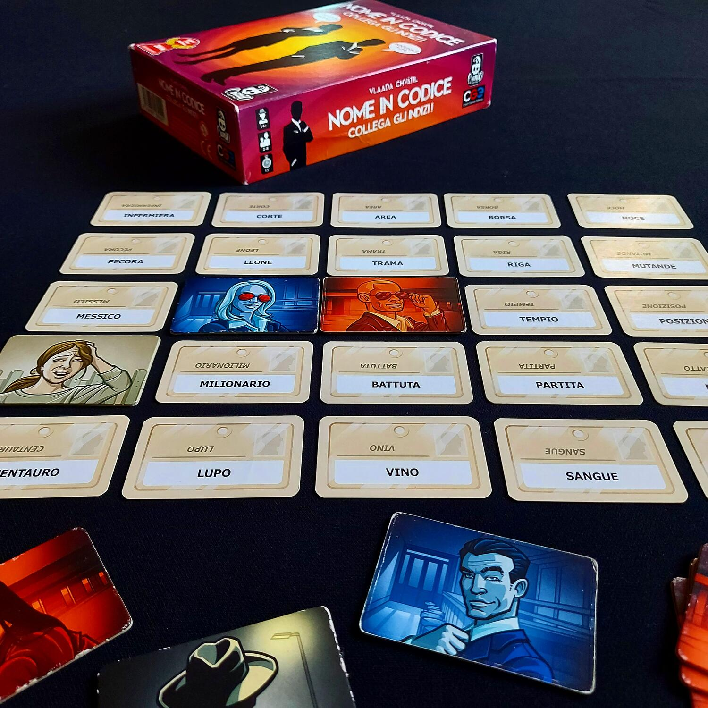
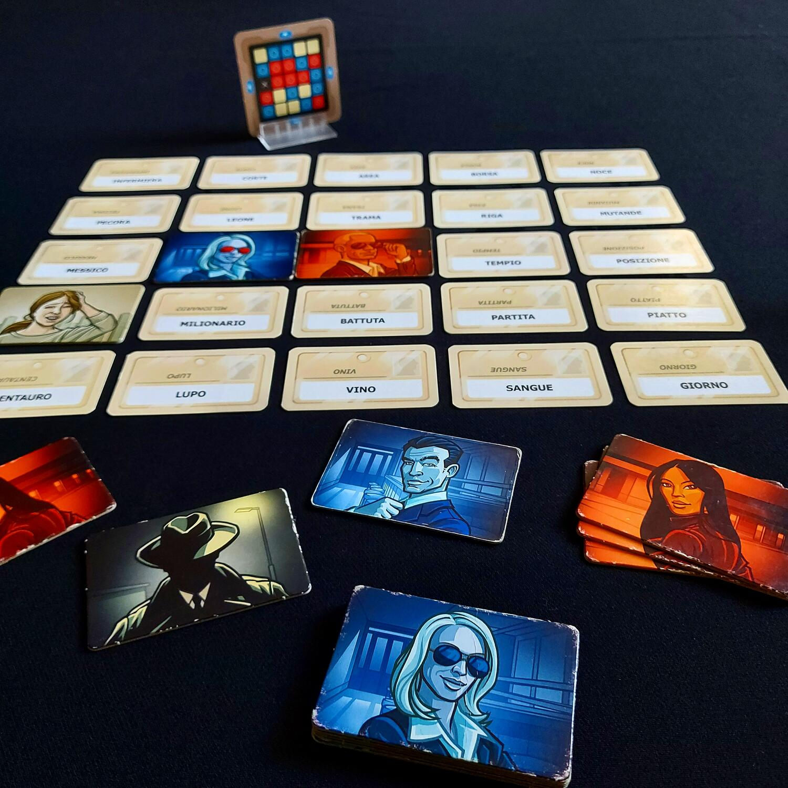

<Setting>

  Cappello in testa, occhiali da sole e bavero dell’impermeabile ben alzato.
  Siete pronti a vestire i panni di agenti segreti che lavorano sotto copertura?
  Dovrete però stare ben attenti a cogliere i suggerimenti del vostro “capo” per
  riunire la squadra, senza farvi scoprire dagli agenti della squadra avversaria
  o ancora peggio dall’assassino che si aggira tra i quartieri malfamati della
  città!

</Setting>

<Rules>

  I giocatori si divideranno in 2 squadre, nelle quali ci saranno un capo e
  degli agenti. I due “capi” si siederanno su un lato del tavolo, mentre gli
  agenti saranno seduti sul lato opposto.
   
  Per iniziare la partita sarà sufficiente pescare 25 carte tra le innumerevoli
  che il gioco mette a disposizione e disporle in una griglia 5 x 5. Si
  sorteggerà poi dal mazzo una carta Chiave, che indicherà ai capi le parole da
  far indovinare alla propria squadra, quelle neutre e quella dell’assassino. Il
  compito dei due capi è evidentemente quello di portare i propri compagni a
  indovinare le parole appartenenti al set della propria squadra prima che gli
  avversari indovinino le loro. A tale scopo, a turno dovranno pronunciare una
  parola seguita da un numero: la parola sarà l’indizio, il numero si riferirà
  alle parole sulla griglia a cui l’indizio allude. I capi dovranno fare
  attenzione ad evitare che l'indizio contenga al suo interno una delle parole
  sul tavolo o che abbia la stessa radice; inoltre, dovranno evitare che i
  compagni selezionino per errore la carta dell’assassino, pena la sconfitta
  immediata. Il compito dei compagni di squadra sarà invece quello di
  interpretare correttamente il suggerimento del capo, cercando di azzeccare le
  parole corrette.

</Rules>

<Feedback>

  Nome in Codice è un esempio di come con pochissimi materiali, e sfruttando
  unicamente i giochi di parole, sia possibile realizzare un grande gioco da
  tavolo. Facilmente trasportabile e giocabile ovunque, tradotto in moltissime
  lingue e vincitore di numerosissimi premi, Nome in Codice non potrà mancare
  nella vostra collezione di giochi.
   
  Party game di sicuro successo, che permetterà di far sedere attorno al tavolo
  molte persone diverse e di avvicinare giocatori neofiti al mondo dei giochi da
  tavolo in maniera divertente.
   
  La facilità del regolamento e le scelte mai banali né prive di rischi
  permetteranno a chiunque di avvicinarsi a questo gioco in modo leggero e di
  ricavare soddisfazione partita dopo partita, vedendo le proprie strategie
  affinarsi al pari dell’intesa di squadra.
   
  L'interazione è molto alta, i membri della stessa squadra collaborano per
  arrivare a una soluzione ma non ci sono tempi morti. Anche quando è la squadra
  avversaria a giocare il proprio turno, si avrà un'occasione importante per
  eliminare delle parole dalla lista.

</Feedback>

