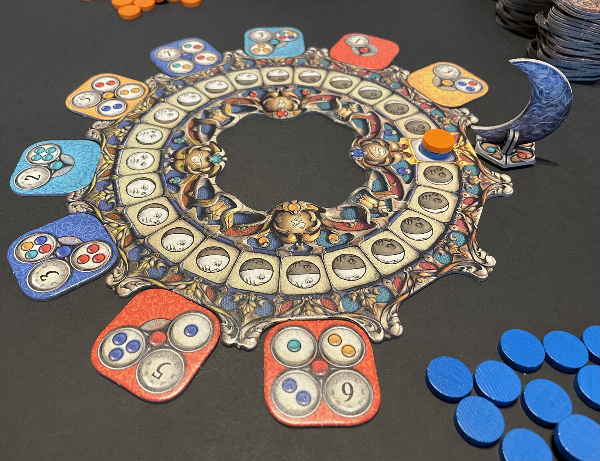
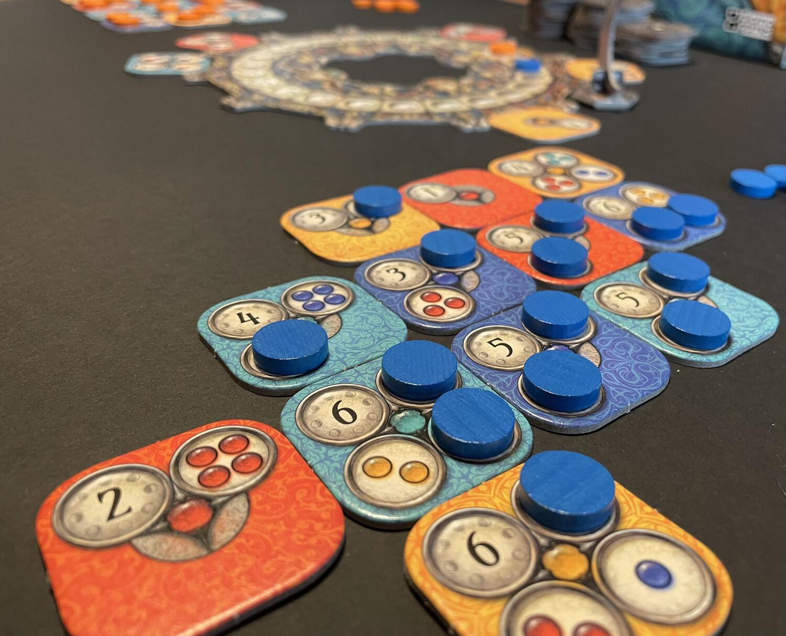

<Setting>

  Finalmente sappiamo rispondere alla domanda posta da Leopardi un paio di
  secoli fa: “Che fai tu luna in ciel?”... «Decoro e scandisco il turno!». Sì,
  perché a questo serve lo scorrimento del ciclo lunare descritto sul tabellone
  del gioco, con tanto di segnalino. Ma volete davvero cercare il pelo nell'uovo
  e confrontare i banali meccanismi in circolazione per tener conto
  dell'iniziativa con questo delizioso omaggio alla luna di Georges Méliès?
   
  L'atmosfera lunare è, appunto, tutta decorativa. I tondini colorati sulle
  graziose tessere potranno anche ricordarvi le gemme a cui gli astri donano
  magiche virtù (i quattro elementi o le quattro stagioni, con un po' di
  fantasia), ma siamo onesti: ciò che vi aspetta è un astratto puro.

</Setting>

<Rules>

  Setup: tutti i gettoni di uno stesso colore a un giocatore diverso - tranne
  uno per ciascuno, da collocare sulla luna nuova per l'iniziativa -, il
  percorso lunare al centro, il segnalino luna in cima all'incavo dorato con il
  simbolo della luna nuova, una tessera a faccia in su per ogni altro incavo e
  le restanti a portata di mano a faccia in giù. Pronti? Via!
   
  Il giocatore con il gettone iniziativa più arretrato (a parità di posizione,
  più in cima) sceglie una tessera tra le prime tre seguenti il segnalino luna
  in senso orario (se ne restano due o una il giocatore di turno può - deve se
  ne restano zero - rimpinguare il tracciato) e avanza il proprio gettone
  iniziativa di tante caselle sul tracciato della luna quanto indicato dal
  numero in alto a sinistra della tessera scelta. Poi, posiziona la tessera
  sulla propria area di gioco. I tondini restanti sulla tessera (da 0 a 3) sono
  i suoi obiettivi: indicano quante altre tessere e di che colore occorre
  posizionare adiacenti ortogonalmente alla stessa tessera per completare
  ciascun obiettivo. Tessere dello stesso colore adiacenti tra loro possono
  contare per realizzare un obiettivo. Completando un obiettivo, lo si copre con
  uno dei gettoni della propria riserva.
   
  Vince chi esaurisce per primo i propri gettoni o chi ne ha di meno quando non
  ci sono più tessere da pescare.

</Rules>

<Feedback>

  Prendi una tessera, incastrala nella tua area di gioco, passa il turno (o
  forse no). Uwe Rosenberg spreme fino all'ultimo spicchio di luna la fortunata
  meccanica già vista in Patchwork e la armonizza con un'idea di Corné van
  Moorsel a cui dà grande credito (perché il plagio è un reato anche nel grande
  mondo ludico). Di una semplicità disarmante e di un'eleganza straordinaria.
  Trascorrerete dei momenti di intima grazia quando, grazie al posizionamento di
  una singola tessera, soddisferete a catena cinque obiettivi. Un po' vi
  domanderete dov'eravate quando, due turni prima, ne avevate soddisfatti altri
  due senza accorgervene. Magari, notandolo, avreste anche vinto…
   
  Si gioca con gusto anche in tre o in quattro, ma la vera sfida è in coppia,
  dove la fortuna è minima. Sempre più titoli di questo genere, infine,
  prevedono la variante in solitario, ma anche qui, come altrove, si tratta
  principalmente di una palestra.
   
  In ogni caso, grandi o piccini, vi divertirete!

</Feedback>

