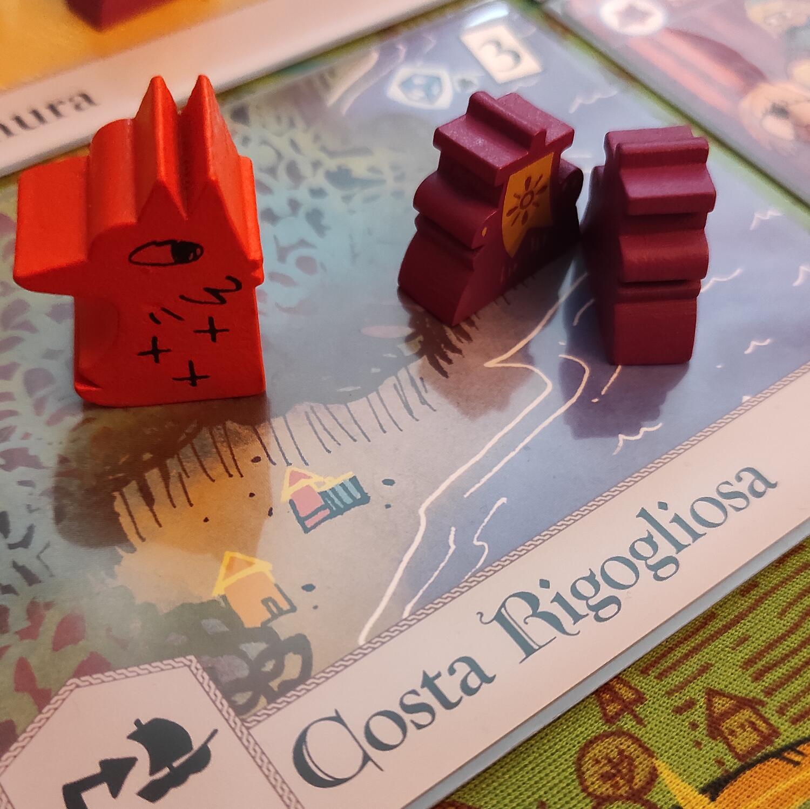
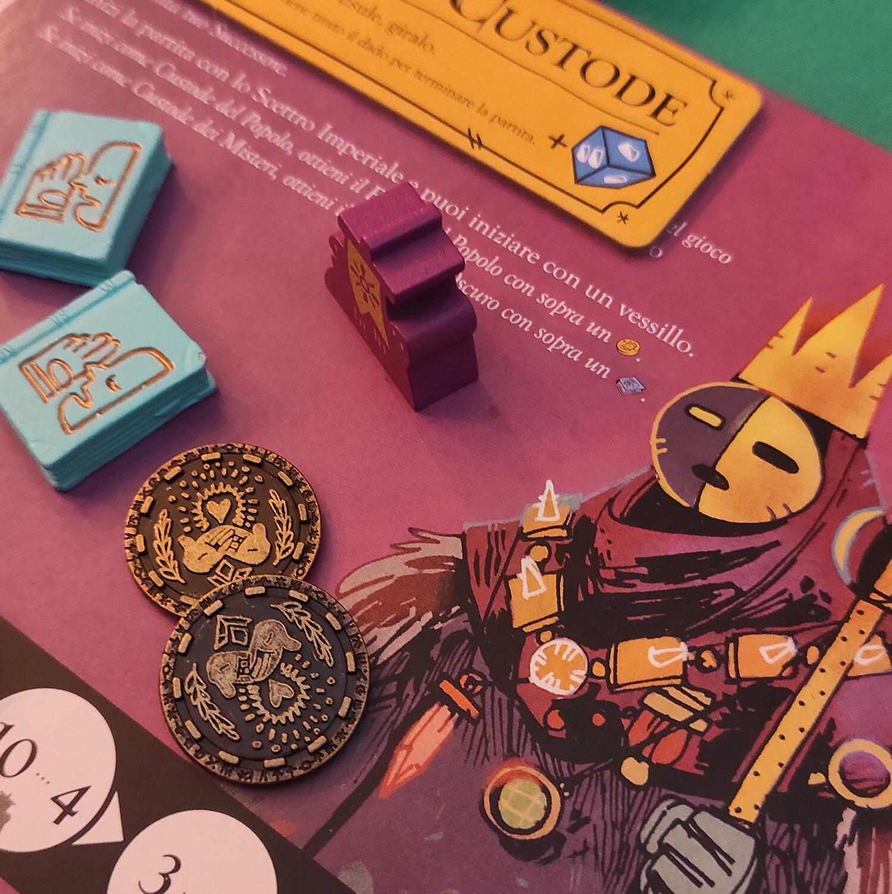

<Setting>

  Siete qui per scrivere una storia, una lunghissima storia di battaglie,
  usurpatori e ambizioni di potere. L'equilibrio potrà essere spezzato o sarà
  ancora nelle mani del Cancelliere? Come Esuli inizierete una intricata rete di
  favori e conoscenza per cercare di usurpare il trono, ma potreste cadere nelle
  mani del persuasivo Cancelliere che potrà portarvi nelle sue fila. Intrighi,
  combutte e alleanze costruiscono un mondo in continua evoluzione partita dopo
  partita.
   
  Questo è Oath, una splendida cronaca che sarete voi giocatori a scrivere (nel
  vero senso della parola).

</Setting>

<Rules>

  Per la natura del gioco, ci limiteremo a spiegare i concetti fondamentali del
  turno dei giocatori e delle condizioni di vittoria.
   
  Il gioco presenta una mappa suddivisa in tre aree che compongono il Regno,
  ogni area ospita delle carte Territorio dove ci si sposterà durante la partita
  e si attiveranno le eventuali carte giocate.
   
  Un giocatore interpreterà il Cancelliere, mentre gli altri inizieranno come
  Esuli.
   
  Nel proprio turno ogni giocatore svolgerà tre Fasi:
   
  Fase Risveglio - dove si controllano le condizioni di vittoria per gli Esuli
   
  Fase Azioni - dove si consumeranno le proprie scorte per effettuare azioni:
   
  <ul>
    <li>Viaggiare tra i Territori&nbsp;</li>
    <li>Pescare e Giocare carte nel territorio</li>
    <li>Recuperare Reliquie</li>
    <li>Commerciare Segreti o Favori</li>
    <li>Reclutare truppe</li>
    <li>Attaccare avversari</li>
  </ul>
  Fase Riposo - dove si aggiorneranno i segnalini utilizzati durante il turno e si
  recupereranno le scorte
   
  Finite le tre fasi si passerà al giocatore successivo.
   
  Ogni Partita avrà un Obiettivo principale da soddisfare per vincere. Nella prima
  partita sarà quello di avere più territori conquistati. Chi soddisfa questo requisito
  avrà il ruolo di portatore del Potere che determinerà la vittoria immediata di
  uno dei giocatori, in base al ruolo.
   
  Il Cancelliere partirà con questa condizione già soddisfatta e dovrà riuscire a
  mantenerla fino alla fine del quinto round, a partite dal quale tirerà un dado
  che potrà decretare la fine della partita, che comunque si concluderà entro l'ottavo
  round di gioco.
   
  Un Esule dovrà usurpare il potere e mantenerlo per almeno due turni di gioco per
  vincere immediatamente la partita. Inoltre, potrà perseguire la via delle carte
  Visione che modificheranno le sue condizioni di vittoria (ad esempio avere più
  reliquie di tutti i giocatori).
   
  Infine, il Cancelliere può convincere gli Esuli a diventare Cittadini: questi ultimi
  giocheranno insieme al Cancelliere, ma sempre con la possibilità di rovesciare
  il trono e vincere.

</Rules>

<Feedback>

  Il Regolamento di Oath è esaustivo, la guida rapida ti accompagna passo dopo
  passo con esempi e turni completi per ogni giocatore. Nonostante ciò, la curva
  di apprendimento è molto ripida. Vi troverete spaesati nei primi turni di
  gioco, senza sapere cosa stiate facendo. Ma una volta capito il meccanismo dei
  giochi di potere, comincerete a darvele di santa ragione, con mosse e
  contromosse per ostacolare gli avversari. Ci vorrà ugualmente qualche partita
  per prendere dimestichezza con la profondità che offre il gioco.
   
  Componenti di ottima fattura, con un playmat al posto del tabellone, divisori
  per le carte e token in legno serigrafati. Potete aggiungere un pizzico di
  immersività acquistando separatamente i favori e le monete in metallo, che
  fanno la loro figura.
   
  Parliamo anche di quel gioco nel gioco che sono le Cronache. Ogni partita ad
  Oath racconta la storia di un regno che lascerà il segno. Quando avrete finito
  di giocare e decretato un vincitore, seguirà tutto un Setup che vi preparerà
  alla partita successiva, mantenendo alcuni elementi come territori e carte,
  modifiche al mazzo del mondo e scelta delle condizioni di vittoria a cura del
  nuovo Cancelliere. Trovata geniale, in quanto il gioco è praticamente infinito
  con partite sempre diverse e la possibilità di aggiungere giocatori senza per
  forza dover ricominciare da capo (come se in un regno si presentasse un nuovo
  popolo che vuole conquistare il potere).
   
  Volendo, potete acquistare il fantastico Diario delle cronache, dove
  raccontare ogni partita annotando le vostre gesta!
   
  Un’esperienza epica, in definitiva: Oath si ama o si odia.

</Feedback>

