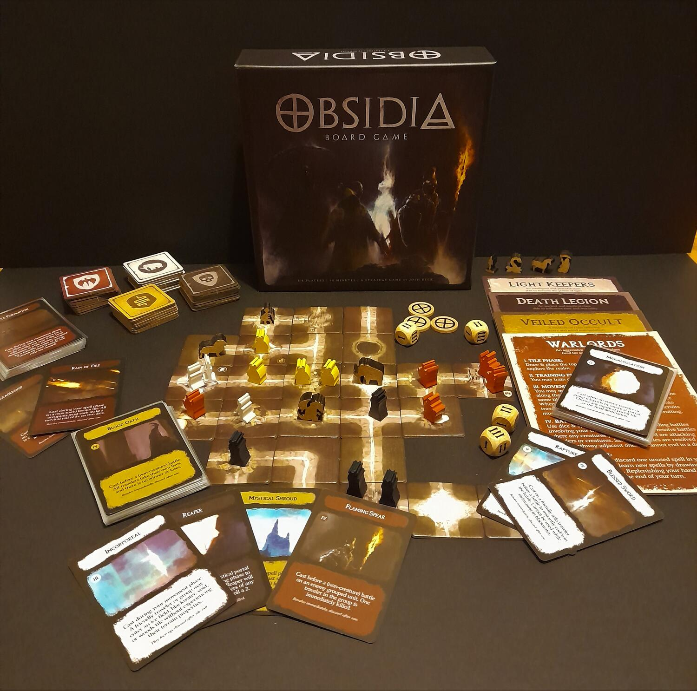
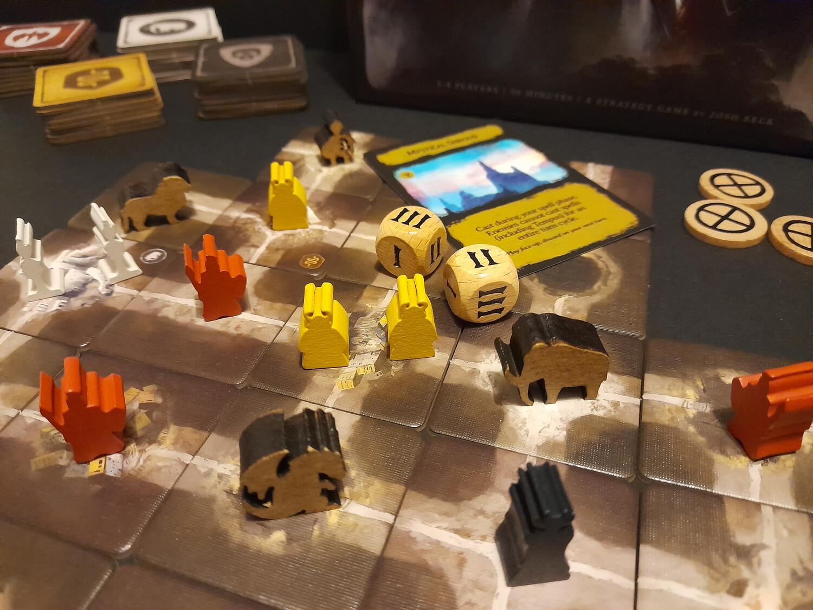

<Setting>

  Originariamente Obsidia era un “reame prigione” dove rinchiudere esseri
  pericolosi provenienti da diversi mondi, sotto il vigile sguardo dei custodi.
  Con il passare dei millenni si formarono colonie e addirittura imperi, in
  un'inquieta ma costante pace. Un giorno però la luce svanì, lasciando il reame
  nell'oscurità, e i custodi smisero di esercitare il loro controllo. Le fazioni
  più potenti cominciarono allora a combattere per la supremazia, cercando di
  accaparrarsi le città, gli ultimi posti abitabili e non immersi in quella
  imperscrutabile oscurità.

</Setting>

<Rules>

  Ogni giocatore impersona una delle 4 fazioni disponibili, ognuna con un mazzo
  composto da 20 carte uniche e votate più ad un aspetto piuttosto che ad un
  altro (attacco, difesa, manipolazione degli avversari o dei turni di gioco).
   
  Scelta la fazione si costruisce l'iniziale mondo di gioco tramite delle
  tessere neutrali, piazzando anche le basi di partenza delle fazioni. Ogni
  partita vedrà quindi una plancia differente, e il posizionamento delle proprie
  capitali potrà risultare decisivo.  
  Terminato ciò, si può cominciare: ogni turno i giocatori svolgono in sequenza 6
  fasi: piazzare una nuova tessera terreno presa dalla propria riserva, reclutare
  una pedina, muovere tutti i propri uomini in gioco, risolvere eventuali battaglie
  e infine giocare carte magia che non possono essere giocate in altre fasi. Queste
  ultime hanno, infatti, un'icona che mostra quando possono essere giocate, in base
  a cosa influenzano: il movimento solo durante la fase 3, i combattimenti durante
  la fase 4 e così via.  
  Quando si esauriscono le tessere terreno di tutti i giocatori, colui che
  controlla più città vince la partita.

</Rules>

<Feedback>

  Quando ho finanziato il progetto su Kickstarter ammetto che ero stato colpito
  principalmente dall'ambientazione, dalle pedine e dalle illustrazioni,
  soffermandomi meno sulle meccaniche di quello che pareva un piccolo “dudes on
  a map”. Pur partendo da buoni presupposti, il gioco si perde sotto alcuni
  importanti aspetti. Tra questi spiccano i poteri delle carte, che in molti
  casi sono esagerati: si va dal vincere istantaneamente una battaglia, allo
  spostare 2 capitali, all'uccidere tutti gli omini su una tessera e così via.
  Il gioco risulta quindi non tanto un misto tra pianificazione delle mosse e
  delle carte da giocare, quanto piuttosto una battaglia a chi fa la
  “cattiveria” più grossa. A questo si aggiunge una forte presenza dell'alea:
  dal posizionamento iniziale delle città e delle capitali, reso poco tattico
  dal dover seguire determinate regole, ai combattimenti a suon di dadi, alla
  pesca stessa di carte e tessere terreno durante la partita.
   
  Dal punto di vista dei materiali la situazione è ondivaga: le pedine in legno
  sono davvero apprezzabili, soprattutto quelle dei mostri, come anche le
  tessere terreno. Il punto dolente sono le carte: anche i loro disegni, come si
  evince da quelli mostrati sul progetto, dovevano essere davvero belli ed
  evocativi, ma purtroppo sono stati stampati con un contrasto troppo scuro. Il
  risultato è che di molte carte non si riconosce quasi nulla, nell'immagine.
   
  In conclusione, Obsidia si presenta con una bella idea e soprattutto una bella
  ambientazione, ma entrambe si perdono in un gioco dalle meccaniche traballanti
  ed eccessivamente legate al caso.

</Feedback>

