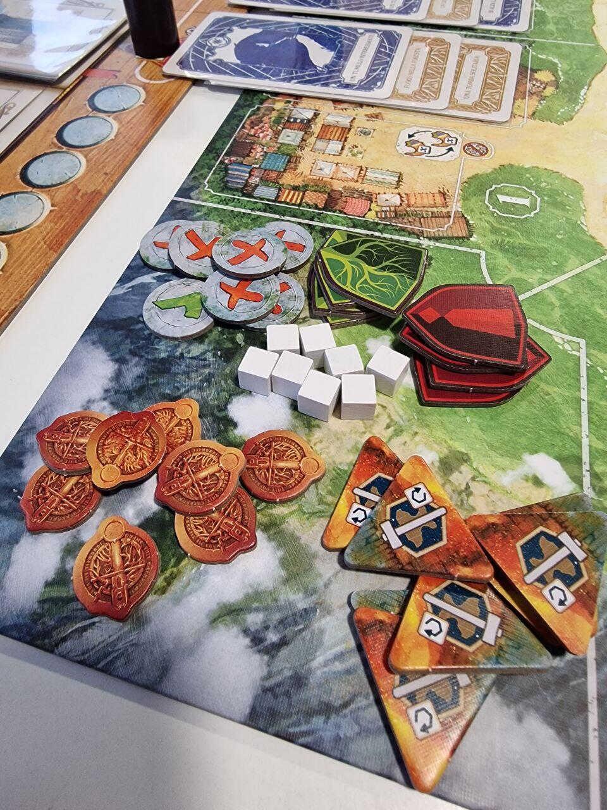
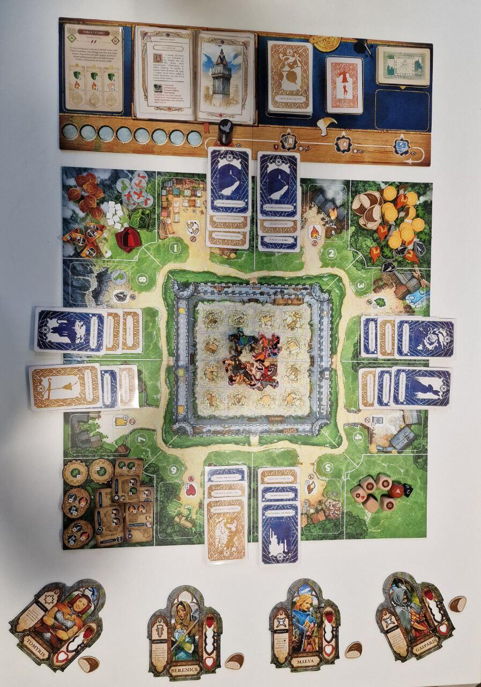

<Setting>

  In un regno ormai in rovina, dove le vestigia della passata gloria sbiadiscono
  ogni giorno di più, un gruppo di coraggiosi ranger veglia sui villaggi allo
  sbando, lavorando per recuperare un barlume di stabilità e, chissà, magari un
  giorno, ristabilire anche l’impero stesso. La fortezza che vi è stata affidata
  deve essere rimessa a nuovo e resa efficiente, mentre le regioni che la
  circondano sono infestate da bande di mostri o altri ostacoli da superare. 
  Riusciranno i Ranger ad essere all’altezza della loro missione?

</Setting>

<Rules>

  Oltre è un gioco cooperativo e narrativo in cui i giocatori, vestendo i panni di uno degli 8 ranger della scatola,
  dovranno lavorare insieme per riuscire ad arrivare al lieto fine della cronaca selezionata nel set up. Per farlo
  dovranno adempiere ai compiti assegnati nei vari capitoli della storia, che ad ogni turno verrà progressivamente
  svelata. Ma attenzione! Incombenze, problemi ed eventi renderanno il tutto più complicato, ponendo ogni giocatore di
  fronte a nuovi ostacoli lungo il cammino.
   
  Il turno si divide in due fasi.
  <ol>
    <li>      Durante la prima fase si tira il dado turno che farà avanzare il segnalino turno su uno dei quattro spazi del tracciato; ad ogni spazio corrisponde una carta da dover leggere o piazzare sul tabellone. Gli spazi sono i seguenti:<ul><li>        <strong>Cronaca</strong>. Si gira pagina e si legge un nuovo capitolo della storia principale, dove saranno indicati obiettivi e missioni. Risolverli garantirà un lieto fine, fallire comporterà una sconfitta.</li><li>        <strong>Incombenze</strong>. Si piazza una nuova carta su una delle otto regioni della mappa; se ci sono quattro carte incombenza contemporaneamente sulla stessa regione, quest’ultima è dichiarata pericolosa, con conseguente perdita di prestigio a fine round.</li><li>        <strong>Problemi</strong>. Si piazza il problema sopra uno dei villaggi delle otto regioni, cosa che impedirà ai giocatori di eseguire le azioni ad essi collegate (di solito ottenere risorse).</li><li>        <strong>Eventi</strong>. Si legge e risolve la carta evento.</li></ul></li><li>      Durante la seconda fase ogni giocatore può svolgere due azioni tra le seguenti: spostarsi, riposare, compiere una delle azioni dei villaggi, risolvere una carta problema, risolvere una carta incombenza, costruire o riparare un edificio, costruire una torre.</li>
  </ol>
  Per riuscire a compiere le proprie azioni i giocatori tireranno un certo numero di dadi, calcolato in base al tipo di
  prova in oggetto, agli edifici già costruiti nella fortezza e alla professione del ranger che effettua la prova.
  Inoltre, ogni ranger avrà a disposizione un’abilità unica che, usata nel modo giusto, potrà fare la differenza tra
  vittoria e sconfitta.
   I turni si susseguiranno in questo modo fino a giungere all’ultima pagina della cronaca, dove i giocatori scopriranno
  il finale.

</Rules>

<Feedback>

  Nonostante questo gioco sia appena stato pubblicato, sta già andando a ruba: da subito il “fenomeno Oltre” è stato
  evidente: un gioco semplice, originale e visivamente bellissimo.&nbsp;
   
  I materiali sono eccellenti e, soprattutto le risorse, saranno davvero soddisfacenti da maneggiare (peccato solo che
  la risorsa pane sia in cartoncino). Certo, qualche carta evento o problema in più non sarebbe guastata, ma confidiamo
  in pacchetti extra futuri. Discreta, invece, la selezione di cronache e obiettivi in dotazione.
   
  Da ricordare che la fortuna risulta determinante nello svolgimento del gioco e, nonostante i vari modificatori, quasi
  tutto dipende dal caso. Questo potrebbe frustrare i giocatori che amano la strategia, ma renderà il gioco estremamente
  immediato e semplice per tutti. Infatti, la vocazione principale di questo titolo è quella di essere un entry level
  per famiglie che desiderano espandere i propri orizzonti e osare un pochino. Se siete giocatori esperti, puristi del
  piazzamento lavoratori, cultori dei regolamenti dalle 50 pagine in su, lasciate perdere questo titolo: non fa per voi.
  Se invece volete giocare un cooperativo-narrativo con uno o più principianti/bambini, è davvero perfetto.
   
  Abbassate le luci, sfoderate la vostra migliore voce da narratore e preparatevi a vivere fantastiche avventure nel
  mondo di Oltre!

</Feedback>
