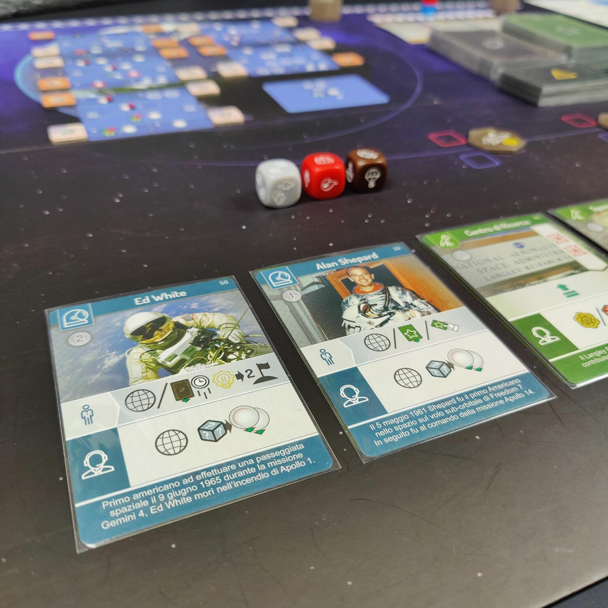
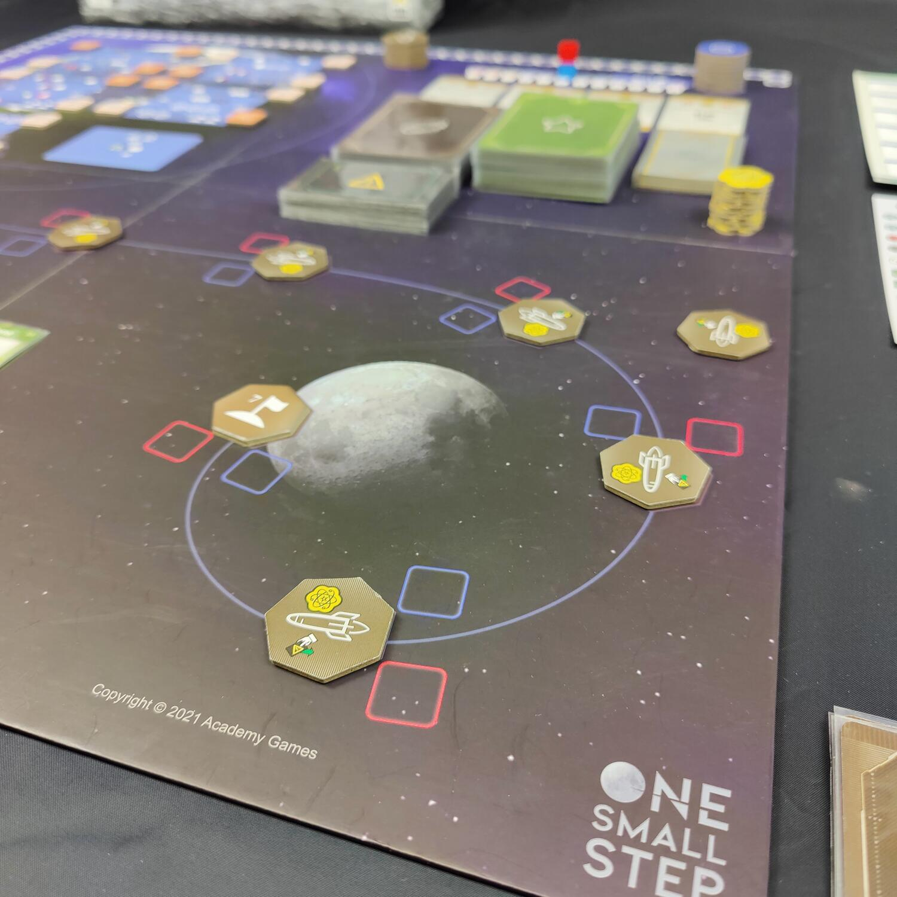

<Setting>

  Da sempre la luna ammalia e attrae l'uomo. È stata spettatrice passiva della
  storia umana e della sua evoluzione fino al 21 luglio 1969, quando le parole
  di un certo signor Neil Armstrong hanno cambiato tutto…
   
  Siete pronti per un tuffo nel passato? One Small Step vi riporta ai tempi
  della guerra fredda tra USA e URSS, proprio al centro della corsa per la
  conquista della luna e della supremazia tecnologica. Dovrete coordinare e
  ponderare le scelte tra i dipartimenti di ingegneria e di controllo della
  vostra agenzia, raccogliere le risorse necessarie per far partire le vostre
  missioni satellite e, meglio ancora, quelle con equipaggio per avvicinarvi al
  sogno di ogni astronauta, e infine ostacolare in maniera subdola le operazioni
  dei vostri eterni rivali. Incontrerete i personaggi che hanno fatto la storia
  e rivivrete gli avvenimenti più importanti che hanno condizionato la corsa
  tecnologica degli anni '60 dello scorso secolo. One Small Step non è solo un
  gioco; o meglio, lo è nella sua semplice essenza, ma se lo desiderate potrete
  farne una vera e propria lezione di storia!

</Setting>

<Rules>

  Il vostro obiettivo sarà quello di fare più punti della nazione avversaria.
  Chi si troverà davanti alla fine sarà coperto di gloria e onore; inoltre, sì:
  raggiungere la luna vi darà una bella spinta, ma non è detto che basti.
   
  Il gioco è composto da turni che si susseguono fino a quando non viene
  raggiunta la luna, fino a che non avrete esaurito le missioni con equipaggio a
  vostra disposizione, oppure fino a che non avrete terminato il mazzo di carte
  degli eventi. È tutto molto logico, a pensarci bene: arrivare per primi sulla
  luna è lo scopo delle due nazioni; senza missioni da lanciare non avete altro
  modo per arrivare lassù; senza altri eventi da giocare… beh la storia finisce.
  Ogni turno è composto da 7 fasi e la nazione che farà la prima mossa sarà
  quella che si troverà in vantaggio sul tracciato media, ovvero quella scala
  che rappresenta il favore del proprio governo e l'appoggio dell'opinione
  pubblica.
   
  Farete avanzare le vostre missioni programmate verso la fase di lancio,
  rifornirete le vostre risorse permanenti, svelerete nuove carte evento,
  programmerete il lavoro dei vostri due ingegneri e dei due controllori in modo
  da recuperare le risorse temporanee necessarie o da bloccare i programmi
  avversari, pescherete e giocherete nuove carte missione e personali, infine
  lancerete le missioni pronte sulla rampa - ovviamente se non capiterà qualche
  intoppo o qualche problema dell'ultimo minuto.

</Rules>

<Feedback>

  Ad una prima occhiata, One Small Step potrebbe sembrare complicato e suscitare
  un certo timore. Tutte quelle icone e quei segnalini, le carte piene di
  simboli con molteplici spazi, le missioni satellite ed equipaggio, la
  terminologia tecnica, metterebbero sull'attenti anche alcuni giocatori di
  vecchia data.
   
  Nella realtà ogni simbolo è spiegato con precisione, ha un suo senso logico e,
  appena svelato, vi sembrerà di averlo sempre conosciuto. I fogli di aiuto vi
  serviranno solamente per la prima partita, poi ve li dimenticherete. La
  sequenza di gioco rimane sempre la stessa, dopo i primi turni la imparerete
  senza alcuna difficoltà, grazie anche alla chiara iconografia sulle plance.
   
  Lo trovo più un gioco da 2 giocatori, anche se in fondo ha un suo senso nella
  versione a 4, in cui ognuno è al comando di un dipartimento e i giocatori sono
  divisi in due squadre. In quest'ultimo caso, vi ritroverete a compiere scelte
  che potranno interferire non solamente con l'avversario ma anche con il lavoro
  del compagno della stessa nazione.
   
  Il titolo necessita sicuramente almeno un paio di partite per permettervi di
  entrare con dimestichezza nei suoi meccanismi e per incominciare a programmare
  con qualche turno di anticipo le mosse successive. Ma già durante la prima
  partita, ve ne renderete conto, la necessità di guardare avanti sarà davvero
  naturale.
   
  Estremamente gradita la variante noobs. Per le prime partite, infatti, il
  gioco è dotato di una plancia principiante che semplifica alcune meccaniche e
  ne elimina altre, come il miglioramento delle azioni terra e i potenziamenti.
  Una volta che avrete preso la mano con la versione per principianti sarete
  pronti per giocare con le grandi menti delle agenzie spaziali. Passo e chiudo.

</Feedback>

