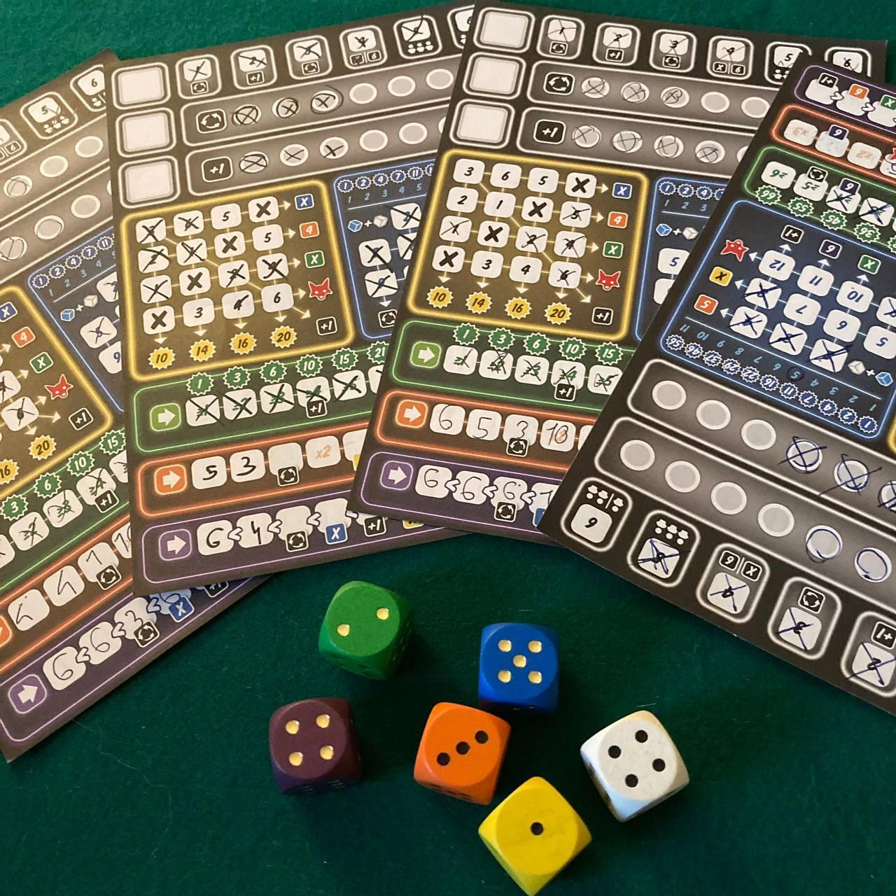
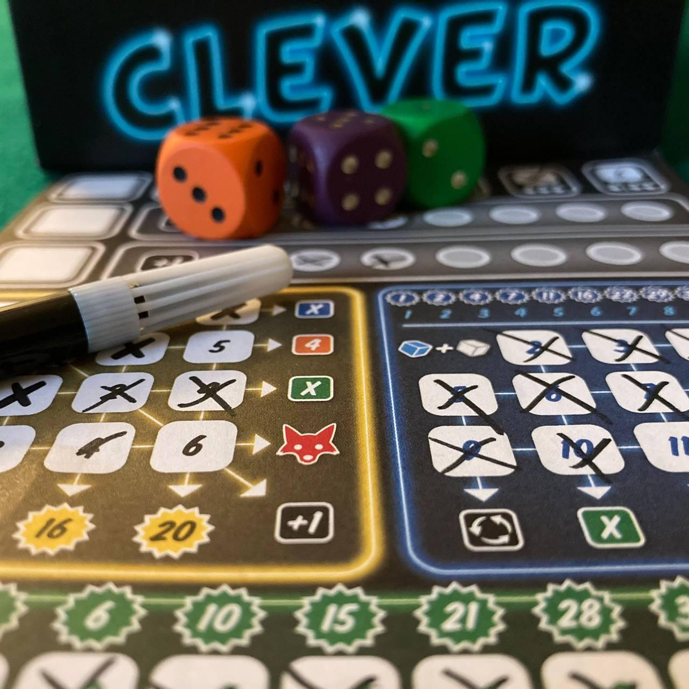

<Setting>

  Optimus (Ganz schön Clever per i veri intenditori) non ha un’ambientazione. È
  un gioco astratto in cui bisogna lanciare dei dadi e sommare dei valori per
  ottenere un punteggio sempre più alto, combinando nel modo più efficiente
  possibile i poteri speciali, così da massimizzare il punteggio e passare per
  una persona molto intelligente. Traducete dal tedesco il titolo originale del
  gioco!

</Setting>

<Rules>

  In Optimus i giocatori, durante un determinato numero di round, dovranno…
  <strong>rullo di tamburi</strong>…
   
  <strong>Lanciare dei dadi!</strong>
   
  Ogni dado, oltre a fornire un risultato numerico, dovrà anche essere posizionato
  in una zona particolare sulla scheda del giocatore determinata dal proprio colore.
   
  <ul>
    <li>      <strong>Dado bianco:</strong> può essere posizionato in qualsiasi
      posizione</li>
    <li>      <strong>Dado Viola:</strong> va posizionato nella zona viola e ogni volta
      il valore dovrà essere minore o uguale di quello già precedentemente
      piazzato</li>
    <li>      <strong>Dado Arancione:</strong>va posizionato nella zona arancione,
      indipendentemente dal valore</li>
    <li>      <strong>Dado Verde:</strong>va posizionato nella zona verde con un valore
      pari o superiore del numero segnato nella casella</li>
    <li>      <strong>Dado Giallo:</strong>va posizionato nella zona gialla, cancellando
      di volta in volta il valore corrispondente sulla scheda</li>
    <li>      <strong>Dado Blu:</strong>va posizionato nella zona blu, cancellando un
      valore pari alla somma del dado blu stesso e del dado bianco{" "}</li>
  </ul>
  Oltre a determinare i punteggi finali, ogni zona regalerà ai giocatori dei
  bonus che permetteranno fantasmagoriche combo!

</Rules>

<Feedback>

  Optimus è il <Link to="/mechanisms/roll-and-write"> Roll and write </Link> per
  eccellenza. Fa solo quello e lo fa dannatamente bene.
   
  Il suo più grande difetto è quello di essere risolto. Infatti esiste una{" "}
  <strong>strategia dominante</strong> che permette di massimizzare il
  punteggio. Per un gioco del genere, il cui cuore è proprio essere un “batti il
  tuo punteggio”, avere una strategia dominante è come tirarsi una zappa sui
  piedi! Infatti nel momento in cui verrà scoperta, privando i giocatori della
  ricerca dell’ottimizzazione, Optimus perderà inevitabilmente il suo fascino…
  Fino ad allora però sarà uno dei{" "}
  <Link to="/mechanisms/roll-and-write"> Roll and write </Link> più meritevoli
  che giocherete!

</Feedback>

