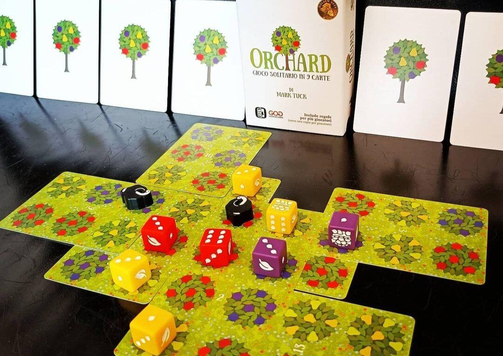
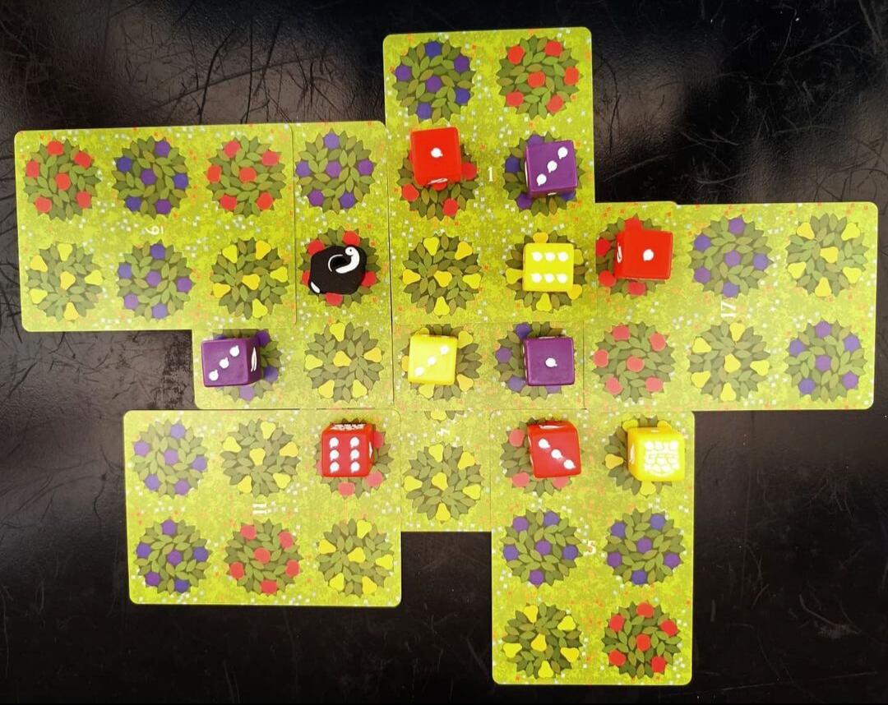

<Setting>

  Mele, pere e susine. Quindici dadi, diciotto semplici carte e un regolamento. Costruisci il tuo frutteto e raccogli
  più frutta possibile.

</Setting>

<Rules>

  In Orchard dovremo competere contro noi stessi per ottenere più punti possibili grazie alla frutta sui nostri alberi.{" "}
  <strong>La preparazione è immediata</strong>: basterà prendere 9 carte dal mazzo e posizionarne una sul tavolo. Questa
  sarà la base per la costruzione del vostro frutteto. Ad ogni turno avrete in mano solo due carte, dopo averne giocata
  una potrete pescarne un'altra. Ma come potrete ottenere punti vittoria? Ogni carta del mazzo è diversa, composta da
  una combinazione di 6 alberi da frutto. Nel vostro turno potrete posizionare una carta dalla vostra mano facendola
  combaciare con alcuni alberi da frutto già presenti sul tavolo, potendola ruotare sia verticalmente che
  orizzontalmente. Per ogni albero che combacerà potrete posizionare un dado di quel tipo di frutto sul numero 1, o
  ruotare il dado già presente su un numero direttamente più alto (1,3,6,10). Importante stare attenti a non posizionare
  alberi da frutto diversi uno sull'altro, poiché a quel punto dovrete collocare{" "}
  <strong>un segnalino frutta marcia</strong> su di esso, perdendo non solo il dado posizionato su di esso, ma anche la
  possibilità di poter posizionare un'altra carta su quest'ultima (solo due di questi segnalini potranno essere
  posizionati durante la partita). Il gioco prosegue fino a quando tutte le carte saranno posizionate. Al termine
  potrete contare la quantità di frutta presente nel vostro frutteto, tenendo conto che ogni albero può avere su di esso
  solo 10 unità di frutta.

</Rules>

<Feedback>

  Orchard: a 9 card solitaire game è un frutto prelibato. Un <strong>pocket game</strong> che ogni giocatore da tavolo
  dovrebbe avere nella sua collezione o nel suo zaino da viaggio. Poche regole, facile da intavolare, ma un mondo di
  strategie e possibilità ad ogni partita. La curva di apprendimento <strong>ripida ma incoraggiante</strong> vi porterà
  a fare una partita dietro l’altra. Consiglio di provare a giocare più partite con lo stesso mazzo di carte, per
  cercare di fare sempre più punti vittoria con la stessa combinazione di carte, oppure cimentarvi nelle{" "}
  <strong>sfide multigiocatore</strong> offerte sui gruppi di BGG. I materiali sono di ottima fattura, anche se la
  grafica davvero troppo minimal. Per concludere, Orchard, anche grazie ad un’animata community su web, vi permetterà di
  avere un’interessante sfida sempre in tasca pronta per essere affrontata.

</Feedback>

