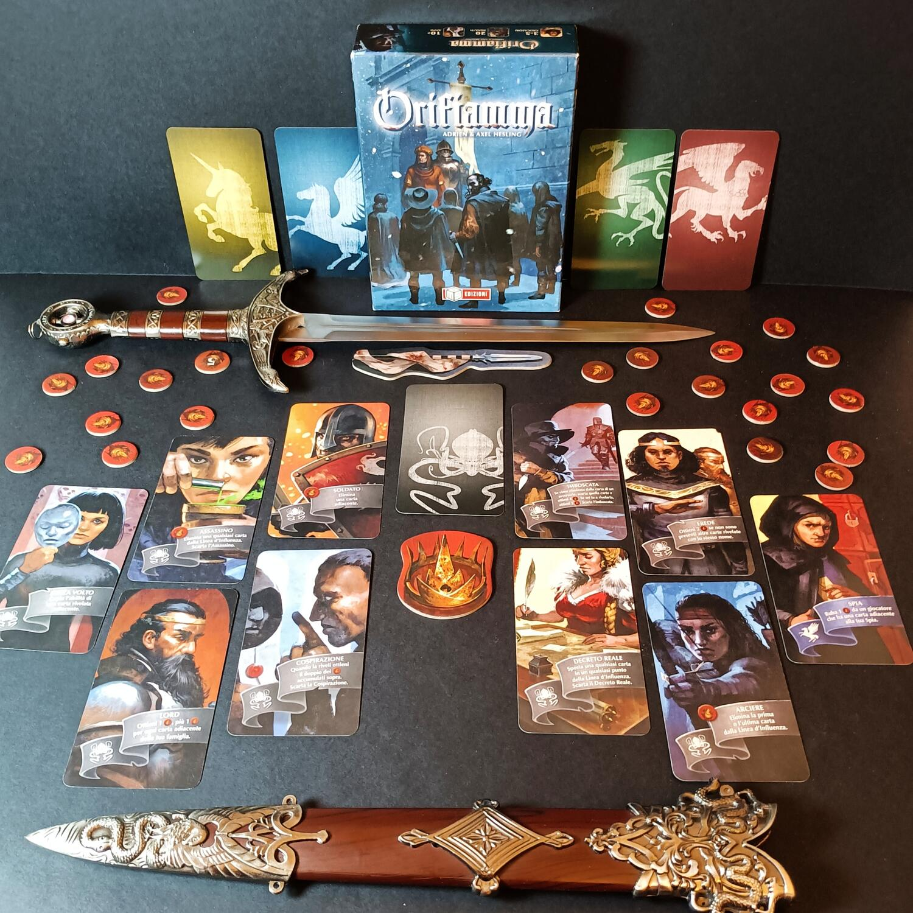
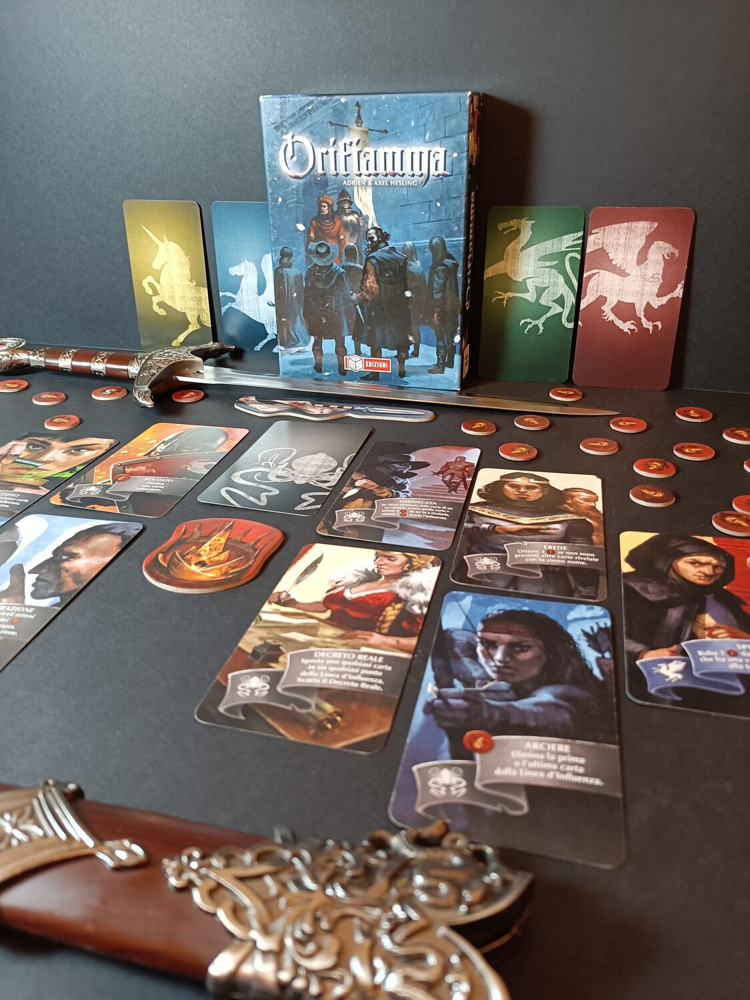

<Setting>

  Il re è morto senza lasciare eredi. Le famiglie più influenti del regno sono
  in lotta per conquistare il potere e assicurarsi la successione al trono.
  Intrighi, tradimenti, omicidi… Sei pronto ad utilizzare ogni mezzo necessario
  per garantire il successo della tua famiglia e diventare il nuovo re?

</Setting>

<Rules>

  In Orifiamma ogni giocatore dovrà guidare la propria casata per ottenere più
  onore e diventare così il nuovo erede al trono.
   
  All'inizio della preparazione ogni giocatore prende tutte le carte di una
  casata e un segnalino Onore. Posizionate poi il segnalino Risoluzione al
  centro del tavolo e consegnate il segnalino primo giocatore al più anziano. A
  questo punto ogni giocatore, scarta 3 carte Personaggio, arrivando così ad
  averne 7; queste{" "}
  <strong>saranno le carte con cui giocherete questa partita</strong>. Una
  partita di Orifiamma è divisa in <strong>sei Round</strong>, divisi a loro
  volta in due fasi. Durante la prima,{" "}
  <strong>la fase di Posizionamento</strong>, i giocatori posizionano una carta
  coperta sul tavolo. Se sono già presenti carte, il giocatore deve posizionare
  la propria carta o all'estrema sinistra o all'estrema destra rispetto alle
  altre. A partire dal secondo Round di gioco è possibile giocare una carta
  <strong>sopra</strong> una delle proprie carte già in gioco, a prescindere dal
  fatto che sia rivelata o meno; questa mossa permetterà di avere alcuni vantaggi
  strategici durante la partita, come ad esempio proteggere la carta appena coperta.
  Durante la seconda fase, <strong>la fase di Risoluzione</strong>, i giocatori iniziano
  uno dopo l'altro a scegliere se rivelare una propria carta o lasciarla coperta.
  Se si decide di non rivelarla, la carta rimane coperta e viene posizionato un segnalino
  Onore su di essa. Se invece il giocatore sceglie di attivarla, mostra la carta,
  ottiene gli eventuali punti Onore accumulati su di essa e attiva l'effetto della
  carta. La maggior parte delle carte Personaggio, una volta rivelate, <strong>    rimangono in gioco</strong> per i Round successivi, altre, invece, andranno scartate dopo la risoluzione.
  Una volta che ogni giocatore ha deciso, <strong>in ordine</strong>, il destino
  delle sue carte sulla Linea di Influenza, passate il segnalino Primo Giocatore
  in senso orario e iniziate un nuovo Round partendo dalla fase di Posizionamento.
   
  Alla fine del sesto Round il giocatore con più punti Onore è dichiarato il vincitore
  e <strong>incoronato nuovo re di Francia</strong>.

</Rules>

<Feedback>

  Orifiamma è uno di quei giochi con cui, dopo la prima partita, non riesci a
  smettere di giocare. Un connubio di semplicità, strategia e interazione tra i
  giocatori che vi faranno stare incollati alle sedie. Orifiamma risulta a primo
  impatto un gioco spoglio, con pochi materiali, anche se i disegni attireranno
  subito la vostra attenzione. Ma il vero fulcro e bellezza di questo gioco sta
  nell'<strong>interazione tra le carte</strong> e tra i giocatori al tavolo.
  Strategia e bluff si fondono in una perfetta armonia permettendo di creare
  un'atmosfera tesa e piena di suspence. Ma andiamo con ordine. La portabilità e
  la preparazione di questo gioco sono davvero ottime, e si aggiungono al pregio
  di un <strong>regolamento fluido ed immediato</strong>, Orifiamma risulta un
  gioco sempre facile da intavolare nei momenti morti delle vostre serate. La
  scalabilità è ottimale per tutte le configurazioni, anche se, come in molti i
  giochi, avere più persone al tavolo non vi permetterà di controllare al meglio
  la vostra partita. Le <strong>strategie sono molte</strong> e vi
  costringeranno a crearne sempre di nuove per riuscire a superare i vostri
  avversari, permettendo al gioco di avere comunque una buona longevità, anche
  con così poche carte. Qualche difetto è comunque presente, come ad esempio il{" "}
  <strong>poco controllo sulla partita</strong>. Ad inizio partita dovrete
  scartare casualmente tre carte, le quali potrebbero essere chiave per alcune
  strategie. Inoltre, la presenza di numerosi giocatori al tavolo non sarà di
  aiuto se vorrete costruire piani ben architettati. La possibilità di king
  making è sempre dietro l'angolo, e in alcune partite potreste venire tagliati
  fuori anche senza un apparente motivo. Bisogna comunque far presente che
  Orifiamma si presenta come un <strong>medio-light</strong>, un gioco che
  dovrete intavolare senza dare troppo peso alla vostra vittoria o sconfitta,
  pur avendo una componente strategica ben congegnata. Per concludere, Orifiamma
  è un gioiellino da tenere sempre sotto mano. Uno di quei giochi di cui vi
  stuferete difficilmente,{" "}
  <strong>un ever-green semplice e coinvolgente</strong> davvero da non farsi
  scappare.

</Feedback>

