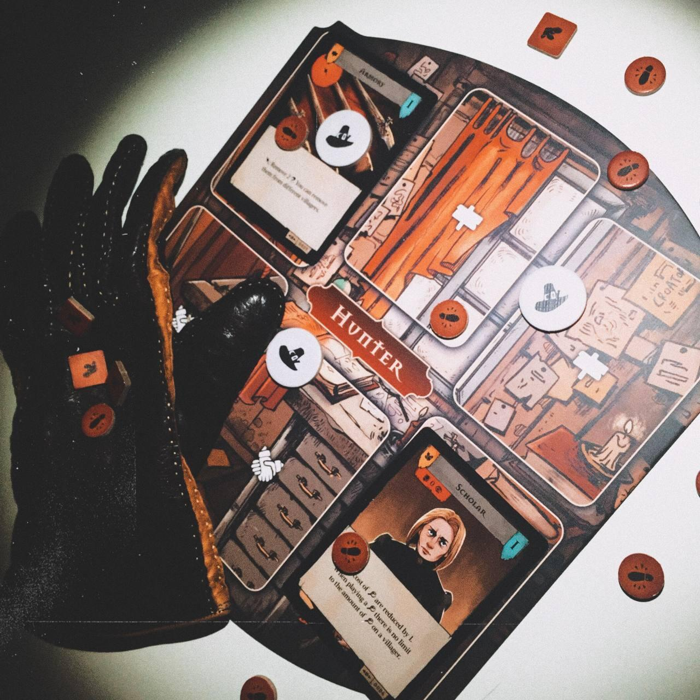
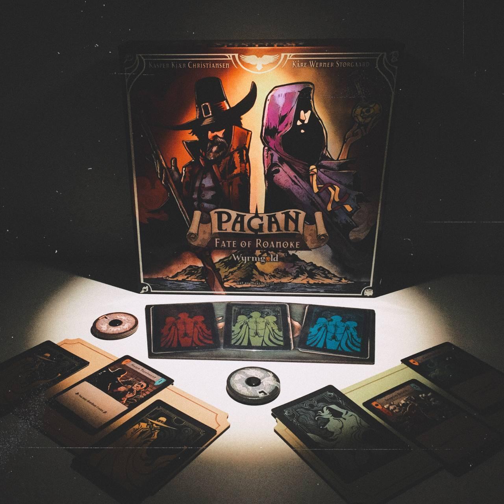

<Setting>

  La cittadina di Roanoke è una matassa di segreti e di pettegolezzi. Basta poco
  perché la voce della presenza di una Strega arrivi alle orecchie di un
  Cacciatore. L’una e l’altro dovranno guadagnarsi i favori dei cittadini o
  estorcere loro delle prove in una corsa contro il tempo per fermarsi a
  vicenda. <strong>Riuscirà il Cacciatore a stanare la Strega</strong>,
  rivelando la sua vera identità, prima che ella porti a termine il suo malefico
  rituale?
   

</Setting>

<Rules>

  <strong>    <em>Pagan: Fate of Roanoke</em></strong>{" "}
  è un gioco di <strong>deduzione </strong>e di{" "}
  <strong>carte asimmetrico </strong>in cui due contendenti vestono i panni
  della Strega e del suo Cacciatore, ricevendo in dotazione un proprio mazzo di
  carte precostituito e dei segnalini azione. Questi ultimi saranno utilizzati
  per <strong>“visitare” i cittadini</strong> non ancora occupati e svolgere le
  azioni riportate sulle loro carte; sia la Strega che il Cacciatore, inoltre,
  hanno a disposizione un diverso set di azioni base sempre attive.
   
  All’inizio della partita, la Strega pescherà una carta dal mazzo degli
  indiziati: quella rappresenterà la sua <strong>identità segreta</strong>, che
  sarà compito del Cacciatore rendere pubblica prima che la Strega svolga
  l’azione del rituale. Ogni cittadino, infatti, se visitato, permette di
  distribuire su altri cittadini dei segnalini detti <strong>segreti </strong>
  (per la Strega) o <strong>indizi </strong>(per il Cacciatore). Tre segreti possono
  diventare un <strong>favore</strong>, mentre tre indizi fanno guadagnare una <strong>    prova</strong>. 
  <strong>Il Cacciatore vince</strong> se riesce a <strong>giustiziare</strong>{" "}
  <strong>il cittadino alter-ego della Strega</strong> entro il suo terzo
  tentativo o se <strong>esaurisce il mazzo</strong> degli indiziati (da cui può
  pescare una carta per escludere un cittadino innocente spendendo tre prove).{" "}
  <strong>La Strega vince</strong> se il Cacciatore{" "}
  <strong>giustizia il terzo cittadino innocente</strong> o se riesce a{" "}
  <strong>portare a termine il suo rituale</strong>, avendo almeno tre favori
  sul cittadino che corrisponde alla sua reale identità.
   

</Rules>

<Feedback>

A suo favore, <em>Pagan: Fate of Roanoke</em> ha <strong>un’ambientazione per nulla banale</strong>, che sfrutta a pieno costruendo <strong>meccaniche ben incastrate</strong> tra loro e confezionando due mazzi di carte dalle <strong>illustrazioni molto evocative</strong> e dagli effetti “azzeccati” (almeno tematicamente). In generale il team artistico ha fatto un ottimo lavoro con tutta la componentistica. 
Anche <strong>la qualità dei materiali è molto buona</strong>: le carte sono telate e i cartoni delle plance e dei segnalini belli robusti. 
Quanto a <strong>ergonomia</strong> è <strong>“rimandato a settembre”</strong>: l’organizer della scatola non riesce a contenere alcune delle plance di un paio di centimetri; il gioco occupa uno spazio stranamente lungo sul tavolo; talvolta si è costretti a tenere le plance in bilico sul bordo. Ad ogni modo, a niente di tutto questo è impossibile sopperire in qualche modo. 
Dal punto di vista del gameplay, sta <strong>perfettamente in bilico</strong> tra un gioco di <strong>deduzione</strong> card-driven e un gioco di <strong>carte</strong> con elementi di deduzione. Il perno di questo equilibrio è dato però dal <strong>piazzamento lavoratori</strong>, che contribuisce a dare al gioco un <strong>taglio tattico davvero intrigante</strong> (e molto calzante con il feeling stesso del gioco). Con l’aggiunta della varietà data dalle carte, addentrarsi in una partita di Pagan può essere un’esperienza coinvolgente e affascinante. 
Il <strong>difetto macroscopico</strong> che fa precipitare il gradimento è il <strong>crudele sbilanciamento del gioco</strong>. 
Crudele perché ogni asimmetria tra i due ruoli sembra essere stata architettata a danno della Strega. Il fatto che <strong>ogni tipo di carta di un ruolo ha un corrispettivo nell’altro</strong> non basta a superare lo sbilanciamento in favore del Cacciatore sotto innumerevoli punti di vista: persistenza delle inquisizioni, stabilità dei luoghi, affidabilità a lungo termine degli alleati, coerenza del mazzo con uno stile di gioco aggressivo (quasi in modalità “pilota automatico”) e abbondanza di risorse per il Cacciatore da un lato; dall’altro volatilità di incanti e pozioni, lentezza del supporto dei famigli, incoerenza del mazzo rispetto al playstyle basato sul bluff e penuria di risorse per la Strega. Come se non bastasse, le stesse condizioni di vittoria sono impari, dato che una delle due della Strega è solo una condizione di sconfitta del Cacciatore, il quale spesso non ha bisogno di rischiare perché ha un largo margine di tempo per eseguire una strategia più sicura.  
Giocare la Strega sarà raramente una sfida e più spesso <strong>un’esperienza frustrante</strong> (ma ci riserviamo di testare varianti fanmade più bilanciate). Sebbene sui forum di BoardGameGeek non manchi chi afferma che la Strega ha bisogno di diverse partite prima di riuscire a vincere, c’è da chiedersi se il gioco - pur con i suoi materiali promettenti e le sue meccaniche ben congegnate - sia stato playtestato a dovere (una guida ai ruoli non dispiacerebbe) e se in definitiva non sia più saggio spendere il proprio tempo in giochi che risultino più divertenti per tutte le persone sedute al tavolo. 

</Feedback>

