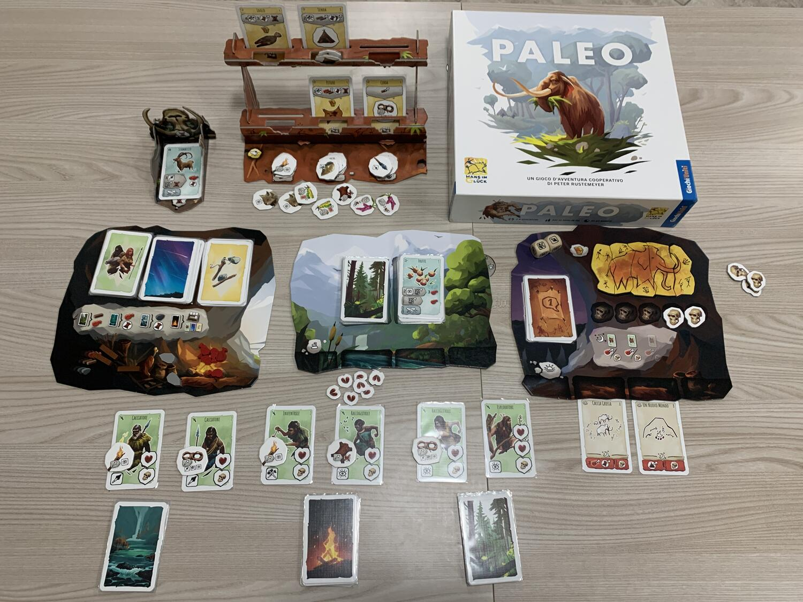
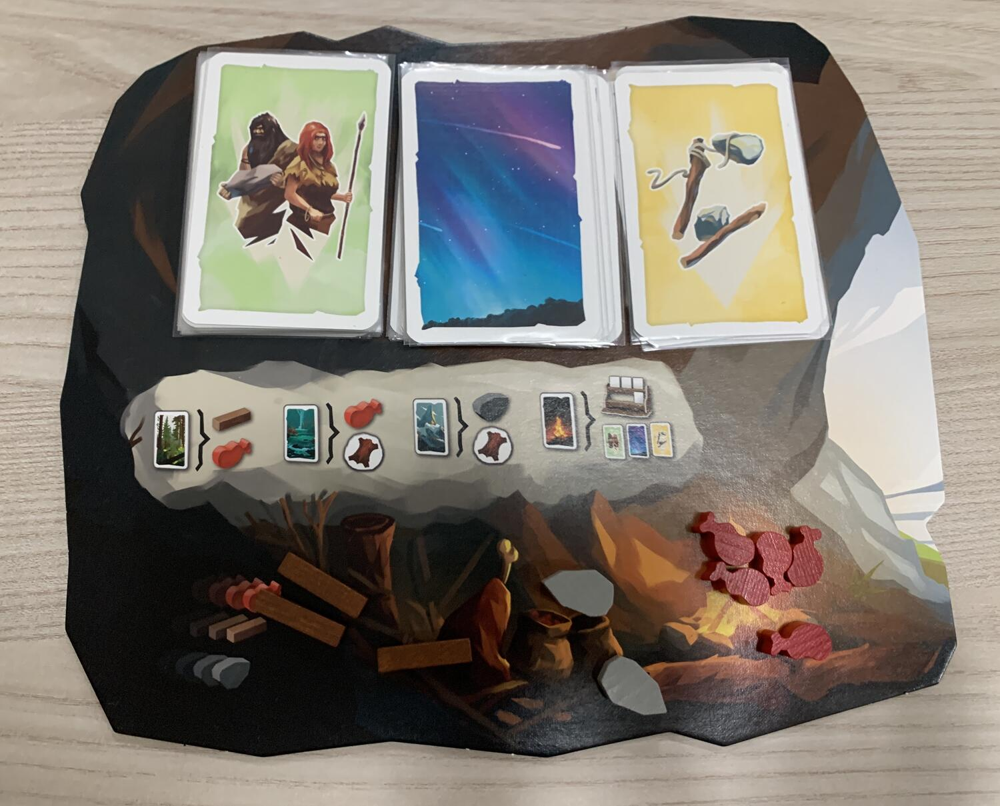

<Setting>

  Preistoria. È l'alba di un nuovo giorno ed una nuova specie viene alla luce: l'UOMO. Da subito questo strano essere si
  colloca ai vertici della catena alimentare e, dapprima scendendo dagli alberi, poi ergendosi tra la folta vegetazione,
  si afferma come la forma di vita più intelligente del tempo.  
  Ben presto tra le sue scoperte si annoverano ad esempio il FUOCO e la concia delle PELLI. Come membri di diverse tribù
  vi troverete a dover sopravvivere in un mondo pieno di insidie, dove ogni giorno la vostra fama di esseri più intelligenti
  verrà messa a dura prova. Vi troverete a dover fronteggiare la FAME, il FREDDO, gli attacchi di animali feroci quali MAMMUTH,
  TIGRI DAI DENTI A SCIABOLA, LUPI; potrete cacciare CERVI, DODO, CINGHIALI per raccogliere cibo sufficiente a superare la
  giornata; conciare pelli per ripararvi dalle intemperie e non solo…
   
  LEGNA e PIETRA vi saranno utili per costruire UTENSILI che vi faciliteranno la vita, mentre inventare nuove IDEE potrebbe
  fare la differenza tra perire oggi e vivere domani. Cooperare per sopravvivere sembra la scelta migliore, anche se dividere
  le forze a volte è l'unica strada percorribile.
   
  Ritornate al vostro RIFUGIO, riposate se potete, sfamatevi, mentre nuovi membri della tribù si stanno avvicinando a voi
  per unirsi nella lotta per la sopravvivenza della specie. Sappiamo com'è andata se siamo qui oggi a parlare di questo gioco:
  i nostri lontani antenati ci sono riusciti, sono sopravvissuti alle avverse condizioni di vita dell'epoca.
   
  Orsù quindi… Imparate dal passato e lasciate la vostra testimonianza ai posteri attraverso PITTURE nelle caverne, che verranno
  conservate per il FUTURO!

</Setting>

<Rules>

  Una partita a Paleo si svolge in un numero indefinito di round, che varia a seconda del momento in cui si presentano
  le condizioni di vittoria o di sconfitta. Per vincere i giocatori devono completare la PITTURA RUPESTRE collezionando
  5 punti vittoria; in modo analogo i giocatori perdono tutti insieme se collezionano 5 TESCHI.
   
  Scelto lo scenario da giocare e preparato il setup, il gioco inizia con una fase GIORNO, in cui i giocatori
  visiteranno diversi luoghi, rappresentati dalle carte distribuite ad ogni giocatore in mazzetti pressoché uguali tra
  loro; nei luoghi visitati si troveranno prove da affrontare, animali da cacciare, pericoli o ostacoli da superare e
  tanto altro ancora. Le carte vengono scelte in modo in partecasuale: ogni giocatore prende le prime 3 del suo mazzetto
  e, guardandone il retro, sceglie quella da giocare per il turno in corso. Il manuale indica le probabilità di trovare
  un certo tipo di terreno (foresta, fiume, montagna ecc…) a seconda del retro.
   
  Il round prosegue così finché tutti i giocatori non hanno esaurito le carte nel proprio mazzetto esplorazione.
   
  Una volta terminato il GIORNO, si procede con la fase NOTTE, dove le tribù si riuniranno intorno al fuoco
  dell'accampamento per sfamarsi e svolgere missioni specifiche dello scenario scelto. In questa fase ogni personaggio
  della tribù deve essere sfamato con un CIBO; nel caso in cui non si riuscisse a sfamare tutti, per ogni personaggio
  NON sfamato il gruppo di giocatori prende 1 TESCHIO.  
  Dopodiché, si risolveranno le carte MISSIONE specifiche di ogni scenario: se il gruppo NON riuscisse a superarle tutte,
  prenderebbe 1 TESCHIO per ogni missione non superata.
   
  Al termine di questa fase vengono ricreati mazzetti di carte esplorazione uguali al numero di giocatori ed un nuovo round
  ha inizio dalla fase GIORNO.

</Rules>

<Feedback>

  Paleo è stata una bellissima sorpresa!
   
  Il gioco è ben impostato per quanto riguarda la difficoltà crescente dei vari scenari (ce ne sono 7 giocabili in
  modalità “campagna”) e la rigiocabilità è davvero alta, considerando che si possono combinare a piacimento per
  esperienze di gioco sempre diverse a livello di obiettivi da perseguire… In realtà la modalità di vittoria è sempre la
  stessa: costruire tutti e 5 i pezzi della pittura rupestre, ma ogni modulo combinato con altri sempre diversi obbliga
  i giocatori ad affrontare prove diverse. Il comparto grafico ed i materiali poi sono ben realizzati e, anche se non
  fanno gridare al miracolo, per il pubblico a cui è rivolto il gioco (dai 10 anni un su) sono dei migliori.
   
  Anche la modalità di gioco cooperativa è stata una sorpresa. È già difficile realizzare un gioco di carte puramente
  collaborativo: se poi lo si fa e si elimina l'aspetto più sgradito del giocatore Alpha beh… Pollice in su !!
   
  Sicuramente per chi si è divertito a giocarlo e lo ha amato come noi, Paleo necessita di una o più espansioni per
  ampliare ancora di più l'esperienza di gioco anche perché… di preistoria ce n'è davvero tanta da esplorare.
   
  L'interazione tra i giocatori è quasi perfetta; piccola sbavatura l'impossibilità di scambiare i token utensile tra i
  giocatori: si sarebbe potuta prevedere ad esempio la possibilità di condividere anche solo i token monouso tra le
  tribù che stanno risolvendo la stessa prova tramite l'azione “AIUTARE”.
   
  La traduzione italiana del manuale e dell'addendum forse potrebbe far indispettire chi cerca regole chiare e semplici
  e chi non vuole stare nemmeno una volta a cercare l'esempio o, come è capitato a noi, leggere qualche FAQ sul web.
   
  In generale Paleo è un gioco completo e non presta assolutamente il fianco ai giochi da cui sono tratte le meccaniche
  di gioco, anzi le migliora. Il gioco è entusiasmante, tiene incollati grandi e piccini ad un'avventura ricca di
  esplorazione e divertimento… Vuoi proprio sapere come andrà a finire e se riuscirai a lasciare il TUO segno nei libri
  di storia!

</Feedback>
