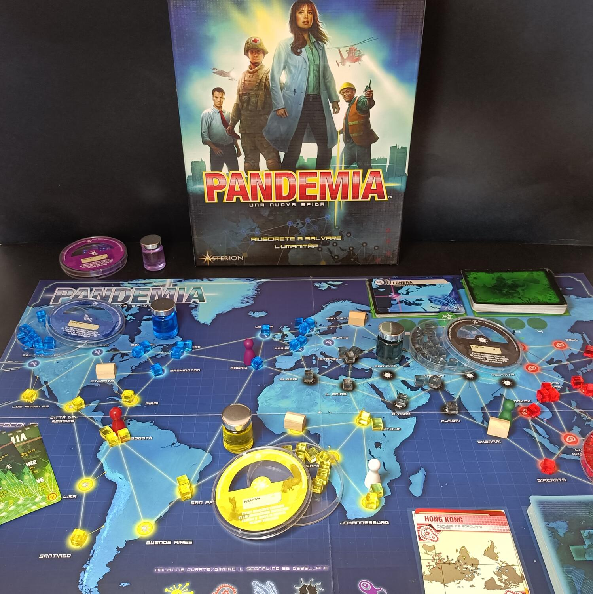
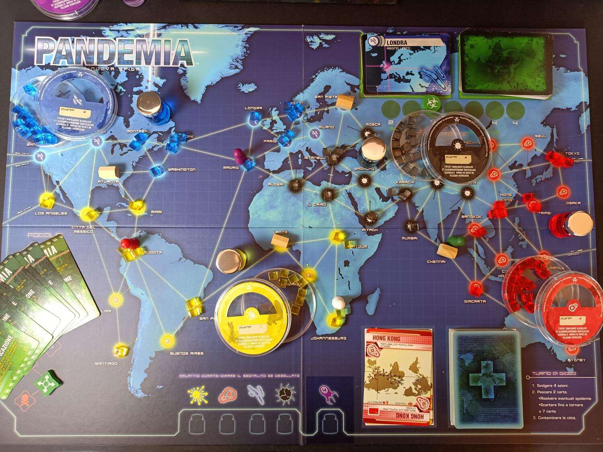

<Setting>

  Situazione mondiale: virus si manifestano e contagiano pian piano gran parte
  della popolazione globale; focolai, crisi, e tumulti generali sono all'ordine
  del giorno. No, non è la situazione di scompiglio dovuta al Coronavirus ma
  semplicemente il gioco da tavolo <strong>Pandemic</strong>.
   
  In Pandemic dovremo impersonare un'equipe di specialisti per cercare di
  arginare e trovare le cure di quattro malattie differenti che pian piano si
  propagano e contagiano varie città sparse per il globo.

</Setting>

<Rules>

  Ad inizio partita, ogni giocatore dovrà scegliere uno specialista tra diverse
  categorie: scienziato, medico, coordinatore, ricercatore, specialista di
  quarantena, esperto di operazioni e pianificatore di contingenze, ognuno dei
  quali in possesso di abilità, competenze e capacità uniche.
   
  Una volta preparato il tabellone di gioco, che rappresenta la mappa globale, e
  dopo aver contagiato le prime nove città, i giocatori si alterneranno in
  turni. In ogni turno un giocatore potrà effettuare{" "}
  <strong>quattro azioni</strong>, tra cui varie tipologie di movimento,
  possibilità di costruire un centro di ricerca, di arginare una malattia, (che
  concretamente significa eliminare un cubo malattia da una città), di scambiare
  informazioni (che in questo gioco sono rappresentate dalle carte tenute in
  mano) e, infine, di trovare una cura (cioè scartare in un centro di ricerca 5
  carte dello stesso colore).
    Come si può intuire, Pandemic è anche un gioco di carte: ogni continente
  è rappresentato da un colore, infestato da un virus in particolare, e ogni carta
  rappresenta una singola città.
    Dopo che un giocatore avrà completato le quattro azioni, dovrà pescare
  due carte dal mazzo giocatori e poi passare alla fase contagio. Ogni turno si
  dovrà pescare un numero di carte dal mazzo contagio pari al livello contagio
  sul tabellone. Questo livello potrà aumentare se si pescherà una carta{" "}
  <strong>Epidemia</strong> dal mazzo dei giocatori; la difficoltà del gioco,
  infatti, risiede proprio nella quantità di carte Epidemia che si mettono nel
  mazzo giocatori. Una volta pescata la carta si dovrà aumentare il livello del
  contagio, pescare e contagiare l'ultima città del mazzo (contagio),
  rimescolare le carte nella pila degli scarti (contagio) e effettuare quindi la
  fase contagio. A causa di ciò si pescheranno di nuovo le stesse carte città,
  ponendo così altri cubi su città già contagiate. Se in qualsiasi momento si
  dovrà mettere un <strong>quarto cubo malattia</strong> in una città allora
  avverrà un <strong>Focolaio</strong>, permettendo così alla malattia di
  propagarsi in tutte le città adiacenti, rendendo ancora più ardua la missione
  dei giocatori.
    La partita sarà vinta nell'esatto momento in cui si troveranno le quattro
  cure, ma allo stesso tempo i giocatori potranno perdere se:
  <ul>
    <li>si arriva all'ottavo focolaio</li>
    <li>      se un virus si è espanso troppo e quindi non ci saranno più cubi da
      mettere sulla mappa</li>
    <li>se non si potranno più pescare carte dal mazzo dei giocatori</li>
  </ul>

</Rules>

<Feedback>

  Pandemic è un gioco complesso, strategico ed estremamente divertente. Ogni
  partita sarà diversa dalle altre e la possibilità di aumentare la difficoltà e
  l'ampio ventaglio di specialisti permetterà ai giocatori di escogitare ogni
  volta una strategia diversa per arrivare alla vittoria.
    I componenti non fanno gridare al miracolo ma creano comunque un buon colpo
  d'occhio e sono di buona fattura. L'interazione è davvero ai massimi livelli, anche
  perché serviranno più teste possibile per riuscire a vincere questo gioco altamente
  sfidante.
    Qualche difetto è comunque presente, come la minima componente
  aleatoria, che potrebbe far storcere il naso ai puristi del genere german, ma
  che a mio avviso permette comunque di aumentare la suspence al tavolo e di
  aumentare anche la rigiocabilità. Su questo aspetto, infatti, Pandemic ha
  bisogno di qualche aiutino superato un determinato numero di partite: la
  presenza di numerose espansioni permette di aumentare il numero di specialisti
  e avere anche la possibilità di cimentarsi in sfide particolari, come il
  bioterrorista o un quinto letale virus. Oltre a queste, tre scatole a parte{" "}
  <strong>Legacy</strong> permetteranno ai giocatori di affrontare una campagna
  a tema, con mille colpi di scena e sfide sempre più competitive, in cui le
  vostre scelte cambieranno le sorti del mondo intero.
   
  Pandemic è un gioco cooperativo eccezionale, non annoia mai e, anche avendo
  qualche annetto di troppo, è un gioco da tavolo <strong>ever green</strong>.
  Uno di quelli che hanno fatto la storia del gioco da tavolo e che ha avuto
  davvero un successo enorme a livello globale, effetto che si può notare dalla
  mole di espansioni e varianti realizzate con queste meccaniche. Un titolo che
  mi sento di consigliare a tutti gli appassionati di giochi da tavolo;{" "}
  <strong>correte a comprarlo!</strong> (vaccinati e con la mascherina).

</Feedback>

