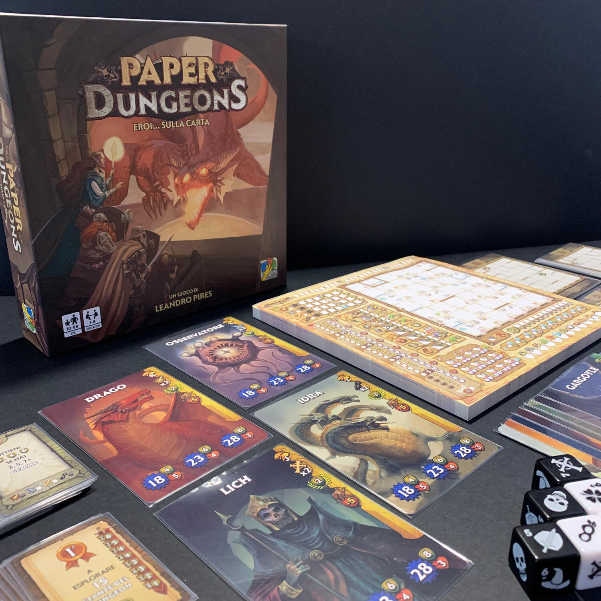
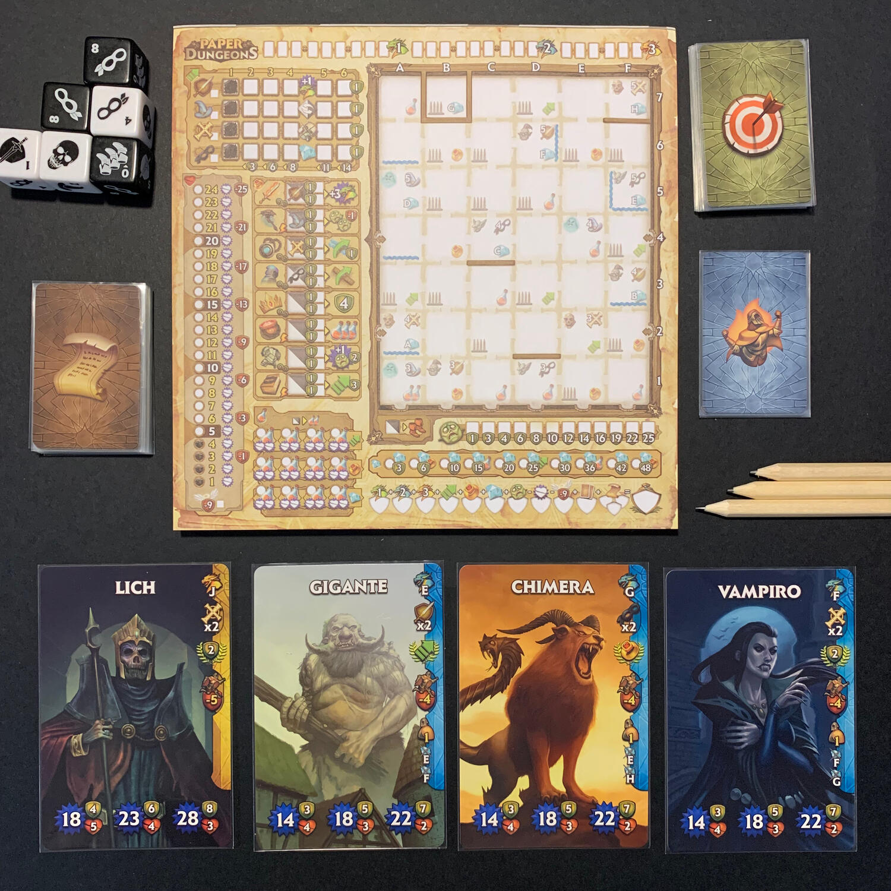

<Setting>

  Un guerriero, un mago, un chierico e un ladro si incontrano in un dungeon, e non c'è niente da ridere. Sarete voi
  chiamati a guidare l'indomito gruppo in un intricato percorso fatto di trappole, fossati, creature mostruose che
  vogliono farvi passare dei brutti momenti. Ma ehi, vuoi mettere il brivido di poter raccogliere gemme scintillanti e
  sconfiggere i Boss più cattivi?
   
  Fai il pieno di pozioni curative e spolvera il tuo arsenale di oggetti magici, tutto ti servirà per compiere i gesti
  più eroici. Per riuscire a primeggiare potrai anche arrivare a saltare i fossi per il lungo.
   
  In Paper Dungeons potrai vivere tutto questo, e il tutto armato solo di matita e comodi fogli prestampati.

</Setting>

<Rules>

  Paper Dungeon è un roll and write molto semplice ma immersivo.
   
  Ogni partita è caratterizzata da un'ambientazione diversa che darà forma al dungeon che ospiterà i 3 boss che siete
  chiamati a sconfiggere nel corso dell'avventura.
   
  La partita è scandita da 8 round e all'inizio di ognuno di essi vengono lanciati i 6 dadi che determinano le possibili
  azioni tra cui scegliere le 3 che il vostro gruppo di eroi compirà. Potrete muovervi all'interno del dungeon, oppure
  far avanzare di livello i vostri eroi, preparare gli oggetti magici che vi daranno utili bonus, oppure preparare
  pozioni curative per affrontare i momenti più difficili.
   
  Il dungeon è rappresentato come una griglia dove ogni cella è una stanza che può contenere trappole, mostri da
  sconfiggere e/o tesori da raccogliere.
   
  I Boss si paleseranno in 3 momenti distinti della partita e se vi ritroverete nel posto giusto al momento giusto
  potrete provare a sconfiggerli.
   
  Lo scopo del gioco è quello di riuscire a raccogliere più punti rispetto agli altri gruppi di avventurieri, per poter
  decretare così i campioni del dungeon.

</Rules>

<Feedback>

  Il gioco si propone come una veloce avventura dalle regole semplici, ma che può trasformarsi in una sfida con sé
  stessi e il proprio gruppo di amici.
   
  Paper Dungeon sfrutta una ambientazione Fantasy collaudata per proporre un gioco in cui non sono solo i dadi a farla
  da padrone, ma saranno le vostre scelte strategiche a determinare l'esito della vostra avventura.
   
  Potrete proporre questo gioco un po' a tutta la famiglia, veterani o novizi del mondo dei giochi da tavolo: tutti
  riusciranno a fare proprie le poche e semplici regole per potersi addentrare nel dungeon. Sta poi ad ogni giocatore
  decidere quanto impegno mettere per pianificare le proprie mosse.
   
  L'interazione tra giocatori è molto limitata, ogni giocatore si troverà a giocare la propria partita senza
  interessarsi più di tanto delle azioni degli altri giocatori, permettendo di svolgere molte fasi di gioco in parallelo
  e di rendere più veloce la partita con pochi momenti di attesa.
   
  Ogni partita si caratterizza per il tipo di Boss da sconfiggere, per i poteri assegnati ai giocatori, e per missioni
  casuali.
   
  La meccanica e la disposizione dei mostri e dei tesori all'interno del dungeon rimane invariata, e questo può dare una
  sensazione di ripetitività tra le varie partite.
   
  Paper dungeon è un gioco leggero che va giocato con la giusta dose di serietà, ma non troppo. D'altronde quando dovete
  affrontare tre temibili boss serve sempre la giusta dose di follia. Se non siete al tavolo a giocare con un gruppo di
  troll, riuscirete comodamente a terminare la vostra partita in mezzo giro di orologio, e magari avrete anche il tempo
  di farvi una risata.

</Feedback>

