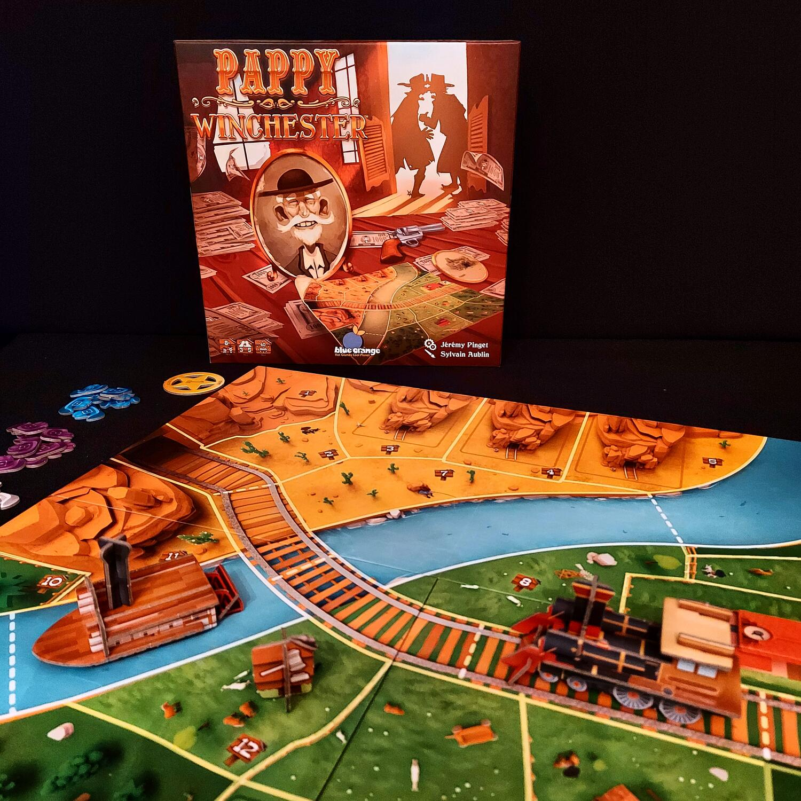
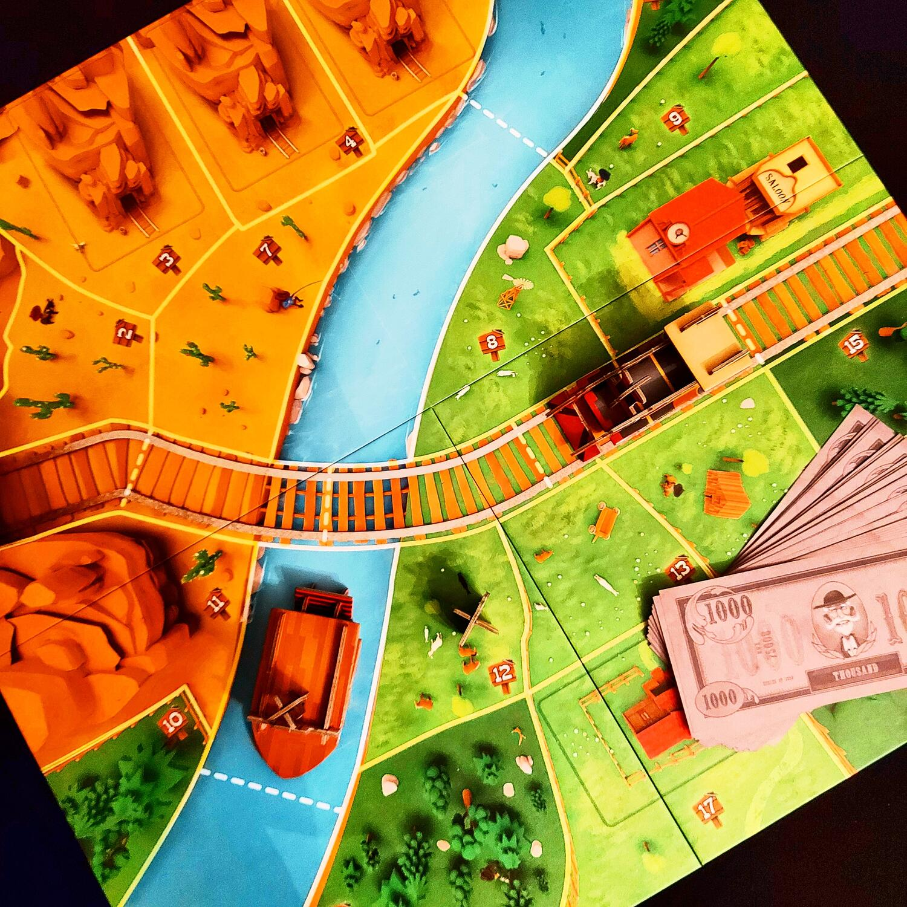

<Setting>

  Pappy Winchester ha appena lasciato il mondo dei vivi! Tutti però sapevano che
  era molto ricco! Le sue ultime volontà erano che i suoi eredi “si dividessero”
  le sue ricchezze e le sue proprietà in modo che il più ricco diventasse il
  nuovo capofamiglia. Pappy Winchester ha lasciato una mappa della sua
  proprietà: ci sono 19 territori che andranno all'asta, attraverso i quali
  transitano una ferrovia ed un fiume, , ci sono lotti di terreno nei quali sono
  presenti miniere e, ovviamente, come in tutti i villaggi del Far West che si
  rispettino, c'è un ranch e un saloon.
   
  Buona Asta.

</Setting>

<Rules>

  Dopo aver posizionato il Tabellone, la locomotiva sulla ferrovia e la nave sul
  fiume, in ciascun lotto di terreno andrà posizionato un gettone Bonus scelto a
  caso. Ogni giocatore inizia con una dotazione di 8.000 dollari e due
  obbiettivi segreti che dovrà cercare di realizzare. Vi saranno inoltre 5
  obbiettivi comuni che permetteranno a chi se li aggiudicherà per primo di
  incrementare la propria disponibilità di denaro.
   
  Ogni turno di gioco si svolge in diverse fasi:
  <ol>
    <li>     <strong> Asta:</strong>Il primo giocatore prende a caso un gettone lotto, per individuare il lotto di terreno che andrà all'asta; quindi, ogni giocatore, procedendo in senso orario, può eseguire 2 azioni a scelta: fare un'offerta, rilanciando di almeno 1.000 dollari sull'offerta in corso, oppure passare. Il giocatore che passa non potrà più fare offerte per il lotto la cui asta è in corso.</li>
    <li>    <strong>  Acquisto del lotto:</strong>Il giocatore che avrà fatto la migliore offerta guadagna il lotto. Prima di prenderne possesso dovrà pagare il prezzo stabilito, dividendolo in maniera equa tra tutti i giocatori; se la somma da pagare non può essere divisa esattamente, il giocatore lascia il resto come mancia al saloon. Il giocatore piazza un Cappello del proprio colore sul lotto di terreno acquistato, prende per sé il gettone Bonus e ne applica subito l'effetto. Se il lotto di terreno contiene il ranch o una miniera, il giocatore deve prendere la carta collegata e ricevere subito la somma indicata dalla banca.</li>
    <li>     <strong>  Verifica degli obbiettivi comuni:</strong>Il giocatore verifica se ha completato uno o più obbiettivi comuni, nel qual caso vince i dollari che sono associati a quell'obbiettivo.</li>
  </ol>
  Il turno finisce e si passa all'asta di un nuovo lotto di terreno.
   
  Nel tentativo di aggiudicarsi un lotto di terreno, i gettoni Bonus che sono
  stati distribuiti casualmente ad inizio partita avranno un ruolo fondamentale.
  Ne esistono di tre tipi:
  <ul>
    <li>      Spostamento: questo gettone permette lo spostamento della Nave oppure della Locomotiva. Il mezzo che il giocatore deciderà di muovere sarà definito veicolo attivo: ogni territorio adiacente alla posizione del “veicolo attivo” farà guadagnare 1.000 dollari al suo proprietario;</li>
    <li>      Saloon: questo gettone consente di recuperare la totalità delle mance che si trovano nel saloon (una sorta di Jackpot);</li>
    <li>      Soffiata: questo gettone permette di visionare una qualunque carta nascosta, quindi si può visionare una carta obbiettivo Segreto di un avversario, la carta Ranch o una delle carte miniera ancora sulla plancia.</li>
  </ul>
  Le carte obbiettivo segreto guideranno la strategia dei giocatori, ma non
  potranno mai essere utilizzate nel corso della partita: queste, infatti,
  genereranno denaro solo al termine della partita stessa.
   
  Con l'acquisto dell'ultimo terreno e dopo averne svolto gli effetti, la
  partita termina e il vincitore, manco a dirlo, sarà il giocatore con il
  maggior bottino.

</Rules>

<Feedback>

  Quello che colpisce da subito di questo gioco sono gli ottimi materiali, la
  plancia di gioco di grandi dimensioni e dai colori vivaci, la nave ed il treno
  tridimensionali, ma soprattutto le banconote di grandi dimensioni e di ottima
  qualità (vi sembrerà di maneggiare degli autentici dollaroni).
   
  L'altro punto di forza di Pappy Winchester è il meccanismo dell'asta,
  innanzitutto perchè la dotazione iniziale di dollari è piuttosto limitata e
  costringerà fin da subito ad adottare una tattica di gioco prudente e mirata
  alla realizzazione degli obbiettivi, ma soprattutto perché chi si aggiudica
  l'asta dovrà pagarne il prezzo agli altri giocatori; questo meccanismo fa sì
  che in talune situazioni i giocatori puntino a far alzare il valore dell'asta
  non tanto per aggiudicarsi il lotto di terreno ma per avere un maggior
  guadagno in caso di sconfitta e per limitare le azioni agli altri giocatori
  nei turni successivi: dunque, l'interazione al tavolo tra i giocatori sarà
  costante e mano a mano che scorre la partita salirà la tensione.
   
  Pappy Winchester è un buon party game, che forse risente un po' della poca
  longevità: alla lunga, infatti, rischia di diventare un po' ripetitivo. Resta
  un ottimo titolo da proporre anche a giocatori neofiti, mentre lo consiglio
  per i giocatori esperti come gioco di riscaldamento a inizio serata.

</Feedback>
